# ResumeAssistant 架构说明文档

> 本文档面向开发者，提供项目的核心架构、数据流向、关键类设计、持久化逻辑和已知风险点的详细说明。

## 目录

1. [架构总览](#架构总览)
2. [核心目录结构](#核心目录结构)
3. [数据流向图](#数据流向图)
4. [关键类与接口](#关键类与接口)
5. [持久化逻辑](#持久化逻辑)
6. [已知风险点](#已知风险点)
7. [架构设计理念](#架构设计理念)

---

## 架构总览

### 系统架构分层图

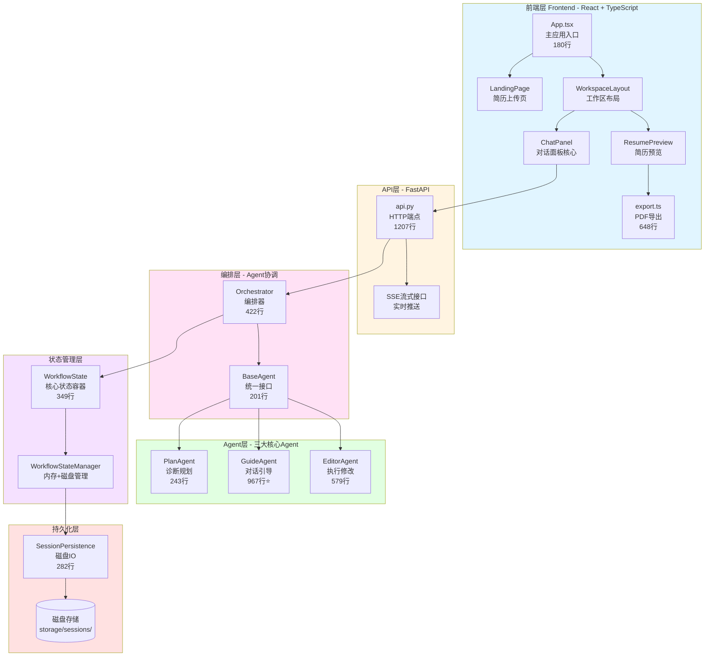
```mermaid
graph TB
    subgraph frontend [前端层 Frontend - React + TypeScript]
        A[App.tsx<br/>主应用入口<br/>180行]
        B[LandingPage<br/>简历上传页]
        C[WorkspaceLayout<br/>工作区布局]
        D[ChatPanel<br/>对话面板核心]
        E[ResumePreview<br/>简历预览]
        F[export.ts<br/>PDF导出<br/>648行]
    end
    
    subgraph api [API层 - FastAPI]
        G[api.py<br/>HTTP端点<br/>1207行]
        H[SSE流式接口<br/>实时推送]
    end
    
    subgraph orchestration [编排层 - Agent协调]
        I[Orchestrator<br/>编排器<br/>422行]
        J[BaseAgent<br/>统一接口<br/>201行]
    end
    
    subgraph agents [Agent层 - 三大核心Agent]
        K[PlanAgent<br/>诊断规划<br/>243行]
        L[GuideAgent<br/>对话引导<br/>967行⭐]
        M[EditorAgent<br/>执行修改<br/>579行]
    end
    
    subgraph state [状态管理层]
        N[WorkflowState<br/>核心状态容器<br/>349行]
        O[WorkflowStateManager<br/>内存+磁盘管理]
    end
    
    subgraph persistence [持久化层]
        P[SessionPersistence<br/>磁盘IO<br/>282行]
        Q[(磁盘存储<br/>storage/sessions/)]
    end
    
    A --> B
    A --> C
    C --> D
    C --> E
    E --> F
    
    D --> G
    G --> H
    G --> I
    
    I --> J
    J --> K
    J --> L
    J --> M
    
    I --> N
    N --> O
    O --> P
    P --> Q
    
    style frontend fill:#e1f5ff
    style api fill:#fff4e1
    style orchestration fill:#ffe1f5
    style agents fill:#e1ffe1
    style state fill:#f5e1ff
    style persistence fill:#ffe1e1
```

### 技术栈总览

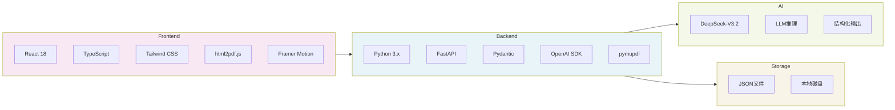
```mermaid
graph LR
    subgraph Backend
        A1[Python 3.x]
        A2[FastAPI]
        A3[Pydantic]
        A4[OpenAI SDK]
        A5[pymupdf]
    end
    
    subgraph Frontend
        B1[React 18]
        B2[TypeScript]
        B3[Tailwind CSS]
        B4[html2pdf.js]
        B5[Framer Motion]
    end
    
    subgraph AI
        C1[DeepSeek-V3.2]
        C2[LLM推理]
        C3[结构化输出]
    end
    
    subgraph Storage
        D1[JSON文件]
        D2[本地磁盘]
    end
    
    Backend --> AI
    Backend --> Storage
    Frontend --> Backend
    
    style Backend fill:#e8f4f8
    style Frontend fill:#f8e8f4
    style AI fill:#f4f8e8
    style Storage fill:#f8f4e8
```

---

## 核心目录结构

### 目录树可视化

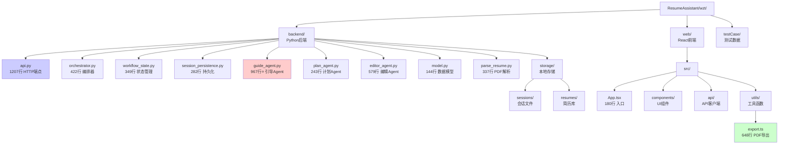
```mermaid
graph TD
    ROOT[ResumeAssistant/wzt/]
    
    ROOT --> BACKEND[backend/<br/>Python后端]
    ROOT --> WEB[web/<br/>React前端]
    ROOT --> TEST[testCase/<br/>测试数据]
    
    BACKEND --> API[api.py<br/>1207行 HTTP端点]
    BACKEND --> ORCH[orchestrator.py<br/>422行 编排器]
    BACKEND --> WF[workflow_state.py<br/>349行 状态管理]
    BACKEND --> PERSIST[session_persistence.py<br/>282行 持久化]
    BACKEND --> GUIDE[guide_agent.py<br/>967行⭐ 引导Agent]
    BACKEND --> PLAN[plan_agent.py<br/>243行 计划Agent]
    BACKEND --> EDITOR[editor_agent.py<br/>579行 编辑Agent]
    BACKEND --> MODEL[model.py<br/>144行 数据模型]
    BACKEND --> PARSE[parse_resume.py<br/>337行 PDF解析]
    BACKEND --> STORAGE[storage/<br/>本地存储]
    
    STORAGE --> SESSIONS[sessions/<br/>会话文件]
    STORAGE --> RESUMES[resumes/<br/>简历库]
    
    WEB --> SRC[src/]
    SRC --> APPTS[App.tsx<br/>180行 入口]
    SRC --> COMP[components/<br/>UI组件]
    SRC --> APIDIR[api/<br/>API客户端]
    SRC --> UTILS[utils/<br/>工具函数]
    
    UTILS --> EXPORT[export.ts<br/>648行 PDF导出]
    
    style GUIDE fill:#ffcccc
    style EXPORT fill:#ccffcc
    style API fill:#ccccff
```

### 详细目录结构

```
ResumeAssistant/wzt/
├── backend/                      # Python 后端服务（FastAPI）
│   ├── api.py                    # 🔌 API 端点定义（1207行）- HTTP 接口层
│   ├── orchestrator.py           # 🎯 编排器（422行）- Agent 协调中心
│   ├── workflow_state.py         # 📊 工作流状态管理（349行）- 核心状态容器
│   ├── session_persistence.py   # 💾 会话持久化（282行）- 磁盘存储层
│   │
│   ├── base_agent.py             # 🧩 Agent 抽象基类（201行）- 统一接口协议
│   ├── agent_adapters.py         # 🔌 Agent 适配器 - 将现有 Agent 适配到统一接口
│   │
│   ├── plan_agent.py             # 🔍 计划 Agent（243行）- 简历诊断与任务规划
│   ├── guide_agent.py            # 💬 引导 Agent（967行）⭐ - 对话挖掘与草稿生成
│   ├── editor_agent.py           # ✏️ 编辑 Agent（579行）- 执行简历修改
│   │
│   ├── model.py                  # 📐 数据模型定义（144行）- Pydantic 模型
│   ├── tool_framework.py         # 🛠️ 工具框架（245行）- Editor Agent 的工具系统
│   ├── tools_models.py           # 📋 工具模型（58行）- 工具参数校验
│   ├── parse_resume.py           # 📄 PDF 解析（337行）- 简历提取与结构化
│   ├── resume_storage.py         # 🗄️ 简历独立存储 - 简历库管理
│   ├── session_utils.py          # 🔧 会话工具函数（132行）- 元数据提取
│   │
│   ├── storage/                  # 本地存储目录
│   │   ├── sessions/             # 会话持久化文件夹
│   │   │   └── {session_id}/     # 每个会话一个文件夹
│   │   │       ├── metadata.json          # 会话元数据（用于列表展示）
│   │   │       └── workflow_state.json    # 完整的 WorkflowState 序列化
│   │   └── resumes/              # 独立简历存储
│   │       └── {resume_id}.json  # 每个简历一个文件
│   │
│   └── requirements.txt          # Python 依赖清单
│
├── web/                          # React 前端（TypeScript + Vite）
│   ├── src/
│   │   ├── App.tsx               # 🏠 应用入口（180行）- 主状态管理
│   │   ├── main.tsx              # ⚡ Vite 入口
│   │   │
│   │   ├── components/           # UI 组件
│   │   │   ├── LandingPage.tsx   # 落地页（简历上传）
│   │   │   ├── WorkspaceLayout.tsx # 工作区布局
│   │   │   ├── ChatPanel.tsx     # 对话面板（核心交互）
│   │   │   ├── ResumePreview.tsx # 简历预览
│   │   │   ├── TaskProgressPanel.tsx # 任务进度面板
│   │   │   └── SessionSelector.tsx # 会话选择器
│   │   │
│   │   ├── api/                  # API 客户端
│   │   │   ├── sse.ts            # SSE 流式接口
│   │   │   └── workflow.ts       # 工作流 API
│   │   │
│   │   ├── utils/                # 工具函数
│   │   │   ├── export.ts         # 📥 PDF 导出（648行）⭐ - html2pdf 集成
│   │   │   ├── markdown.ts       # Markdown 渲染
│   │   │   ├── renderResume.ts   # 简历 HTML 渲染
│   │   │   └── sessionManager.ts # 会话管理客户端
│   │   │
│   │   └── styles/
│   │       └── global.css        # 全局样式（Tailwind）
│   │
│   ├── dist/                     # 构建产物
│   ├── package.json              # Node 依赖清单
│   └── vite.config.ts            # Vite 配置
│
└── testCase/                     # 测试数据
    └── *.json                    # 示例简历 JSON
```

---

## 数据流向图

### 完整数据流序列图

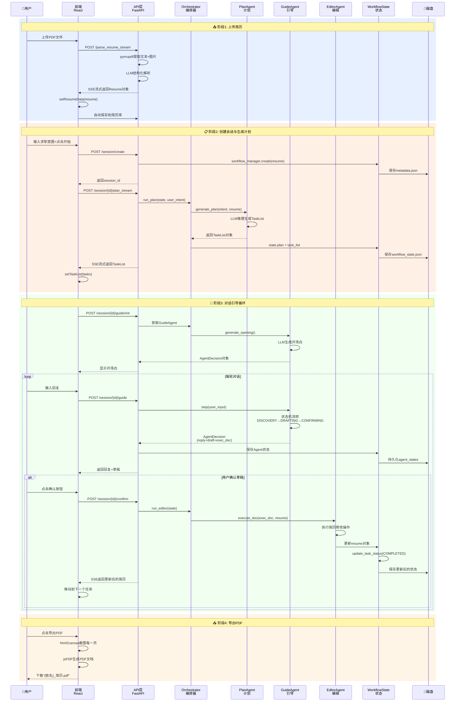
```mermaid
sequenceDiagram
    participant U as 👤用户
    participant FE as 前端<br/>React
    participant API as API层<br/>FastAPI
    participant Orch as Orchestrator<br/>编排器
    participant Plan as PlanAgent<br/>计划
    participant Guide as GuideAgent<br/>引导
    participant Editor as EditorAgent<br/>编辑
    participant State as WorkflowState<br/>状态
    participant Disk as 💾磁盘

    rect rgb(230, 240, 255)
    Note over U,Disk: 📤 阶段1: 上传简历
    U->>FE: 上传PDF文件
    FE->>API: POST /parse_resume_stream
    API->>API: pymupdf提取文本+图片
    API->>API: LLM结构化解析
    API-->>FE: SSE流式返回Resume对象
    FE->>FE: setResumeData(resume)
    FE->>API: 自动保存到简历库
    end

    rect rgb(255, 240, 230)
    Note over U,Disk: 📋 阶段2: 创建会话与生成计划
    U->>FE: 输入求职意图+点击开始
    FE->>API: POST /session/create
    API->>State: workflow_manager.create(resume)
    State->>Disk: 保存metadata.json
    API-->>FE: 返回session_id
    
    FE->>API: POST /session/{id}/plan_stream
    API->>Orch: run_plan(state, user_intent)
    Orch->>Plan: generate_plan(intent, resume)
    Plan->>Plan: LLM推理生成TaskList
    Plan-->>Orch: 返回TaskList对象
    Orch->>State: state.plan = task_list
    State->>Disk: 保存workflow_state.json
    API-->>FE: SSE流式返回TaskList
    FE->>FE: setTaskList(tasks)
    end

    rect rgb(240, 255, 240)
    Note over U,Disk: 💬 阶段3: 对话引导循环
    FE->>API: POST /session/{id}/guide/init
    API->>Orch: 获取GuideAgent
    Orch->>Guide: generate_opening()
    Guide->>Guide: LLM生成开场白
    Guide-->>API: AgentDecision对象
    API-->>FE: 显示开场白
    
    loop 每轮对话
        U->>FE: 输入回复
        FE->>API: POST /session/{id}/guide
        API->>Guide: step(user_input)
        Guide->>Guide: 状态机流转<br/>DISCOVERY→DRAFTING→CONFIRMING
        Guide-->>API: AgentDecision<br/>(reply+draft+exec_doc)
        API->>State: 保存Agent状态
        State->>Disk: 持久化agent_states
        API-->>FE: 返回回复+草稿
        
        alt 用户确认草稿
            U->>FE: 点击确认按钮
            FE->>API: POST /session/{id}/confirm
            API->>Orch: run_editor(state)
            Orch->>Editor: execute_doc(exec_doc, resume)
            Editor->>Editor: 执行简历修改操作
            Editor->>State: 更新resume对象
            State->>State: update_task_status(COMPLETED)
            State->>Disk: 保存更新后的状态
            API-->>FE: SSE返回更新后的简历
            FE->>FE: 移动到下一个任务
        end
    end
    end

    rect rgb(255, 245, 230)
    Note over U,Disk: 📥 阶段4: 导出PDF
    U->>FE: 点击导出PDF
    FE->>FE: html2canvas截图每一页
    FE->>FE: jsPDF生成PDF文档
    FE-->>U: 下载"{姓名}_简历.pdf"
    end
```

### Agent 交互流程图

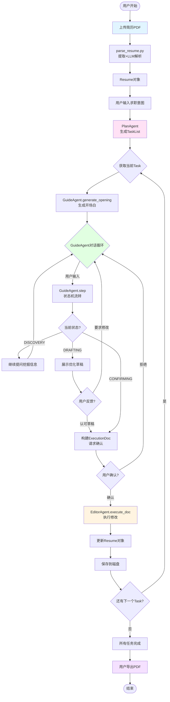
```mermaid
graph TD
    START([用户开始]) --> UPLOAD[上传简历PDF]
    UPLOAD --> PARSE[parse_resume.py<br/>提取+LLM解析]
    PARSE --> RESUME[Resume对象]
    
    RESUME --> INTENT[用户输入求职意图]
    INTENT --> PLAN[PlanAgent<br/>生成TaskList]
    
    PLAN --> TASK1{获取当前Task}
    
    TASK1 --> GUIDE_INIT[GuideAgent.generate_opening<br/>生成开场白]
    GUIDE_INIT --> GUIDE_LOOP{GuideAgent对话循环}
    
    GUIDE_LOOP -->|用户输入| GUIDE_STEP[GuideAgent.step<br/>状态机流转]
    GUIDE_STEP --> STATE_CHECK{当前状态?}
    
    STATE_CHECK -->|DISCOVERY| ASK[继续提问挖掘信息]
    ASK --> GUIDE_LOOP
    
    STATE_CHECK -->|DRAFTING| DRAFT[展示优化草稿]
    DRAFT --> USER_CHECK{用户反馈?}
    USER_CHECK -->|要求修改| GUIDE_LOOP
    USER_CHECK -->|认可草稿| CONFIRM
    
    STATE_CHECK -->|CONFIRMING| CONFIRM[构建ExecutionDoc<br/>请求确认]
    CONFIRM --> USER_CONFIRM{用户确认?}
    
    USER_CONFIRM -->|确认| EDITOR[EditorAgent.execute_doc<br/>执行修改]
    USER_CONFIRM -->|拒绝| GUIDE_LOOP
    
    EDITOR --> UPDATE[更新Resume对象]
    UPDATE --> SAVE[保存到磁盘]
    SAVE --> NEXT{还有下一个Task?}
    
    NEXT -->|是| TASK1
    NEXT -->|否| COMPLETE[所有任务完成]
    
    COMPLETE --> EXPORT[用户导出PDF]
    EXPORT --> END([结束])
    
    style UPLOAD fill:#e1f5ff
    style PLAN fill:#ffe1f5
    style GUIDE_LOOP fill:#e1ffe1
    style EDITOR fill:#fff4e1
    style EXPORT fill:#f5e1ff
```

### GuideAgent 状态机图

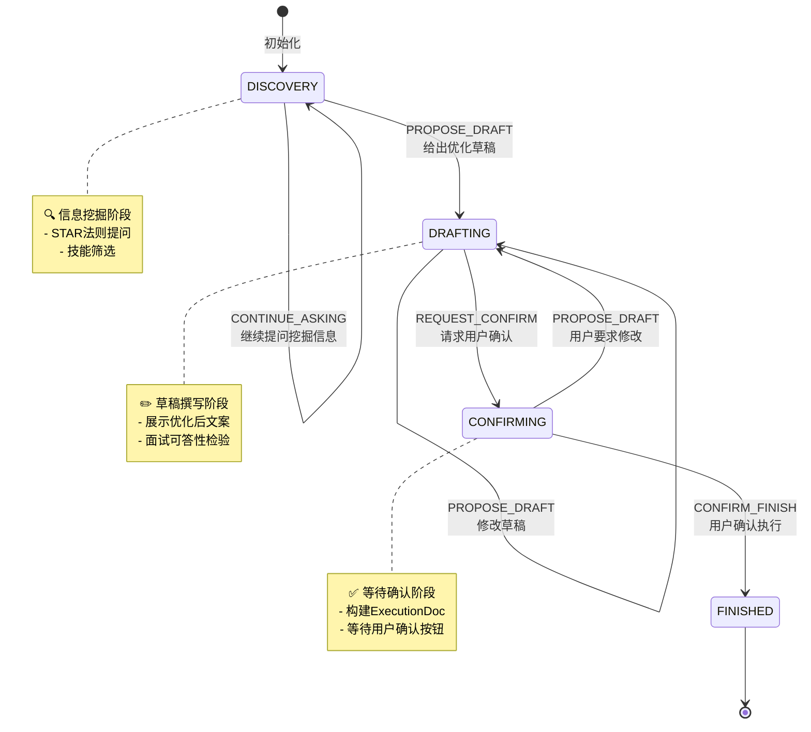
```mermaid
stateDiagram-v2
    [*] --> DISCOVERY: 初始化
    
    DISCOVERY --> DISCOVERY: CONTINUE_ASKING<br/>继续提问挖掘信息
    DISCOVERY --> DRAFTING: PROPOSE_DRAFT<br/>给出优化草稿
    
    DRAFTING --> DRAFTING: PROPOSE_DRAFT<br/>修改草稿
    DRAFTING --> CONFIRMING: REQUEST_CONFIRM<br/>请求用户确认
    
    CONFIRMING --> DRAFTING: PROPOSE_DRAFT<br/>用户要求修改
    CONFIRMING --> FINISHED: CONFIRM_FINISH<br/>用户确认执行
    
    FINISHED --> [*]
    
    note right of DISCOVERY
        🔍 信息挖掘阶段
        - STAR法则提问
        - 技能筛选
    end note
    
    note right of DRAFTING
        ✏️ 草稿撰写阶段
        - 展示优化后文案
        - 面试可答性检验
    end note
    
    note right of CONFIRMING
        ✅ 等待确认阶段
        - 构建ExecutionDoc
        - 等待用户确认按钮
    end note
```

### 文字版完整用户旅程

```
┌─────────────────────────────────────────────────────────────────────┐
│ 阶段 1: 简历上传与解析                                                │
└─────────────────────────────────────────────────────────────────────┘
用户上传 PDF
    ↓
[LandingPage.tsx] handleFileUpload()
    ↓
POST /parse_resume_stream  (SSE 流式)
    ↓
[parse_resume.py] parse_resume_with_progress()
    │
    ├─> 阶段反馈: "reading" → "converting" → "analyzing"
    │
    ├─> pymupdf 提取文本 + 图片
    ├─> LLM (DeepSeek-V3.2) 结构化解析
    │
    └─> Resume 对象（Pydantic 模型）
    ↓
前端接收 Resume → setResumeData()
自动保存到 resume_storage（独立简历库）

┌─────────────────────────────────────────────────────────────────────┐
│ 阶段 2: 会话创建与任务规划                                            │
└─────────────────────────────────────────────────────────────────────┘
用户点击"开始优化" + 输入求职意图（JD）
    ↓
[App.tsx] handleStart() → 进入 workspace
    ↓
[ChatPanel.tsx] useEffect 检测到 sessionId == null
    ↓
POST /session/create  (创建会话)
    ├─> [api.py] create_session()
    ├─> workflow_manager.create(resume)
    ├─> 生成 session_id (UUID)
    ├─> 创建 SessionMetadata（默认值）
    └─> 保存到磁盘: storage/sessions/{id}/metadata.json + workflow_state.json
    ↓
前端接收 session_id → setSessionId()
    ↓
POST /session/{id}/plan_stream  (SSE 流式生成计划)
    ├─> [api.py] generate_plan_stream()
    ├─> [orchestrator.py] run_plan(state, user_intent)
    │       ↓
    │   [plan_agent.py] PlanAgent.generate_plan_with_progress()
    │       ├─> 后台线程: LLM 推理（System Prompt + Resume + Intent）
    │       ├─> 主线程: 伪进度反馈（0% → 15% → 35% → ... → 100%）
    │       │
    │       └─> TaskList 对象（包含 N 个 Task）
    │           每个 Task 包含:
    │           - id, section, strategy (STAR_STORYTELLING / KEYWORD_FILTER)
    │           - original_text, diagnosis, goal
    │
    └─> [workflow_state.py] state.plan = task_list
        state.current_stage = GUIDING
        ↓
    保存到磁盘: workflow_state.json 更新
    提取元数据: [session_utils.py] extract_session_metadata()
    更新 metadata.json（job_title, job_company, progress.total）
    ↓
前端接收 TaskList → setTaskList()
前端自动调用 POST /session/{id}/guide/init（生成任务开场白）

┌─────────────────────────────────────────────────────────────────────┐
│ 阶段 3: 引导对话与草稿生成（循环）                                     │
└─────────────────────────────────────────────────────────────────────┘
[每个 Task 的处理流程]

3.1 任务开场白
    POST /session/{id}/guide/init
    ↓
[api.py] guide_init()
    ↓
[orchestrator.py] 获取 guide agent（GuideAgentAdapter）
    ↓
[agent_adapters.py] GuideAgentAdapter.invoke_opening()
    ├─> 从 WorkflowState 获取 current_task
    ├─> 构建任务流转上下文（skipped_tasks, is_first_after_skip）
    ├─> 初始化 GuideAgent(task, context)
    │
    └─> [guide_agent.py] GuideAgent.generate_opening()
        ├─> 构建 System Prompt（根据 strategy）
        │   - STAR_STORYTELLING: 深挖模式（STAR 法则提问）
        │   - KEYWORD_FILTER: 快速筛选模式（技能删减）
        │
        ├─> 调用 LLM（触发消息: "请开始引导我优化这个部分"）
        │   返回 AgentDecision:
        │   - thought, next_action, reply_to_user, draft_content
        │
        └─> 更新内部状态:
            - self.messages.append({user, assistant})
            - self.current_state = DISCOVERY
    ↓
前端接收开场白 → 显示在对话框

3.2 用户回复循环
    用户输入 → POST /session/{id}/guide
    ↓
[api.py] guide_step(user_input)
    ├─> 从磁盘加载 WorkflowState（如果不在内存）
    ├─> 恢复 GuideAgent 状态（从 state.agent_states['guide']）
    │
    └─> [guide_agent.py] GuideAgent.step(user_input)
        │
        ├─> 状态机判断:
        │   ┌──────────────────────────────────────┐
        │   │ DISCOVERY (信息挖掘)                 │
        │   │   - LLM 基于 STAR/KEYWORD 策略提问   │
        │   │   - next_action: CONTINUE_ASKING     │
        │   │      或 PROPOSE_DRAFT                │
        │   └──────────────────────────────────────┘
        │           ↓
        │   ┌──────────────────────────────────────┐
        │   │ DRAFTING (草稿展示)                  │
        │   │   - 生成优化后的文案（draft_content）│
        │   │   - 附带"面试可答性检验"             │
        │   │   - next_action: PROPOSE_DRAFT       │
        │   │      或 REQUEST_CONFIRM               │
        │   └──────────────────────────────────────┘
        │           ↓
        │   ┌──────────────────────────────────────┐
        │   │ CONFIRMING (等待确认)                │
        │   │   - 构建 ExecutionDoc（操作指令）    │
        │   │   - 包含: operation, changes,        │
        │   │     section_title, item_id           │
        │   │   - next_action: CONFIRM_FINISH      │
        │   └──────────────────────────────────────┘
        │           ↓
        │   ┌──────────────────────────────────────┐
        │   │ FINISHED (任务完成)                  │
        │   └──────────────────────────────────────┘
        │
        ├─> 原子化更新状态:
        │   - self.messages.append()
        │   - self.draft = draft_content
        │   - self.execution_doc = _build_execution_doc()
        │   - self.current_state 流转
        │
        └─> 返回 AgentDecision
    ↓
[api.py] 处理 AgentDecision:
    - 如果 action == REQUEST_CONFIRM:
        state.current_stage = CONFIRMING
        state.current_exec_doc = decision.execution_doc
    - 保存 Agent 状态到 WorkflowState
    - 保存 WorkflowState 到磁盘
    ↓
前端接收:
    - reply_to_user → 显示在对话框
    - draft_content → 显示在草稿区域
    - is_confirming == true → 显示"确认"按钮

3.3 用户确认执行
    用户点击"确认" → POST /session/{id}/confirm
    ↓
[api.py] confirm_and_execute()
    ├─> 检查 state.current_exec_doc 是否存在
    │
    └─> [orchestrator.py] run_editor(state)
        ↓
    [agent_adapters.py] EditorAgentAdapter.stream()
        ↓
    [editor_agent.py] EditorAgent.execute_doc(exec_doc, resume)
        │
        ├─> 根据 operation 类型路由:
        │   ┌──────────────────────────────────────────────┐
        │   │ update_basics (基本信息)                     │
        │   │   → 直接调用 UpdateBasicsTool               │
        │   │   → resume.basics.{name, email, phone, ...} │
        │   └──────────────────────────────────────────────┘
        │   ┌──────────────────────────────────────────────┐
        │   │ update_experience (经历更新)                 │
        │   │   → 查找目标 section（精确/模糊匹配）       │
        │   │   → 定位目标 item（通过 item_id）           │
        │   │   → 解析 highlights（_parse_highlights）    │
        │   │   → 更新 item.highlights 列表               │
        │   └──────────────────────────────────────────────┘
        │   ┌──────────────────────────────────────────────┐
        │   │ update_generic (通用板块，如技能)           │
        │   │   → 检测是否是技能列表类型                  │
        │   │   → 解析技能列表（_parse_skill_list）       │
        │   │   → 替换 section.items                      │
        │   └──────────────────────────────────────────────┘
        │
        └─> 返回 updated_resume (通过 StopIteration.value)
    ↓
state.resume = updated_resume
state.update_task_status(task_id, COMPLETED)
state.current_exec_doc = None
    ↓
检查是否还有下一个任务:
    - 如果有 → state.move_to_next_task()
               清除 guide agent 状态
               current_stage = GUIDING
    - 如果没有 → current_stage = COMPLETED
    ↓
保存到磁盘: workflow_state.json, metadata.json（更新进度）
    ↓
前端接收:
    - 更新后的 resume → setResumeData()
    - 更新任务进度 → setCurrentTaskIdx()
    - 如果有下一个任务 → 自动调用 /guide/init 开始下一轮

┌─────────────────────────────────────────────────────────────────────┐
│ 阶段 4: 导出 PDF                                                     │
└─────────────────────────────────────────────────────────────────────┘
用户点击"导出 PDF"
    ↓
[ResumePreview.tsx] handleExport()
    ↓
[export.ts] exportToPDF(element, options)
    │
    ├─> 预处理: adjustContentForPDF()
    │   - 移除 Markdown 渲染容器样式干扰
    │   - 调整字体大小、行高、间距
    │   - 处理分页（page-break-inside: avoid）
    │
    ├─> html2canvas 渲染每一页
    │   - 逐页截图（避免跨页内容截断）
    │   - 配置: scale=2（高清）, useCORS=true
    │
    ├─> jsPDF 生成 PDF
    │   - A4 尺寸, portrait 模式
    │   - 将 canvas 图片插入 PDF 页面
    │   - 添加页眉/页脚（可选）
    │
    └─> 触发浏览器下载
        file_name: "{姓名}_简历.pdf"
```

---

## 关键类与接口

### 核心类关系图

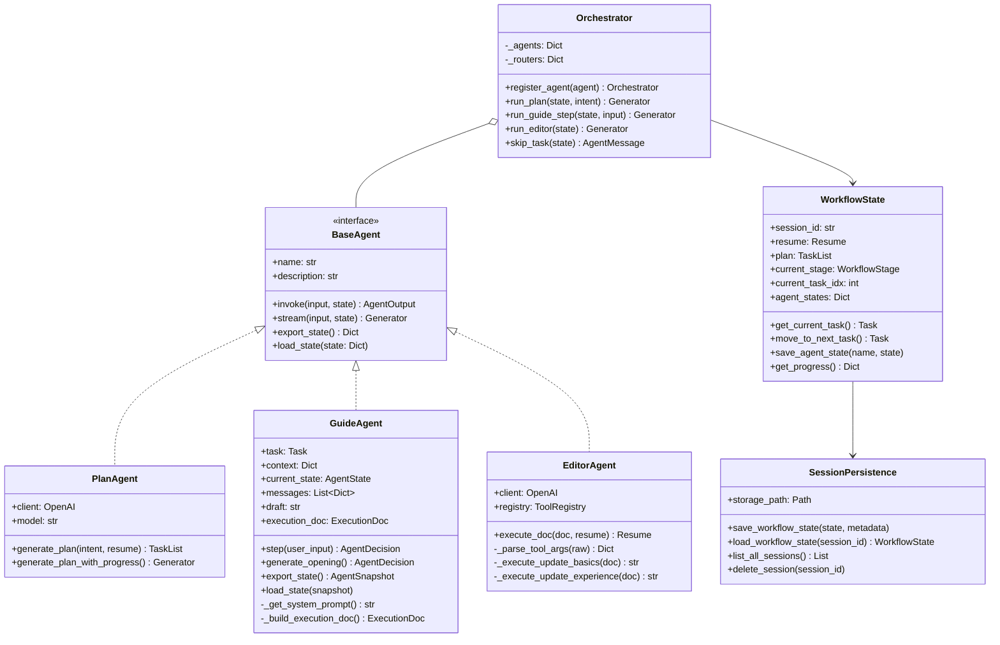
```mermaid
classDiagram
    class BaseAgent {
        <<interface>>
        +name: str
        +description: str
        +invoke(input, state) AgentOutput
        +stream(input, state) Generator
        +export_state() Dict
        +load_state(state: Dict)
    }
    
    class PlanAgent {
        +client: OpenAI
        +model: str
        +generate_plan(intent, resume) TaskList
        +generate_plan_with_progress() Generator
    }
    
    class GuideAgent {
        +task: Task
        +context: Dict
        +current_state: AgentState
        +messages: List~Dict~
        +draft: str
        +execution_doc: ExecutionDoc
        +step(user_input) AgentDecision
        +generate_opening() AgentDecision
        +export_state() AgentSnapshot
        +load_state(snapshot)
        -_get_system_prompt() str
        -_build_execution_doc() ExecutionDoc
    }
    
    class EditorAgent {
        +client: OpenAI
        +registry: ToolRegistry
        +execute_doc(doc, resume) Resume
        -_parse_tool_args(raw) Dict
        -_execute_update_basics(doc) str
        -_execute_update_experience(doc) str
    }
    
    class Orchestrator {
        -_agents: Dict
        -_routers: Dict
        +register_agent(agent) Orchestrator
        +run_plan(state, intent) Generator
        +run_guide_step(state, input) Generator
        +run_editor(state) Generator
        +skip_task(state) AgentMessage
    }
    
    class WorkflowState {
        +session_id: str
        +resume: Resume
        +plan: TaskList
        +current_stage: WorkflowStage
        +current_task_idx: int
        +agent_states: Dict
        +get_current_task() Task
        +move_to_next_task() Task
        +save_agent_state(name, state)
        +get_progress() Dict
    }
    
    class SessionPersistence {
        +storage_path: Path
        +save_workflow_state(state, metadata)
        +load_workflow_state(session_id) WorkflowState
        +list_all_sessions() List
        +delete_session(session_id)
    }
    
    BaseAgent <|.. PlanAgent
    BaseAgent <|.. GuideAgent
    BaseAgent <|.. EditorAgent
    
    Orchestrator o-- BaseAgent
    Orchestrator --> WorkflowState
    WorkflowState --> SessionPersistence
```

### 1. GuideAgent（guide_agent.py - 967 行）⭐

这是整个系统最复杂的类，负责通过多轮对话挖掘用户信息并生成优化草稿。

#### 核心属性
```python
class GuideAgent:
    task: Task                        # 当前处理的任务
    context: Dict[str, Any]           # 任务流转上下文（跳过的任务、进度等）
    current_state: AgentState         # 状态机当前状态（DISCOVERY/DRAFTING/CONFIRMING/FINISHED）
    messages: List[Dict]              # 完整的对话历史（用户+助手）
    draft: Optional[str]              # 当前持有的最新草稿
    execution_doc: Optional[ExecutionDoc]  # 待确认的执行文档
    client: OpenAI                    # LLM 客户端（SiliconFlow）
    model: str                        # "Pro/deepseek-ai/DeepSeek-V3.2"
```

#### 主要方法

##### 核心交互方法
- `__init__(task, context)` - 初始化 Agent，设置任务和上下文
- `step(user_input: str) -> AgentDecision` - 执行单步对话，驱动状态机流转
- `generate_opening() -> AgentDecision` - 生成任务开场白（无需用户输入）
- `run() -> Optional[str]` - CLI 模式的主循环（用于测试）

##### 状态管理方法
- `export_state() -> AgentSnapshot` - 导出当前运行时状态快照（用于持久化）
- `load_state(snapshot: AgentSnapshot)` - 从快照恢复状态（断点续传）
- `is_finished() -> bool` - 检查任务是否完成
- `is_confirming() -> bool` - 检查是否处于确认阶段
- `get_execution_doc() -> Optional[ExecutionDoc]` - 获取执行文档

##### Prompt 构建方法（私有）
- `_get_system_prompt() -> str` - 根据状态和策略动态构建 System Prompt（~600 行字符串）
- `_build_workflow_context() -> str` - 构建任务流转上下文信息（跳过任务感知）
- `_get_star_storytelling_first_message_instruction() -> str` - STAR 策略的首次对话指引
- `_get_keyword_filter_first_message_instruction() -> str` - KEYWORD 策略的首次对话指引
- `_get_star_storytelling_strategy() -> str` - STAR 策略的详细指导（~400 行）
- `_get_keyword_filter_strategy() -> str` - KEYWORD 策略的详细指导

##### 执行文档构建方法
- `_build_execution_doc() -> ExecutionDoc` - 根据草稿构建结构化的执行指令

---

### 2. 核心数据模型（model.py）

#### 数据模型关系图

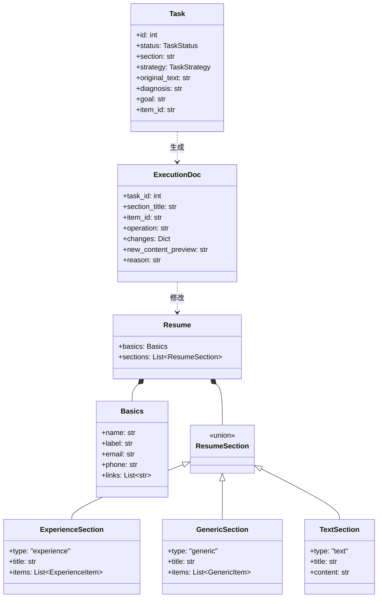
```mermaid
classDiagram
    class Resume {
        +basics: Basics
        +sections: List~ResumeSection~
    }
    
    class Basics {
        +name: str
        +label: str
        +email: str
        +phone: str
        +links: List~str~
    }
    
    class ResumeSection {
        <<union>>
    }
    
    class ExperienceSection {
        +type: "experience"
        +title: str
        +items: List~ExperienceItem~
    }
    
    class GenericSection {
        +type: "generic"
        +title: str
        +items: List~GenericItem~
    }
    
    class TextSection {
        +type: "text"
        +title: str
        +content: str
    }
    
    class Task {
        +id: int
        +status: TaskStatus
        +section: str
        +strategy: TaskStrategy
        +original_text: str
        +diagnosis: str
        +goal: str
        +item_id: str
    }
    
    class ExecutionDoc {
        +task_id: int
        +section_title: str
        +item_id: str
        +operation: str
        +changes: Dict
        +new_content_preview: str
        +reason: str
    }
    
    Resume *-- Basics
    Resume *-- ResumeSection
    ResumeSection <|-- ExperienceSection
    ResumeSection <|-- GenericSection
    ResumeSection <|-- TextSection
    
    Task ..> ExecutionDoc : 生成
    ExecutionDoc ..> Resume : 修改
```

---

## 持久化逻辑

### 双层架构设计

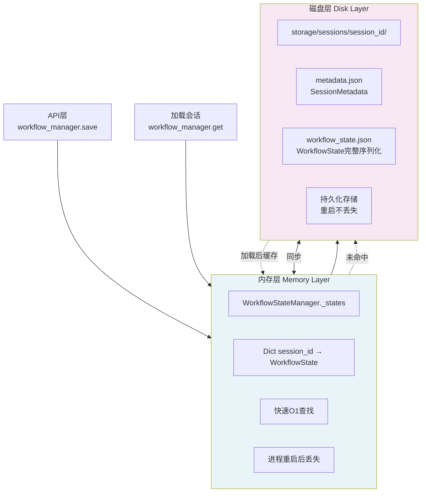
```mermaid
graph TB
    subgraph memory [内存层 Memory Layer]
        M1[WorkflowStateManager._states]
        M2[Dict session_id → WorkflowState]
        M3[快速O1查找]
        M4[进程重启后丢失]
    end
    
    subgraph disk [磁盘层 Disk Layer]
        D1[storage/sessions/session_id/]
        D2[metadata.json<br/>SessionMetadata]
        D3[workflow_state.json<br/>WorkflowState完整序列化]
        D4[持久化存储<br/>重启不丢失]
    end
    
    memory <-->|同步| disk
    
    API[API层<br/>workflow_manager.save] --> memory
    memory --> disk
    
    LOAD[加载会话<br/>workflow_manager.get] --> memory
    memory -.->|未命中| disk
    disk -.->|加载后缓存| memory
    
    style memory fill:#e8f4f8
    style disk fill:#f8e8f4
```

### 持久化时序图

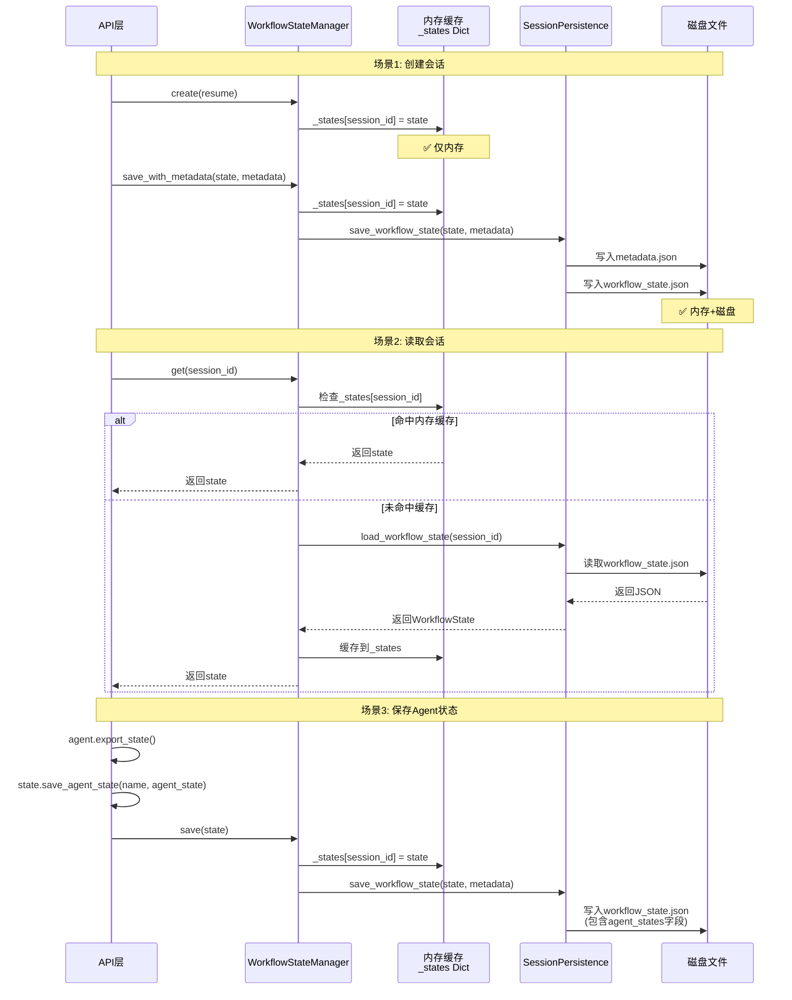
```mermaid
sequenceDiagram
    participant API as API层
    participant Manager as WorkflowStateManager
    participant Memory as 内存缓存<br/>_states Dict
    participant Persist as SessionPersistence
    participant Disk as 磁盘文件
    
    Note over API,Disk: 场景1: 创建会话
    API->>Manager: create(resume)
    Manager->>Memory: _states[session_id] = state
    Note over Memory: ✅ 仅内存
    API->>Manager: save_with_metadata(state, metadata)
    Manager->>Memory: _states[session_id] = state
    Manager->>Persist: save_workflow_state(state, metadata)
    Persist->>Disk: 写入metadata.json
    Persist->>Disk: 写入workflow_state.json
    Note over Disk: ✅ 内存+磁盘
    
    Note over API,Disk: 场景2: 读取会话
    API->>Manager: get(session_id)
    Manager->>Memory: 检查_states[session_id]
    alt 命中内存缓存
        Memory-->>Manager: 返回state
        Manager-->>API: 返回state
    else 未命中缓存
        Manager->>Persist: load_workflow_state(session_id)
        Persist->>Disk: 读取workflow_state.json
        Disk-->>Persist: 返回JSON
        Persist-->>Manager: 返回WorkflowState
        Manager->>Memory: 缓存到_states
        Manager-->>API: 返回state
    end
    
    Note over API,Disk: 场景3: 保存Agent状态
    API->>API: agent.export_state()
    API->>API: state.save_agent_state(name, agent_state)
    API->>Manager: save(state)
    Manager->>Memory: _states[session_id] = state
    Manager->>Persist: save_workflow_state(state, metadata)
    Persist->>Disk: 写入workflow_state.json<br/>(包含agent_states字段)
```

### 关键时机点

持久化操作在以下时机触发：

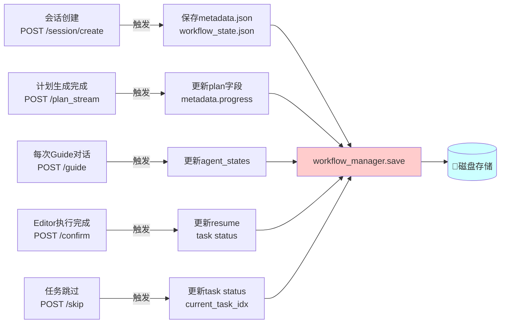
```mermaid
graph LR
    A[会话创建<br/>POST /session/create] -->|触发| P1[保存metadata.json<br/>workflow_state.json]
    B[计划生成完成<br/>POST /plan_stream] -->|触发| P2[更新plan字段<br/>metadata.progress]
    C[每次Guide对话<br/>POST /guide] -->|触发| P3[更新agent_states]
    D[Editor执行完成<br/>POST /confirm] -->|触发| P4[更新resume<br/>task status]
    E[任务跳过<br/>POST /skip] -->|触发| P5[更新task status<br/>current_task_idx]
    
    P1 --> SAVE[workflow_manager.save]
    P2 --> SAVE
    P3 --> SAVE
    P4 --> SAVE
    P5 --> SAVE
    
    SAVE --> DISK[(💾磁盘存储)]
    
    style SAVE fill:#ffcccc
    style DISK fill:#ccffff
```

### 数据一致性保证

⚠️ **手动同步依赖**：当前架构依赖开发者在关键操作后显式调用 `workflow_manager.save(state)`。如果忘记调用，会导致内存与磁盘不一致。

✅ **推荐做法**：在每个 API 端点的最后统一调用 `save()`，确保状态持久化。

---

## 已知风险点

### 风险点概览

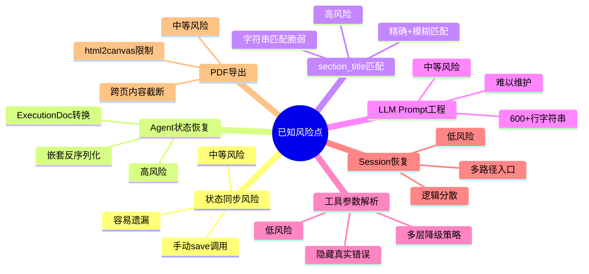
```mermaid
mindmap
    root((已知风险点))
        状态同步风险
            手动save调用
            容易遗漏
            中等风险
        Agent状态恢复
            嵌套反序列化
            ExecutionDoc转换
            高风险
        section_title匹配
            字符串匹配脆弱
            精确+模糊匹配
            高风险
        LLM Prompt工程
            600+行字符串
            难以维护
            中等风险
        工具参数解析
            多层降级策略
            隐藏真实错误
            低风险
        Session恢复
            多路径入口
            逻辑分散
            低风险
        PDF导出
            跨页内容截断
            html2canvas限制
            中等风险
```

### 1. 状态同步风险（中等）⚠️

**问题**：内存与磁盘的同步依赖手动调用 `workflow_manager.save()`，容易遗漏。

**脆弱代码**：
```python
# api.py -> guide_step()
output = agent.invoke(input, state)
state.save_agent_state(agent.name, agent.export_state())

# ❌ 如果此处忘记调用 save()，状态丢失
workflow_manager.save(state)  # 必须显式调用
```

**影响**：
- 进程重启后，未保存的状态丢失
- 用户刷新页面后，对话历史可能丢失

**建议**：
- 引入装饰器或中间件自动触发 `save()`
- 或者在 `WorkflowState` 上实现 `__setattr__` 钩子自动标记脏状态

---

### 2. Agent 状态恢复逻辑复杂（高）🔴

**问题**：`GuideAgent` 的状态恢复涉及多个嵌套对象（AgentSnapshot → ExecutionDoc），序列化/反序列化容易出错。

**脆弱代码**：
```python
# agent_adapters.py -> GuideAgentAdapter._load_from_dict()
def _load_from_dict(self, state: Dict[str, Any]) -> None:
    if not state or not self._agent:
        return
    
    # ⚠️ 嵌套反序列化
    exec_doc = None
    if state.get("execution_doc"):
        exec_doc = ExecutionDoc.model_validate(state["execution_doc"])
    
    snapshot = AgentSnapshot(
        current_state=GuideState(state.get("current_state", "DISCOVERY")),
        messages=state.get("messages", []),
        draft=state.get("draft"),
        execution_doc=exec_doc
    )
    self._agent.load_state(snapshot)
```

**影响**：
- 如果 `execution_doc` 字段变更，反序列化可能失败
- 调试困难（错误堆栈深）

**建议**：
- 增加版本号字段（如 `agent_state_version`）
- 提供迁移脚本处理旧版本数据

---

### 3. ExecutionDoc 的 section_title 匹配脆弱（高）🔴

**问题**：Editor Agent 根据 `section_title` 字符串查找目标 section，容易因标题不匹配导致失败。

**匹配流程图**：

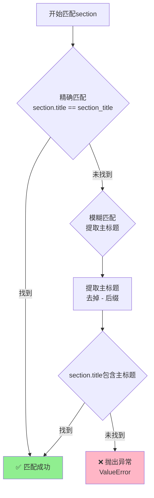
```mermaid
graph TD
    START[开始匹配section] --> EXACT{精确匹配<br/>section.title == section_title}
    
    EXACT -->|找到| SUCCESS[✅ 匹配成功]
    EXACT -->|未找到| FUZZY{模糊匹配<br/>提取主标题}
    
    FUZZY --> EXTRACT[提取主标题<br/>去掉 - 后缀]
    EXTRACT --> FUZZY_MATCH{section.title包含主标题}
    
    FUZZY_MATCH -->|找到| SUCCESS
    FUZZY_MATCH -->|未找到| FAIL[❌ 抛出异常<br/>ValueError]
    
    style SUCCESS fill:#90EE90
    style FAIL fill:#FFB6C6
```

**脆弱代码**：
```python
# editor_agent.py -> _execute_update_experience()
# 精确匹配
for section in self.resume.sections:
    if isinstance(section, ExperienceSection) and section.title == section_title:
        target_section = section
        break

# 模糊匹配（降级策略）
if not target_section:
    main_title = section_title.split(" - ")[0].strip()
    for section in self.resume.sections:
        if isinstance(section, ExperienceSection) and (section.title == main_title or main_title in section.title):
            target_section = section
            break

# ❌ 如果还是找不到，抛出异常
if not target_section:
    raise ValueError(f"未找到经历板块: {section_title}")
```

**影响**：
- 用户修改了 section title 后，ExecutionDoc 失效
- Plan Agent 生成的 section 名称与实际简历不一致

**建议**：
- 使用 `section_id` 替代 `section_title` 作为唯一标识
- 在 Plan Agent 生成 Task 时，记录 `section_id`

---

### 4. LLM Prompt 工程复杂（中等）⚠️

**问题**：`guide_agent.py` 中的 System Prompt 超过 600 行字符串拼接，难以维护和测试。

**Prompt结构图**：

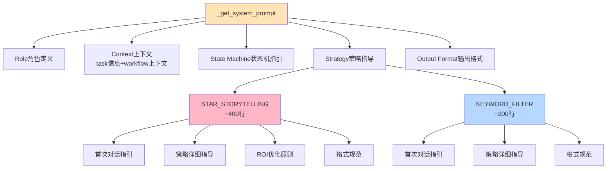
```mermaid
graph TD
    ROOT[_get_system_prompt]
    
    ROOT --> ROLE[Role角色定义]
    ROOT --> CONTEXT[Context上下文<br/>task信息+workflow上下文]
    ROOT --> STATE[State Machine状态机指引]
    ROOT --> STRATEGY[Strategy策略指导]
    ROOT --> SCHEMA[Output Format输出格式]
    
    STRATEGY --> STAR[STAR_STORYTELLING<br/>~400行]
    STRATEGY --> KEYWORD[KEYWORD_FILTER<br/>~200行]
    
    STAR --> STAR_FIRST[首次对话指引]
    STAR --> STAR_STRATEGY[策略详细指导]
    STAR --> STAR_ROI[ROI优化原则]
    STAR --> STAR_FORMAT[格式规范]
    
    KEYWORD --> KEY_FIRST[首次对话指引]
    KEYWORD --> KEY_STRATEGY[策略详细指导]
    KEYWORD --> KEY_FORMAT[格式规范]
    
    style ROOT fill:#FFE4B5
    style STAR fill:#FFB6C6
    style KEYWORD fill:#B6D7FF
```

**影响**：
- 修改 Prompt 需要重启服务测试
- 难以版本控制和 A/B 测试
- 调试困难（LLM 输出不符合预期时，难以定位是哪段 Prompt 有问题）

**建议**：
- 将 Prompt 模板迁移到独立文件（如 `prompts/guide_agent/*.jinja2`）
- 使用 LangChain 的 PromptTemplate 管理
- 引入 Prompt 版本号和热更新机制

---

### 5. 工具框架的参数解析降级策略（低）

**问题**：Editor Agent 的工具参数解析有多层降级策略（JSON → ast.literal_eval → 原始字符串），可能隐藏真实错误。

**解析流程图**：

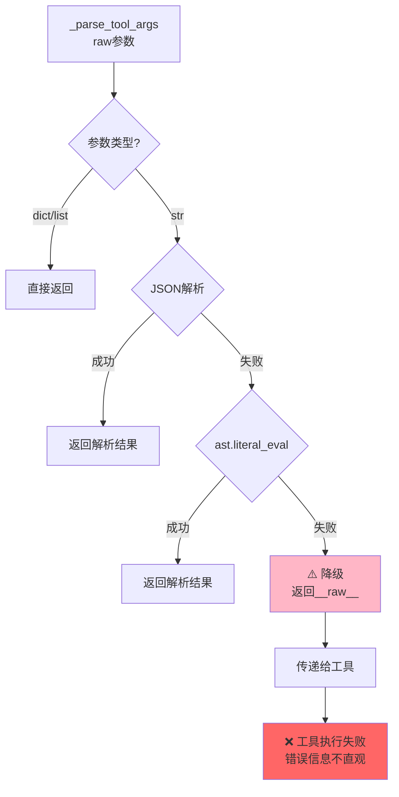
```mermaid
graph TD
    START[_parse_tool_args<br/>raw参数] --> CHECK{参数类型?}
    
    CHECK -->|dict/list| RETURN1[直接返回]
    CHECK -->|str| JSON{JSON解析}
    
    JSON -->|成功| RETURN2[返回解析结果]
    JSON -->|失败| AST{ast.literal_eval}
    
    AST -->|成功| RETURN3[返回解析结果]
    AST -->|失败| FALLBACK[⚠️ 降级<br/>返回__raw__]
    
    FALLBACK --> TOOL[传递给工具]
    TOOL --> ERROR[❌ 工具执行失败<br/>错误信息不直观]
    
    style FALLBACK fill:#FFB6C6
    style ERROR fill:#FF6666
```

**影响**：
- LLM 输出格式错误时，降级策略可能导致工具执行失败
- `{"__raw__": raw}` 传递给工具后，错误信息不直观

**建议**：
- 明确告知 LLM 参数格式要求（在工具 Schema 中加强约束）
- 参数解析失败后，直接返回错误给 LLM，触发重试

---

### 6. Session 恢复的多路径问题（低）

**问题**：Session 恢复有多个入口（启动时自动恢复、用户手动选择、API 加载），逻辑分散。

**恢复路径图**：

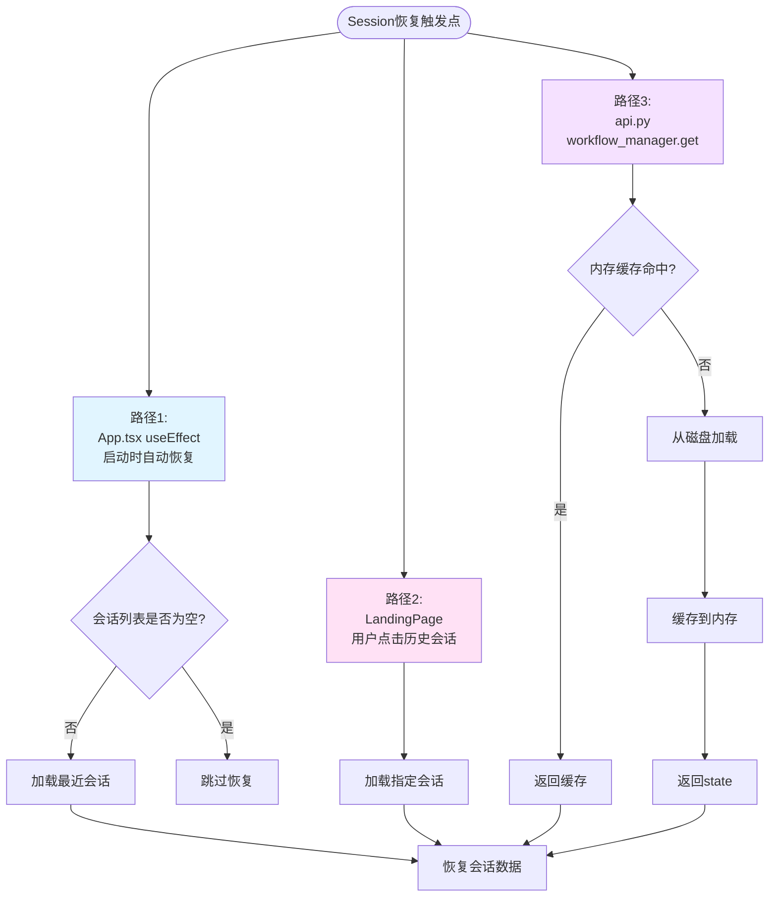
```mermaid
graph TD
    START([Session恢复触发点])
    
    START --> PATH1[路径1:<br/>App.tsx useEffect<br/>启动时自动恢复]
    START --> PATH2[路径2:<br/>LandingPage<br/>用户点击历史会话]
    START --> PATH3[路径3:<br/>api.py<br/>workflow_manager.get]
    
    PATH1 --> CHECK1{会话列表是否为空?}
    CHECK1 -->|否| LOAD1[加载最近会话]
    CHECK1 -->|是| SKIP1[跳过恢复]
    
    PATH2 --> LOAD2[加载指定会话]
    
    PATH3 --> MEMORY{内存缓存命中?}
    MEMORY -->|是| RETURN1[返回缓存]
    MEMORY -->|否| DISK[从磁盘加载]
    DISK --> CACHE[缓存到内存]
    CACHE --> RETURN2[返回state]
    
    LOAD1 --> RESULT[恢复会话数据]
    LOAD2 --> RESULT
    RETURN1 --> RESULT
    RETURN2 --> RESULT
    
    style PATH1 fill:#e1f5ff
    style PATH2 fill:#ffe1f5
    style PATH3 fill:#f5e1ff
```

**影响**：
- 恢复逻辑不一致，容易出现边界情况（如会话已删除）
- 调试困难（不清楚是哪个路径触发的恢复）

**建议**：
- 统一封装 `sessionManager.restoreSession(session_id)` 方法
- 在恢复前增加会话有效性检查（`session_exists()`）

---

### 7. PDF 导出的跨页内容截断（中等）⚠️

**问题**：html2pdf 使用 html2canvas 截图，可能导致跨页内容被截断（如长列表项）。

**导出流程图**：

```mermaid
graph TD
    START[用户点击导出PDF] --> PREPROCESS[adjustContentForPDF<br/>预处理样式]
    
    PREPROCESS --> CANVAS[html2canvas<br/>渲染截图]
    CANVAS --> ISSUE{跨页内容?}
    
    ISSUE -->|是|截断[⚠️ 内容被截断<br/>显示不完整]
    ISSUE -->|否| NORMAL[正常截图]
    
    截断 --> PDF[jsPDF生成PDF]
    NORMAL --> PDF
    
    PDF --> DOWNLOAD[浏览器下载]
    
    style截断 fill:#FFB6C6
    style NORMAL fill:#90EE90
```

**影响**：
- 用户导出的 PDF 中，某些内容可能只显示一半
- 简历排版错乱

**建议**：
- 在 CSS 中添加 `page-break-inside: avoid` 样式
- 或者使用 Puppeteer 后端渲染（更精确的分页控制）

---

## 架构设计理念

### 1. Orchestrator 模式

采用 **编排器（Orchestrator）** 统一管理 Agent 间的流转，避免 Agent 之间的直接耦合。

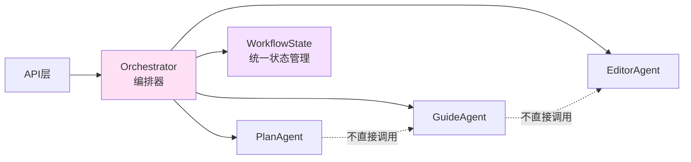
```mermaid
graph LR
    API[API层] --> Orch[Orchestrator<br/>编排器]
    
    Orch --> Plan[PlanAgent]
    Orch --> Guide[GuideAgent]
    Orch --> Editor[EditorAgent]
    
    Plan -.不直接调用.-> Guide
    Guide -.不直接调用.-> Editor
    
    Orch --> State[WorkflowState<br/>统一状态管理]
    
    style Orch fill:#ffe1f5
    style State fill:#f5e1ff
```

**优势**：
- 解耦 API 层与 Agent 层
- 便于扩展（增加新 Agent 只需注册到 Orchestrator）
- 未来可无缝迁移到 LangGraph

---

### 2. 适配器模式（Adapter Pattern）

使用 `AgentAdapter` 将现有 Agent 适配到 `BaseAgent` 接口，实现统一协议。

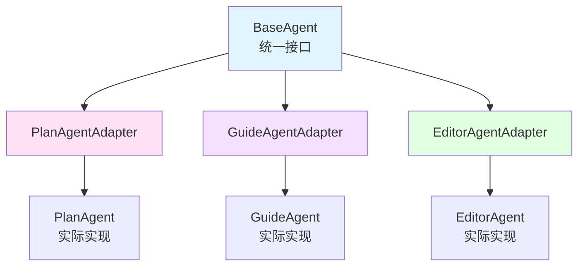
```mermaid
graph TB
    BaseAgent[BaseAgent<br/>统一接口]
    
    BaseAgent --> PlanAdapter[PlanAgentAdapter]
    BaseAgent --> GuideAdapter[GuideAgentAdapter]
    BaseAgent --> EditorAdapter[EditorAgentAdapter]
    
    PlanAdapter --> PlanImpl[PlanAgent<br/>实际实现]
    GuideAdapter --> GuideImpl[GuideAgent<br/>实际实现]
    EditorAdapter --> EditorImpl[EditorAgent<br/>实际实现]
    
    style BaseAgent fill:#e1f5ff
    style PlanAdapter fill:#ffe1f5
    style GuideAdapter fill:#f5e1ff
    style EditorAdapter fill:#e1ffe1
```

**优势**：
- 最小侵入：不改动原 Agent 代码
- 渐进迁移：逐步替换 Agent 实现
- 便于测试：Mock BaseAgent 即可

---

### 3. 状态机驱动（State Machine）

`GuideAgent` 采用显式状态机，确保流程可控。

（状态机图已在前文展示）

**优势**：
- 流程清晰：每个状态的职责明确
- 易于调试：打印 `current_state` 即可定位问题
- 可恢复：状态持久化后可断点续传

---

### 4. SSE 流式交互

前后端使用 **Server-Sent Events（SSE）** 实现实时流式推送。

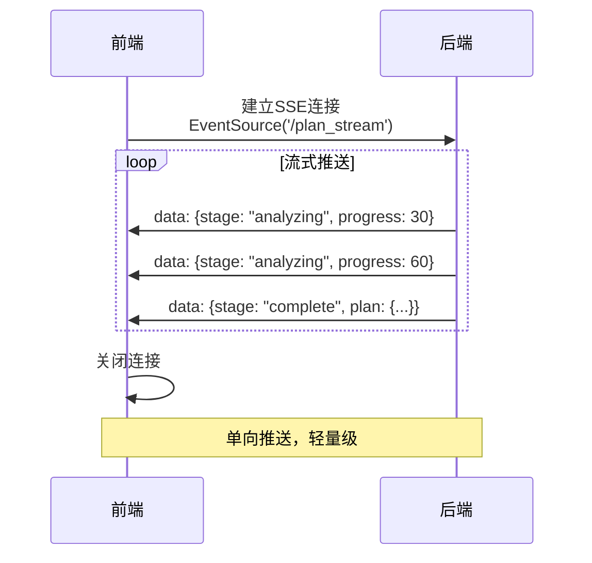
```mermaid
sequenceDiagram
    participant FE as 前端
    participant BE as 后端
    
    FE->>BE: 建立SSE连接<br/>EventSource('/plan_stream')
    
    loop 流式推送
        BE->>FE: data: {stage: "analyzing", progress: 30}
        BE->>FE: data: {stage: "analyzing", progress: 60}
        BE->>FE: data: {stage: "complete", plan: {...}}
    end
    
    FE->>FE: 关闭连接
    
    Note over FE,BE: 单向推送，轻量级
```

**优势**：
- 用户体验好：实时反馈进度
- 简单：比 WebSocket 更轻量
- 适合单向推送场景

---

### 5. Pydantic 模型驱动

所有数据结构（Resume、Task、WorkflowState）均使用 Pydantic 模型定义。

```mermaid
graph LR
    Model[Pydantic模型] --> Type[类型安全<br/>自动校验]
    Model --> Serialize[序列化友好<br/>model_dump]
    Model --> API[API友好<br/>OpenAPI Schema]
    Model --> Validate[数据验证<br/>model_validate]
    
    style Model fill:#e1f5ff
```

**优势**：
- 类型安全：自动校验和类型提示
- 序列化友好：`.model_dump()` / `.model_validate()`
- API 友好：FastAPI 自动生成 OpenAPI Schema

---

## 总结

### 核心特点总结

```mermaid
mindmap
    root((ResumeAssistant<br/>核心特点))
        三段式工作流
            Plan 诊断
            Guide 对话
            Editor 执行
        状态机驱动
            显式状态
            可恢复
            易调试
        双层持久化
            内存缓存
            磁盘存储
            断点续传
        解耦架构
            Orchestrator编排
            BaseAgent接口
            便于扩展
        LLM驱动
            DeepSeek-V3.2
            结构化输出
            策略化Prompt
```

ResumeAssistant 是一个基于 **多 Agent 协作** 的简历优化系统，核心设计特点：

1. **三段式工作流**：Plan（诊断）→ Guide（对话）→ Editor（执行）
2. **状态机驱动**：GuideAgent 采用显式状态机确保流程可控
3. **双层持久化**：内存缓存 + 磁盘存储，支持断点续传
4. **解耦架构**：Orchestrator 统一管理 Agent，便于扩展

**主要风险点**：
- 🔴 Agent 状态恢复逻辑复杂（高风险）
- 🔴 ExecutionDoc 的 section_title 匹配脆弱（高风险）
- ⚠️ 状态同步依赖手动调用（中等风险）
- ⚠️ LLM Prompt 工程复杂且难以维护（中等风险）

**未来优化方向**：
- 迁移到 LangGraph（利用其状态管理和检查点机制）
- 引入 Prompt 版本管理和热更新
- 使用 `section_id` 替代 `section_title` 作为标识符
- 后端 PDF 渲染（Puppeteer）替代前端 html2pdf

---

**文档版本**：v1.1（增强可视化版）  
**最后更新**：2025-01-03  
**维护者**：ResumeAssistant 开发团队

