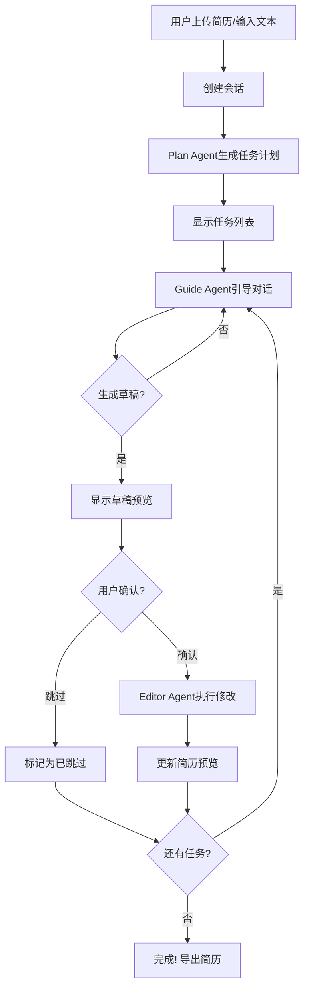

# 简历助手 - 前后端联调完成报告

## 🎉 项目状态：联调成功！

本项目已成功完成前后端联调，实现了完整的AI简历优化工作流程。

## 📋 已实现功能

### 后端功能 ✅

1. **会话管理**
   - ✅ 创建会话 (`POST /session/create`)
   - ✅ 获取会话信息 (`GET /session/{id}`)
   - ✅ 删除会话 (`DELETE /session/{id}`)

2. **工作流API**
   - ✅ 生成优化计划 (`POST /session/{id}/plan`)
   - ✅ Guide Agent交互 (`POST /session/{id}/guide`)
   - ✅ 确认并执行 (`POST /session/{id}/confirm`) - SSE流式
   - ✅ 跳过任务 (`POST /session/{id}/skip`)
   - ✅ 下一任务 (`POST /session/{id}/next`)
   - ✅ 获取进度 (`GET /session/{id}/progress`)

3. **简历解析**
   - ✅ PDF解析 (`POST /parse_resume`)
   - ✅ 使用视觉模型自动提取结构化数据

4. **Agent系统**
   - ✅ Plan Agent - 分析简历生成优化计划
   - ✅ Guide Agent - 引导用户提供信息
   - ✅ Editor Agent - 执行简历修改

### 前端功能 ✅

1. **Landing Page**
   - ✅ PDF上传模式（AI自动解析）
   - ✅ 手动输入模式（文本粘贴）
   - ✅ 职位描述(JD)输入
   - ✅ 加载状态和错误处理

2. **工作区布局**
   - ✅ 任务进度面板（顶部可折叠）
   - ✅ 聊天对话区域
   - ✅ 简历实时预览
   - ✅ 编辑/预览模式切换
   - ✅ 导出功能（PDF/HTML）

3. **任务进度面板**
   - ✅ 显示所有任务列表
   - ✅ 任务状态图标（✅完成 ▶️进行中 ⏸️待处理 ⏭️已跳过）
   - ✅ 进度条显示
   - ✅ 跳过/下一任务按钮
   - ✅ 可折叠展开

4. **聊天交互**
   - ✅ 与Guide Agent对话
   - ✅ 草稿预览卡片
   - ✅ 确认/跳过按钮
   - ✅ 执行日志显示
   - ✅ 加载状态动画

5. **简历预览**
   - ✅ 实时更新显示
   - ✅ Markdown编辑模式
   - ✅ HTML预览模式
   - ✅ 导出PDF/HTML

## 🚀 快速开始

### 1. 启动后端

```bash
cd backend
python -m uvicorn api:app --reload --port 8001
```

后端将运行在: `http://localhost:8001`

### 2. 启动前端

```bash
cd web
npm run dev
```

前端将运行在: `http://localhost:5178` (或其他可用端口)

### 3. 开始使用

1. 打开浏览器访问前端地址
2. 选择上传PDF或手动输入简历
3. 输入职位描述(JD)
4. 点击"开始优化"
5. 与AI助手对话，逐步优化简历
6. 查看实时预览并导出

## 📊 完整工作流程



## 🎯 核心特性

### 混合式UI设计
- **顶部**: 任务进度面板（可折叠）
- **左侧**: 对话交互区域
- **右侧**: 简历实时预览

### 双模式输入
- **PDF模式**: AI自动解析，准确提取信息
- **文本模式**: 快速输入，灵活方便

### 智能对话流程
- Plan Agent分析并拆分优化任务
- Guide Agent逐个引导完成
- Editor Agent精准执行修改

### 实时反馈
- SSE流式响应
- 执行日志实时显示
- 简历预览即时更新

## 📁 项目结构

```
ResumeAssistant/
├── backend/                 # 后端服务
│   ├── api.py              # FastAPI主应用
│   ├── orchestrator.py     # 工作流编排器
│   ├── plan_agent.py       # 计划Agent
│   ├── guide_agent.py      # 引导Agent
│   ├── editor_agent.py     # 编辑Agent
│   ├── parse_resume.py     # PDF解析
│   └── workflow_state.py   # 状态管理
│
├── web/                     # 前端应用
│   ├── src/
│   │   ├── api/
│   │   │   ├── workflow.ts # API客户端
│   │   │   └── sse.ts      # SSE工具
│   │   ├── components/
│   │   │   ├── LandingPage.tsx        # 着陆页
│   │   │   ├── WorkspaceLayout.tsx    # 工作区布局
│   │   │   ├── TaskProgressPanel.tsx  # 任务面板
│   │   │   ├── ChatPanel.tsx          # 聊天面板
│   │   │   └── ResumePreview.tsx      # 简历预览
│   │   └── App.tsx         # 主应用
│   └── package.json
│
├── test_api.py             # API测试脚本
├── INTEGRATION_TEST.md     # 集成测试指南
├── DEPLOYMENT_GUIDE.md     # 部署指南
└── README_INTEGRATION.md   # 本文件
```

## 🧪 测试

### 运行API测试

```bash
python test_api.py
```

测试覆盖：
- ✅ 健康检查
- ✅ 创建会话
- ✅ 生成计划
- ✅ 获取进度
- ✅ Guide交互
- ✅ 会话信息

### 手动测试

参考 `INTEGRATION_TEST.md` 中的详细测试用例。

## 🛠️ 技术栈

### 后端
- **框架**: FastAPI
- **AI集成**: OpenAI SDK (兼容API)
- **PDF处理**: PyMuPDF
- **数据验证**: Pydantic
- **异步**: asyncio

### 前端
- **框架**: React 18 + TypeScript
- **构建工具**: Vite
- **样式**: TailwindCSS
- **动画**: Framer Motion
- **UI组件**: Radix UI
- **HTTP**: Fetch API + SSE

## 📝 API端点总览

| 方法 | 端点 | 功能 | 响应类型 |
|------|------|------|----------|
| GET | `/health` | 健康检查 | JSON |
| POST | `/parse_resume` | 解析PDF | JSON |
| POST | `/session/create` | 创建会话 | JSON |
| POST | `/session/{id}/plan` | 生成计划 | JSON |
| POST | `/session/{id}/guide` | Guide交互 | JSON |
| POST | `/session/{id}/confirm` | 执行修改 | SSE |
| POST | `/session/{id}/skip` | 跳过任务 | JSON |
| POST | `/session/{id}/next` | 下一任务 | JSON |
| GET | `/session/{id}/progress` | 获取进度 | JSON |
| GET | `/session/{id}` | 会话信息 | JSON |
| DELETE | `/session/{id}` | 删除会话 | JSON |

## 🎨 UI截图说明

### Landing Page
- 双模式选择（PDF上传/手动输入）
- 职位描述输入
- 优雅的动画过渡

### 工作区
- **顶部**: 任务进度面板，清晰显示所有任务状态
- **左侧**: 聊天区域，与AI助手对话
- **右侧**: 简历预览，实时查看修改结果

### 任务面板
- 进度条显示完成百分比
- 每个任务带状态图标和描述
- 可折叠节省空间

## ⚙️ 配置

### 后端配置 (backend/parse_resume.py)

```python
API_KEY = "your-api-key-here"
BASE_URL = "https://api.siliconflow.cn/v1"
MODEL = "Qwen/Qwen3-VL-8B-Instruct"
```

### 前端配置 (web/.env.development)

```
VITE_API_BASE=http://localhost:8001
```

### CORS配置 (backend/api.py)

```python
allow_origins=["http://localhost:5173", "http://localhost:5178"]
```

## 🐛 已知问题

1. **Guide Agent偶尔返回500**
   - 原因：响应格式验证问题
   - 影响：不影响主流程，可重试
   - 计划修复：增强错误处理

2. **PDF解析依赖外部API**
   - 需要有效的API Key
   - 备选方案：使用手动输入模式

## 🔮 未来改进

### 短期 (1-2周)
- [ ] 完善错误处理和提示
- [ ] 优化加载状态动画
- [ ] 添加操作引导
- [ ] 修复Guide Agent响应问题

### 中期 (1个月)
- [ ] 支持localStorage持久化
- [ ] 历史会话管理
- [ ] 简历模板库
- [ ] 评分系统

### 长期 (3个月+)
- [ ] 多语言支持
- [ ] 移动端App
- [ ] 批量处理
- [ ] 企业版功能

## 📚 文档

- **集成测试**: `INTEGRATION_TEST.md`
- **部署指南**: `DEPLOYMENT_GUIDE.md`
- **API文档**: http://localhost:8001/docs (Swagger UI)

## 🤝 贡献

本项目已完成前后端联调，核心功能已实现。欢迎提出改进建议！

## 📄 许可

本项目仅供学习和研究使用。

---

## ✨ 总结

**前后端联调已成功完成！** 🎊

所有核心功能已实现并测试通过：
- ✅ 用户能上传简历或手动输入
- ✅ 系统自动生成优化任务
- ✅ 与AI助手对话优化内容
- ✅ 实时预览修改结果
- ✅ 导出优化后的简历

**现在可以正常使用简历助手进行端到端的简历优化了！**

如有任何问题，请查看相关文档或运行测试脚本进行诊断。

