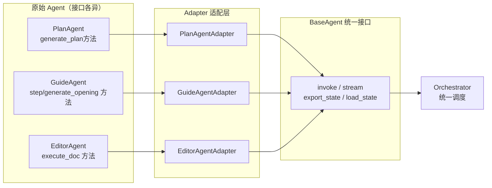
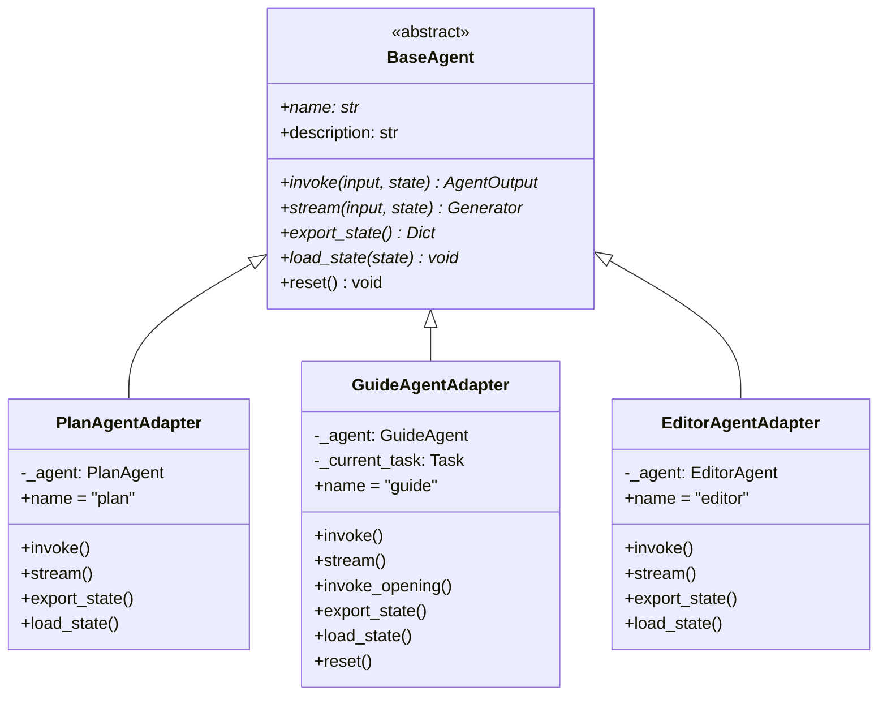
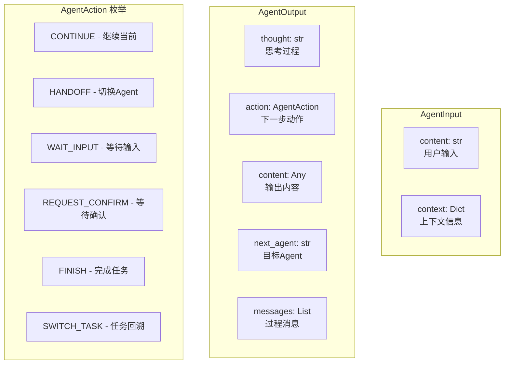
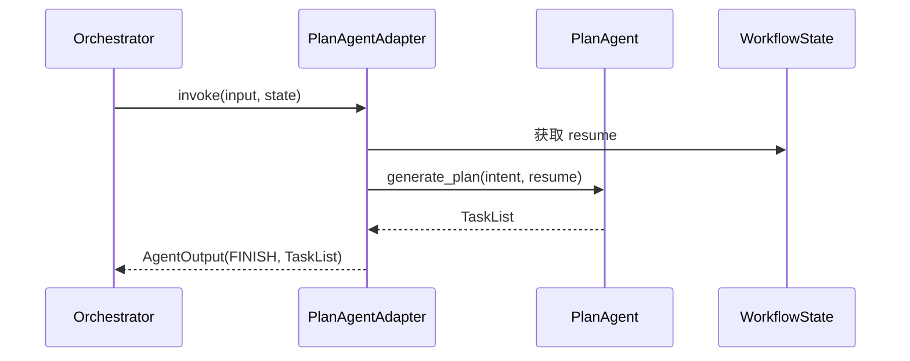
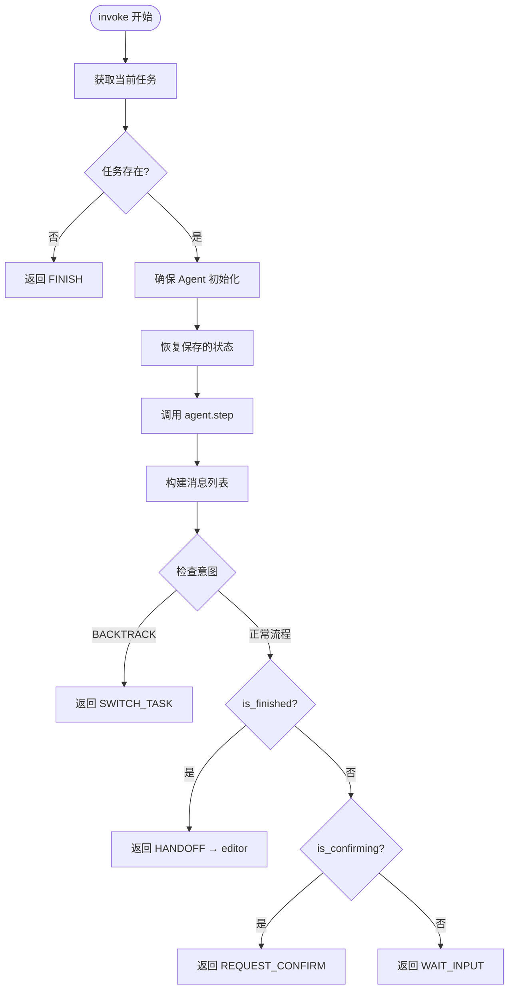
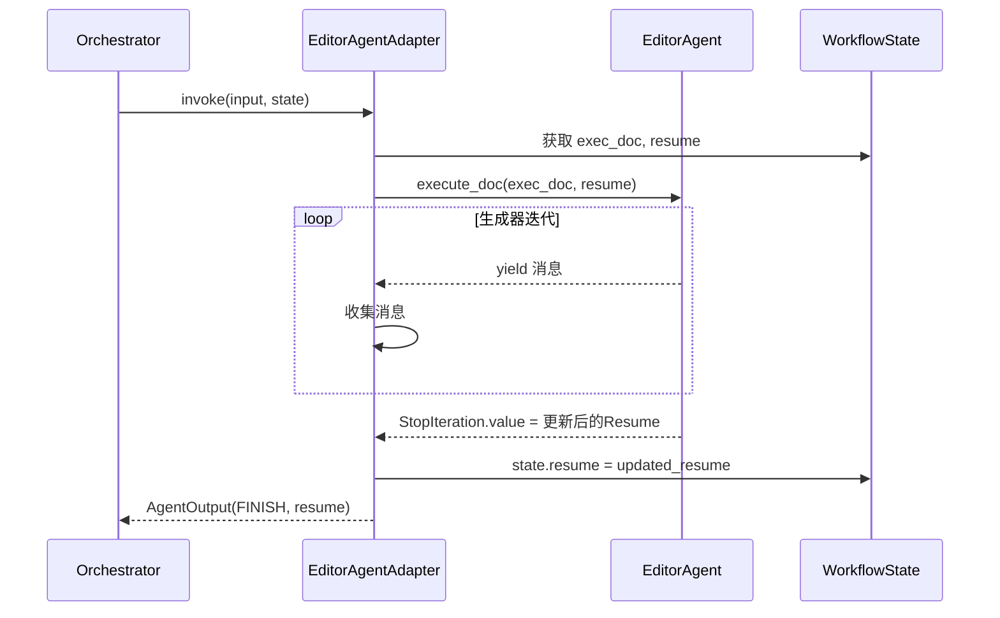
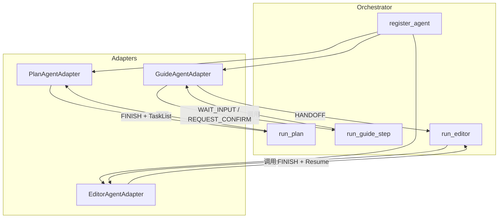
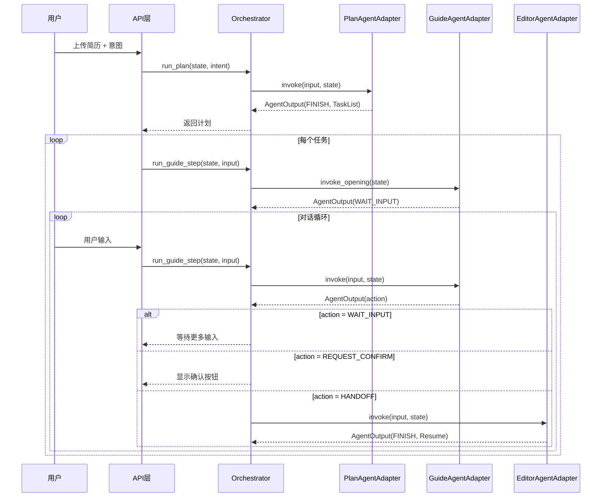
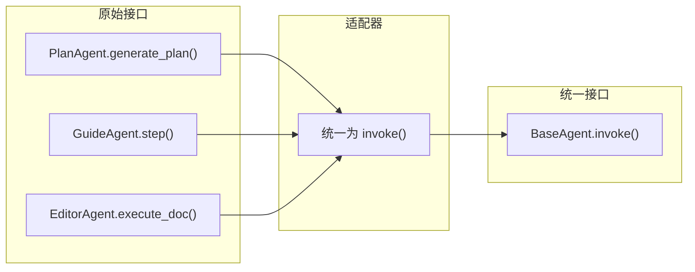
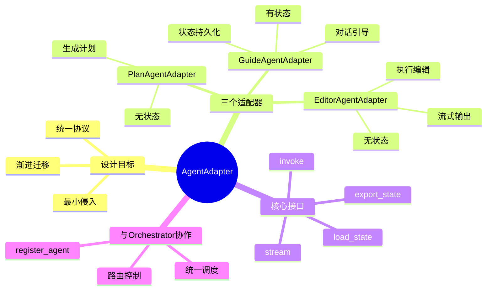

# AgentAdapter 深度解析

> 本文深入剖析 `agent_adapters.py` 中的适配器模式，解释如何将不同的 Agent 统一适配到 `BaseAgent` 接口，实现 Orchestrator 的统一调度。

---

## 1. 什么是 AgentAdapter？

**AgentAdapter（Agent 适配器）** 是一种**设计模式**，用于将现有的、接口不统一的 Agent 包装成统一的 `BaseAgent` 接口，使得 Orchestrator 可以用相同的方式调度不同的 Agent。



### 设计原则

项目文档定义了三大设计原则：

| 原则         | 说明                                                             |
| ------------ | ---------------------------------------------------------------- |
| **最小侵入** | 不改动原 Agent 逻辑，仅包装为统一接口                            |
| **统一协议** | 接入 `BaseAgent` / `AgentInput` / `AgentOutput` / `AgentMessage` |
| **渐进迁移** | 便于后续切换到 LangGraph 或替换 Agent 实现                       |

---

## 2. 核心组件

### 2.1 BaseAgent 抽象基类

所有适配器都继承自 `BaseAgent`，必须实现以下接口：



### 2.2 统一的数据结构



---

## 3. 三个适配器详解

### 3.1 PlanAgentAdapter

**职责**：简历诊断与计划生成

```python
# 源码位置：backend/agent_adapters.py 第29-100行

class PlanAgentAdapter(BaseAgent):
    def __init__(self):
        from plan_agent import PlanAgent
        self._agent = PlanAgent()  # 延迟导入避免循环依赖
    
    @property
    def name(self) -> str:
        return "plan"
    
    def invoke(self, input: AgentInput, state: WorkflowState) -> AgentOutput:
        user_intent = input.content
        resume = state.resume
        
        # 调用原有 PlanAgent 的方法
        task_list = self._agent.generate_plan(user_intent, resume)
        
        return AgentOutput(
            thought="已分析简历并生成修改计划",
            action=AgentAction.FINISH,
            content=task_list,
            messages=[...]
        )
```

**特点**：
- ✅ **无状态**：`export_state()` 返回空字典
- ✅ **不支持真正流式**：`stream()` 调用 `invoke()` 后包装
- ✅ **一次性执行**：调用后直接返回 `FINISH`



---

### 3.2 GuideAgentAdapter

**职责**：引导用户完善简历内容，生成草稿

```python
# 源码位置：backend/agent_adapters.py 第102-374行

class GuideAgentAdapter(BaseAgent):
    def __init__(self):
        self._agent = None  # 延迟初始化
        self._current_task: Optional[Task] = None
    
    @property
    def name(self) -> str:
        return "guide"
```

**核心方法剖析**：

#### 3.2.1 `_ensure_agent()` - 确保 Agent 已初始化

```python
def _ensure_agent(self, task: Task, state: WorkflowState):
    """确保 Agent 已初始化且任务匹配"""
    from guide_agent import GuideAgent
    
    # 只有在未初始化或任务变更时才重建
    if self._agent is None or self._current_task is None or self._current_task.id != task.id:
        context = self._build_context(state)
        self._agent = GuideAgent(task, context=context)
        self._current_task = task
```

#### 3.2.2 `_build_context()` - 构建上下文信息

```python
def _build_context(self, state: WorkflowState) -> Dict[str, Any]:
    """从 WorkflowState 构建任务流转上下文"""
    return {
        "skipped_tasks": [...],      # 已跳过的任务
        "completed_tasks": [...],    # 已完成的任务
        "progress": {...},           # 进度信息
        "is_first_after_skip": bool  # 是否跳过后首次对话
    }
```

#### 3.2.3 `invoke()` - 核心执行逻辑



**状态判断逻辑**（第210-253行）：

```python
# 1. 回溯意图
if decision.intent == "BACKTRACK" and decision.target_section:
    action = AgentAction.SWITCH_TASK
    target_section = decision.target_section
    
# 2. 用户已确认，准备移交 Editor
elif self._agent.is_finished():
    action = AgentAction.HANDOFF
    next_agent = "editor"
    content = self._agent.execution_doc
    
# 3. 等待用户确认草稿
elif self._agent.is_confirming():
    action = AgentAction.REQUEST_CONFIRM
    content = decision.execution_doc
    
# 4. 普通等待用户输入
else:
    action = AgentAction.WAIT_INPUT
    content = decision.reply_to_user
```

#### 3.2.4 `invoke_opening()` - 生成开场白

专用于任务开始时主动向用户展示诊断结果：

```python
def invoke_opening(self, state: WorkflowState) -> AgentOutput:
    """生成任务开场白（无需用户输入）"""
    task = state.get_current_task()
    self._ensure_agent(task, state)
    
    # 调用 generate_opening() 而非 step()
    decision = self._agent.generate_opening()
    
    return AgentOutput(
        action=AgentAction.WAIT_INPUT,  # 开场白后等待用户输入
        content=decision.reply_to_user,
        ...
    )
```

#### 3.2.5 状态持久化

```python
def export_state(self) -> Dict[str, Any]:
    """导出 Agent 状态"""
    if self._agent is None:
        return {}
    
    snapshot = self._agent.export_state()
    return {
        "current_state": snapshot.current_state.value,  # 状态机状态
        "messages": snapshot.messages,                   # 对话历史
        "draft": snapshot.draft,                         # 草稿内容
        "execution_doc": snapshot.execution_doc.model_dump() if ... else None,
        "task_id": self._current_task.id if ... else None
    }

def load_state(self, state: Dict[str, Any]) -> None:
    """恢复 Agent 状态"""
    self._load_from_dict(state)
```

---

### 3.3 EditorAgentAdapter

**职责**：执行简历编辑操作

```python
# 源码位置：backend/agent_adapters.py 第377-489行

class EditorAgentAdapter(BaseAgent):
    def __init__(self):
        from editor_agent import EditorAgent
        self._agent = EditorAgent()
    
    @property
    def name(self) -> str:
        return "editor"
```

**核心执行逻辑**：

```python
def invoke(self, input: AgentInput, state: WorkflowState) -> AgentOutput:
    exec_doc = state.current_exec_doc
    if not exec_doc:
        return AgentOutput(action=AgentAction.FINISH, ...)
    
    # 修复：正确捕获生成器返回值
    messages = []
    updated_resume = None
    
    gen = self._agent.execute_doc(exec_doc, state.resume)
    try:
        while True:
            msg = next(gen)
            messages.append(AgentMessage(...))
    except StopIteration as e:
        updated_resume = e.value  # 获取返回的 Resume
    
    # 更新 state 中的 resume
    if updated_resume:
        state.resume = updated_resume
    
    return AgentOutput(
        action=AgentAction.FINISH,
        content=state.resume,
        messages=messages
    )
```

> [!IMPORTANT]
> **生成器返回值捕获**：EditorAgent 的 `execute_doc()` 是一个生成器，其返回值需要通过 `StopIteration.value` 捕获，而非直接 `for` 循环遍历。



---

## 4. 适配器与 Orchestrator 的协作

### 4.1 注册 Agent

```python
from agent_adapters import (
    PlanAgentAdapter, 
    GuideAgentAdapter, 
    EditorAgentAdapter,
    create_default_orchestrator
)

# 方式1：手动注册
orchestrator = Orchestrator()
orchestrator.register_agent(PlanAgentAdapter())
orchestrator.register_agent(GuideAgentAdapter())
orchestrator.register_agent(EditorAgentAdapter())

# 方式2：使用工厂函数
orchestrator = create_default_orchestrator()
```

### 4.2 工作流程



### 4.3 完整工作流



---

## 5. 三个适配器对比

| 特性           | PlanAgentAdapter | GuideAgentAdapter  | EditorAgentAdapter |
| -------------- | ---------------- | ------------------ | ------------------ |
| **状态**       | 无状态           | 有状态（复杂）     | 无状态             |
| **延迟初始化** | 构造时初始化     | 调用时初始化       | 构造时初始化       |
| **流式支持**   | 伪流式           | 伪流式             | 真流式（生成器）   |
| **返回动作**   | 仅 `FINISH`      | 多种动作           | 仅 `FINISH`        |
| **特殊方法**   | -                | `invoke_opening()` | -                  |
| **状态持久化** | 空实现           | 完整实现           | 空实现             |

---

## 6. 代码亮点与设计模式

### 6.1 延迟导入（Lazy Import）

避免循环依赖：

```python
def __init__(self):
    from plan_agent import PlanAgent  # 在需要时才导入
    self._agent = PlanAgent()
```

### 6.2 延迟初始化（Lazy Initialization）

GuideAgentAdapter 只在需要时初始化：

```python
def __init__(self):
    self._agent = None  # 不立即创建
    self._current_task = None

def _ensure_agent(self, task, state):
    if self._agent is None or self._current_task.id != task.id:
        self._agent = GuideAgent(task, context=...)
```

### 6.3 适配器模式（Adapter Pattern）

将不同接口统一：



### 6.4 工厂函数（Factory Function）

提供便捷的创建方式：

```python
def create_default_orchestrator():
    """创建默认配置的编排器"""
    from orchestrator import Orchestrator
    
    orch = Orchestrator()
    orch.register_agent(PlanAgentAdapter())
    orch.register_agent(GuideAgentAdapter())
    orch.register_agent(EditorAgentAdapter())
    
    return orch
```

---

## 7. 总结



**核心价值**：

1. **解耦**：API 层不需要了解各 Agent 的具体实现
2. **统一**：Orchestrator 用相同方式调度所有 Agent
3. **可扩展**：新增 Agent 只需实现适配器即可接入
4. **可迁移**：未来切换到 LangGraph 只需修改适配器层
