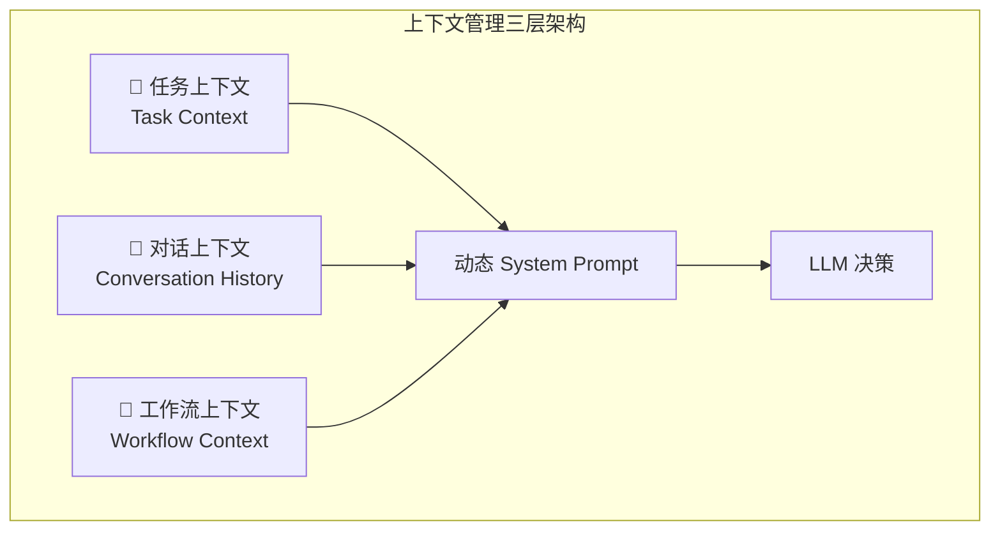
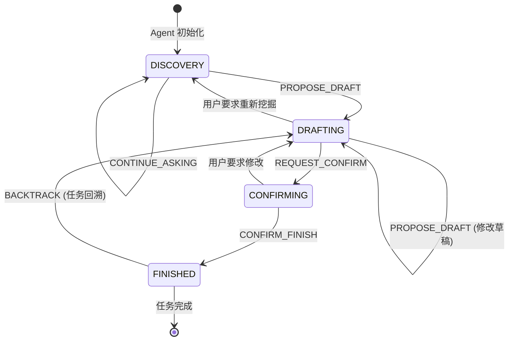
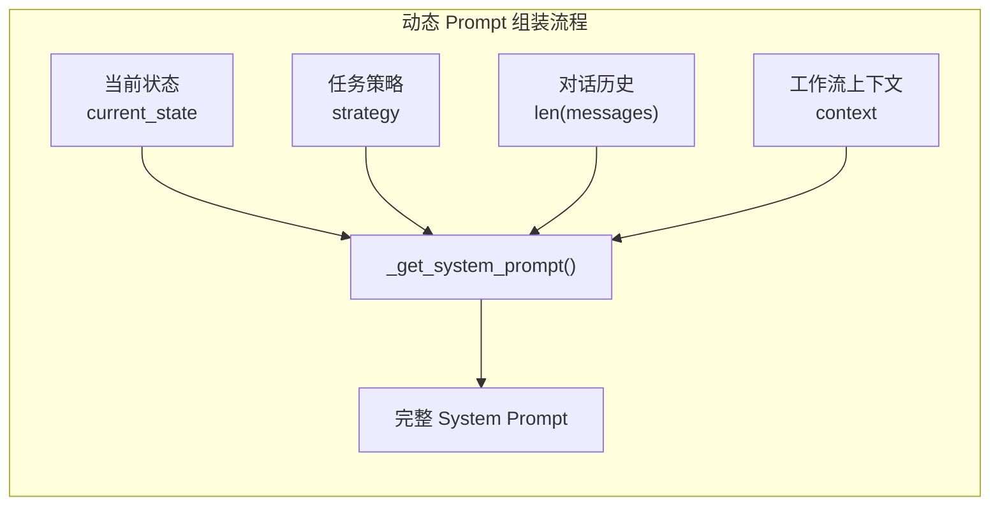
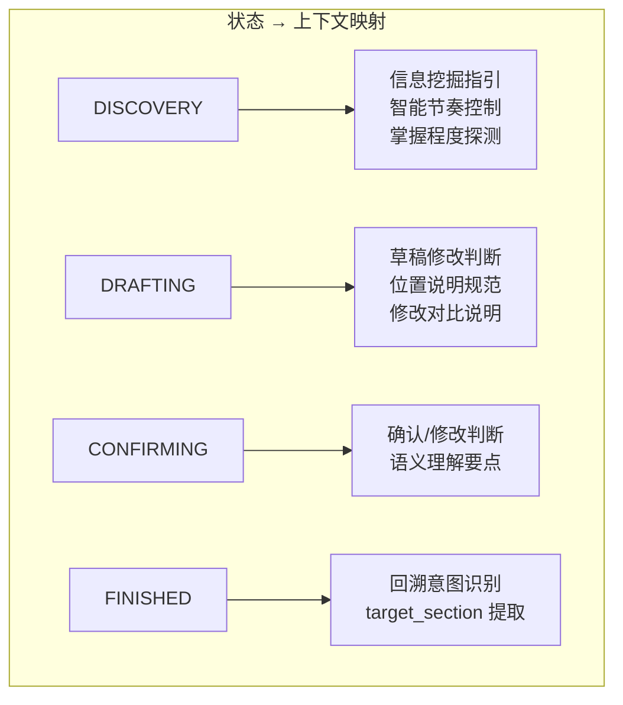
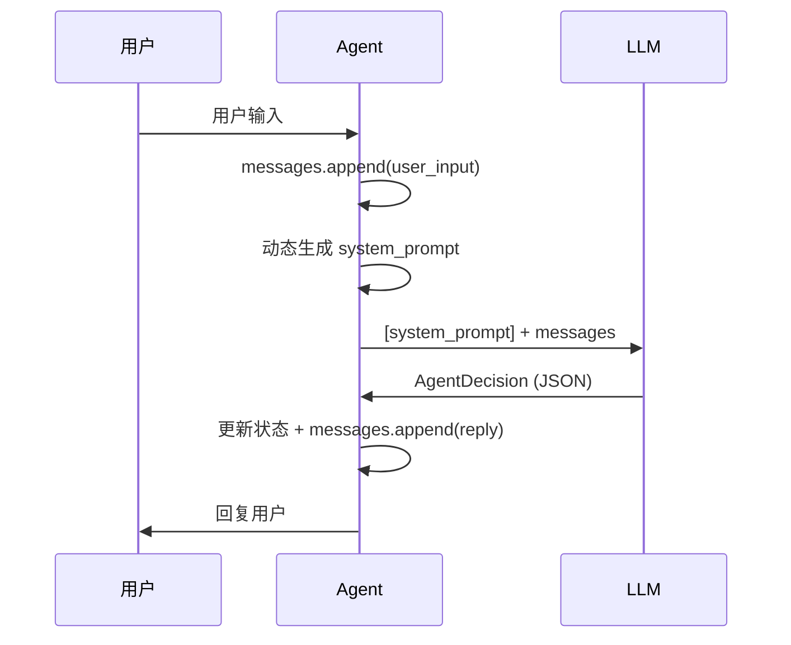
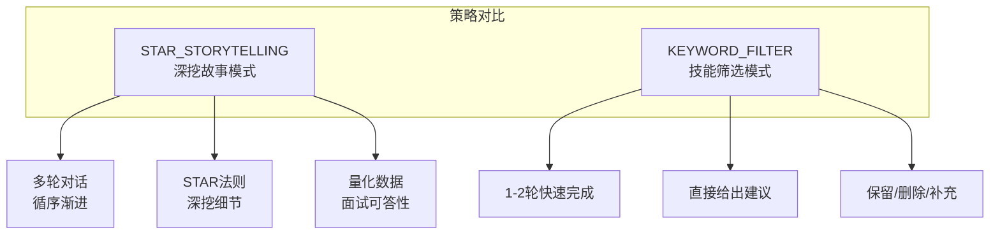
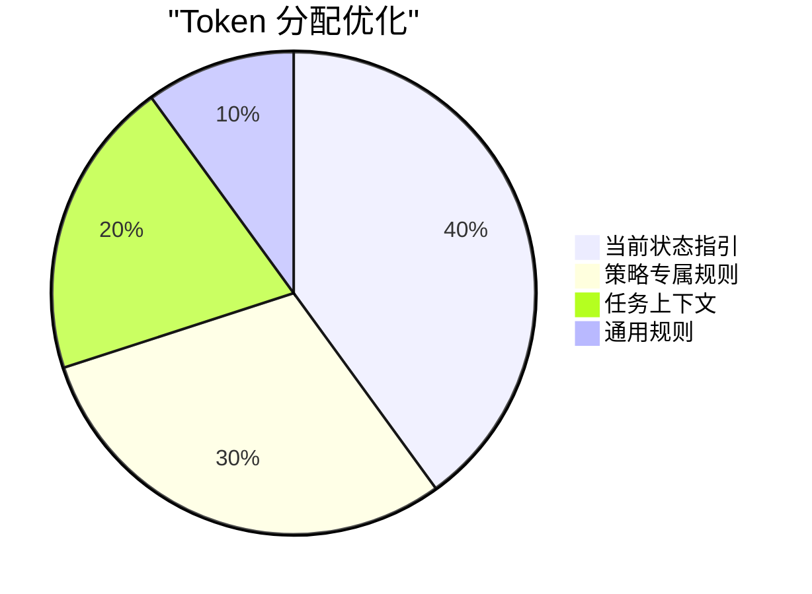
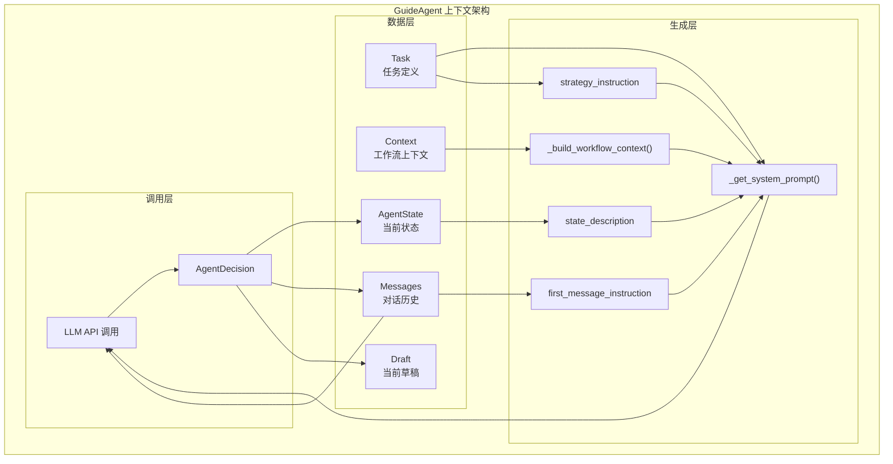

# GuideAgent 上下文管理机制深度解析

本文档详细分析 `guide_agent.py` 的上下文管理机制，包括其动态实现方式、设计目的及优势。

---

## 📌 核心概念总览

GuideAgent 是一个**状态机驱动的对话型 AI Agent**，其上下文管理的核心目标是：

> **让 LLM 在每一轮对话中都能获得精确、相关且动态更新的上下文信息，从而做出正确的决策。**



---

## 🔄 状态机驱动的上下文管理

### 状态流转图

GuideAgent 使用 4 个状态来管理对话流程，每个状态对应不同的上下文策略：



### 状态定义

| 状态 | 中文名 | 作用 | 上下文策略 |
|------|--------|------|------------|
| `DISCOVERY` | 信息挖掘 | 通过提问获取用户信息 | 强调探索性问题、掌握程度检测 |
| `DRAFTING` | 草稿撰写 | 展示和修改优化草稿 | 强调修改判断、草稿展示规范 |
| `CONFIRMING` | 等待确认 | 用户确认最终内容 | 强调确认/修改判断 |
| `FINISHED` | 任务完成 | 任务已执行完毕 | 支持回溯和后续反馈 |

---

## 🧠 动态 System Prompt 生成机制

### 核心方法：`_get_system_prompt()`

这是上下文管理的**核心入口点**，每次调用 LLM 时都会动态生成一个**全新的、针对当前状态定制的** System Prompt。



### Prompt 结构拆解

```python
def _get_system_prompt(self) -> str:
    return f"""
# Role
你是一位拥有15年经验的简历专家...

# Context                    ← 🔹 任务静态上下文
任务 ID: {self.task.id}
简历板块: {self.task.section}
任务策略: {strategy.value}
原始文本: "{self.task.original_text}"
诊断问题: "{self.task.diagnosis}"
优化目标: "{self.task.goal}"
{workflow_context}           ← 🔹 工作流动态上下文

# State Machine Instructions  ← 🔹 状态驱动的行为指引
{state_description}          ← 根据 current_state 动态生成
{first_message_instruction}  ← 仅首次对话时注入

# Output Format
{decision_schema}            ← JSON 输出格式约束

# Strategy Instructions       ← 🔹 策略驱动的详细指导
{strategy_instruction}       ← STAR_STORYTELLING 或 KEYWORD_FILTER

# Important Notes + 自检规则 + 回溯识别...
"""
```

---

## 📊 三种上下文类型详解

### 1️⃣ 任务上下文 (Task Context)

**来源**：`Task` 数据模型  
**特点**：任务生命周期内保持稳定

```python
class Task(BaseModel):
    id: int                    # 任务唯一标识
    section: str               # 简历板块（如"项目经历 - XX系统"）
    strategy: TaskStrategy     # 处理策略
    original_text: str         # 原始文本
    diagnosis: str             # 诊断问题
    goal: str                  # 优化目标
    item_id: Optional[str]     # 目标条目 ID
```

**注入位置**：System Prompt 的 `# Context` 部分

```
任务 ID: 1
简历板块: 项目经历 - 智能客服系统
任务策略: STAR_STORYTELLING
原始文本: "负责智能客服系统的后端开发..."
诊断问题: "描述过于简单，缺乏技术深度和量化数据。"
优化目标: "补充系统规模、性能指标、技术亮点等细节。"
```

---

### 2️⃣ 状态上下文 (State Context)

**来源**：`current_state` + 条件分支逻辑  
**特点**：随状态变化而动态切换



**代码实现**（简化）：

```python
if self.current_state == AgentState.DISCOVERY:
    if strategy == TaskStrategy.KEYWORD_FILTER:
        state_description = "当前状态: DISCOVERY (技能筛选分析)..."
    else:
        state_description = "当前状态: DISCOVERY (信息挖掘)..."
        
elif self.current_state == AgentState.DRAFTING:
    state_description = "当前状态: DRAFTING (草稿撰写)..."
    
elif self.current_state == AgentState.CONFIRMING:
    state_description = "当前状态: CONFIRMING (等待确认)..."
    
elif self.current_state == AgentState.FINISHED:
    state_description = "当前状态: FINISHED (任务已执行完成)..."
```

每个状态的上下文包含：
- **目标**：当前阶段的核心任务
- **约束**：需要遵守的规则
- **可选动作**：允许的 `next_action` 值
- **判断指引**：如何理解用户的回复

---

### 3️⃣ 工作流上下文 (Workflow Context)

**来源**：构造函数传入的 `context` 字典  
**特点**：跨任务的流程信息

```python
def __init__(self, task: Task, context: Optional[Dict[str, Any]] = None):
    self.context = context or {}  # 任务流转上下文
```

**`_build_workflow_context()` 方法注入的信息**：

```python
context = {
    "skipped_tasks": ["技能特长", "自我评价"],    # 用户跳过的任务
    "completed_tasks": ["教育背景 - 硕士"],       # 已完成的任务（支持回溯）
    "progress": {
        "total_tasks": 5,
        "completed_tasks": 2,
        "skipped_tasks": 1
    },
    "is_first_after_skip": True                  # 是否刚跳过任务
}
```

**生成的上下文示例**：

```
# 任务流转上下文
当前进度：已完成 2/5，已跳过 1/5

**已完成的任务（可回溯修改）**：
- 教育背景 - 硕士

用户在本次会话中跳过了以下任务：技能特长, 自我评价

⚠️ 用户刚刚跳过了上一个任务。这可能意味着：
- 用户觉得那个内容暂时不重要
- 用户没有相关信息可以补充
- 用户希望快速推进流程

请用轻松友好的语气开始当前任务，不要让用户感到压力。
```

---

## 🔁 对话历史管理

### 消息列表：`self.messages`

**结构**：标准的 OpenAI 格式

```python
self.messages: List[Dict] = [
    {"role": "user", "content": "请开始引导我优化这个部分。"},
    {"role": "assistant", "content": "我看了你的**项目经历**..."},
    {"role": "user", "content": "这是一个学习项目"},
    {"role": "assistant", "content": "好的，我理解了..."},
    # ...
]
```

### LLM 调用时的消息组装

```python
api_messages = [
    {"role": "system", "content": self._get_system_prompt()}  # 动态生成
] + self.messages  # 完整历史
```



---

## 💾 状态持久化与恢复

### 快照机制

GuideAgent 支持"断点续传"，通过 `AgentSnapshot` 保存完整运行时状态：

```python
class AgentSnapshot(BaseModel):
    current_state: AgentState       # 当前状态
    messages: List[dict]            # 完整对话历史
    draft: Optional[str]            # 当前草稿
    execution_doc: Optional[ExecutionDoc]  # 待确认的执行文档
```

### 导出与恢复

```python
# 导出状态（如用户关闭页面）
snapshot = agent.export_state()

# 恢复状态（用户返回）
new_agent = GuideAgent(task, context)
new_agent.load_state(snapshot)
```

---

## 🎯 策略驱动的上下文定制

GuideAgent 支持两种处理策略，每种策略有完全不同的上下文指导：



### 首次对话的策略差异

| 策略 | 开场方式 | 问题数量 | 对话轮次 |
|------|----------|----------|----------|
| STAR_STORYTELLING | 1句观察 + 1个问题 | 每轮只问1个 | 5+轮 |
| KEYWORD_FILTER | 直接展示分析结果 | 确认性问题 | 1-2轮 |

---

## ✅ 动态上下文的优势

### 1. 精确的状态感知

```
传统方式：固定 Prompt + 全部规则
→ LLM 需要自己判断当前处于哪个阶段

动态方式：根据 current_state 生成针对性 Prompt
→ LLM 只看到当前状态需要的规则和约束
→ 减少混淆，提高决策准确率
```

### 2. 高效的 Token 利用



- 只注入当前状态需要的规则
- 避免在 DISCOVERY 阶段加载 CONFIRMING 的规则
- 降低 Prompt 长度，节省成本

### 3. 灵活的策略切换

同一个 Agent 类可以处理不同类型的任务：

```python
# 项目经历 → 深挖模式
agent1 = GuideAgent(task_project)  # strategy=STAR_STORYTELLING

# 技能特长 → 筛选模式  
agent2 = GuideAgent(task_skills)   # strategy=KEYWORD_FILTER
```

### 4. 自然的对话体验

工作流上下文让 LLM 能够：
- 感知用户跳过了哪些任务（调整语气）
- 知道已完成哪些任务（支持回溯）
- 理解当前进度（过渡更自然）

---

## 📐 架构示意图



---

## 🔑 关键设计总结

| 设计要点 | 实现方式 | 效果 |
|----------|----------|------|
| 状态驱动 | `current_state` + 条件分支 | LLM 只关注当前阶段的任务 |
| 策略适配 | `TaskStrategy` 枚举 | 同一框架支持多种对话模式 |
| 动态 Prompt | 每次调用重新生成 | 上下文始终与当前状态一致 |
| 工作流感知 | `context` 字典传递 | 跨任务的进度和历史可见 |
| 状态持久化 | `AgentSnapshot` | 支持断点续传 |
| 回溯支持 | `intent: BACKTRACK` | 用户可修改已完成任务 |

---

## 📚 相关代码位置

| 功能 | 方法/属性 | 行号 |
|------|-----------|------|
| 动态 Prompt 生成 | `_get_system_prompt()` | 34-338 |
| 工作流上下文构建 | `_build_workflow_context()` | 340-385 |
| STAR策略首次指引 | `_get_star_storytelling_first_message_instruction()` | 387-492 |
| STAR策略详细指导 | `_get_star_storytelling_strategy()` | 590-1165 |
| KEYWORD策略首次指引 | `_get_keyword_filter_first_message_instruction()` | 494-588 |
| KEYWORD策略详细指导 | `_get_keyword_filter_strategy()` | 1167-1222 |
| 核心交互循环 | `step()` | 1224-1333 |
| 状态导出 | `export_state()` | 1458-1467 |
| 状态恢复 | `load_state()` | 1469-1477 |
