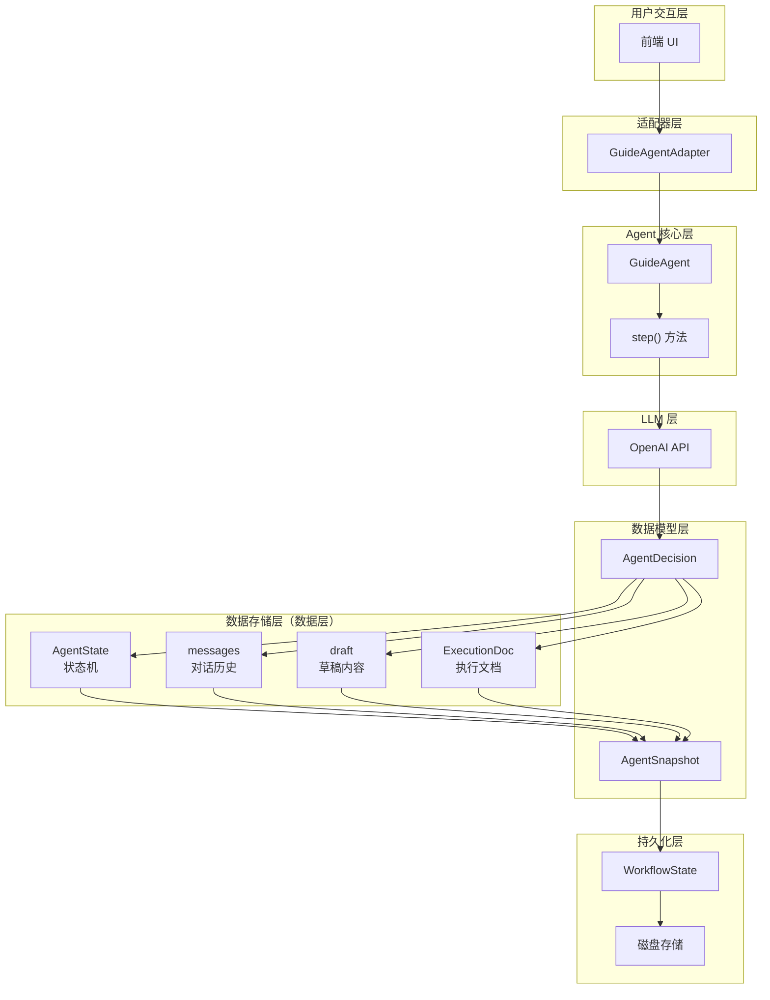
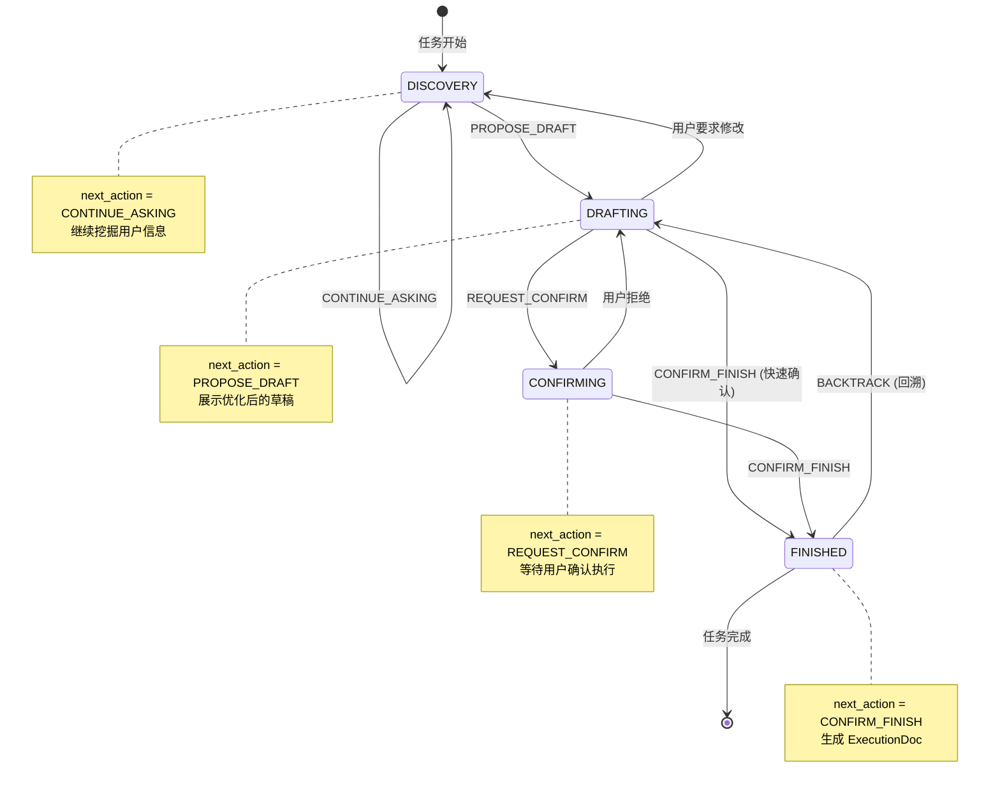
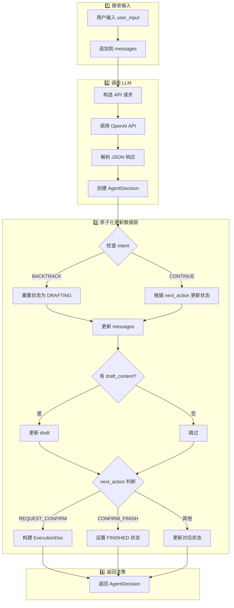
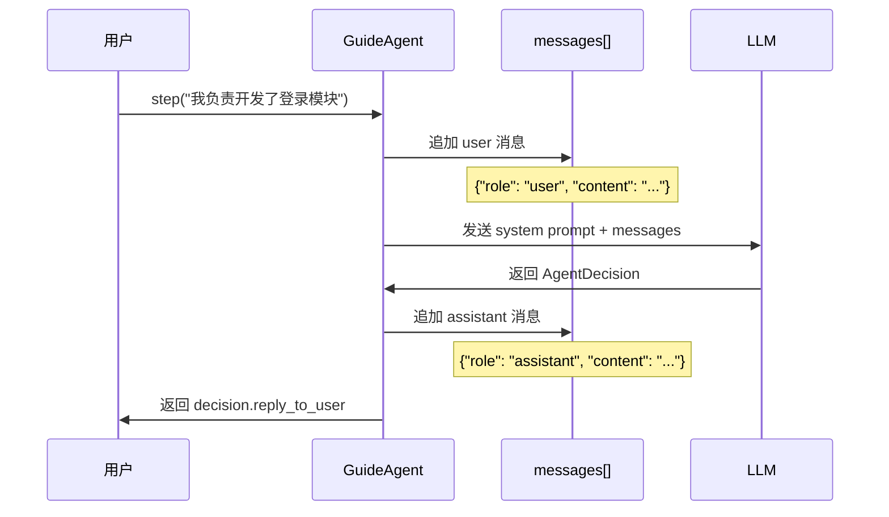
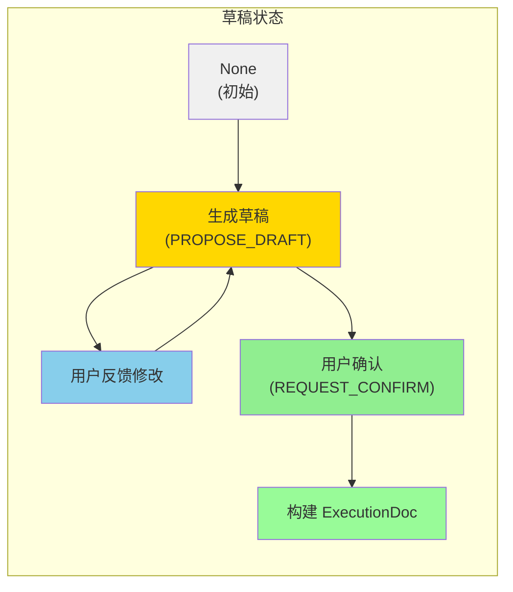
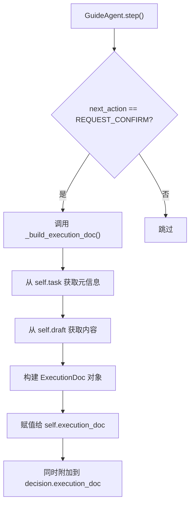
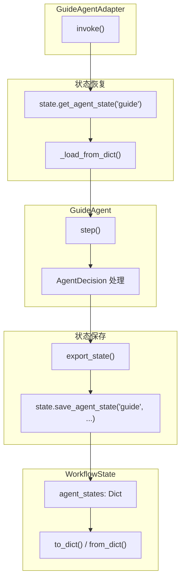
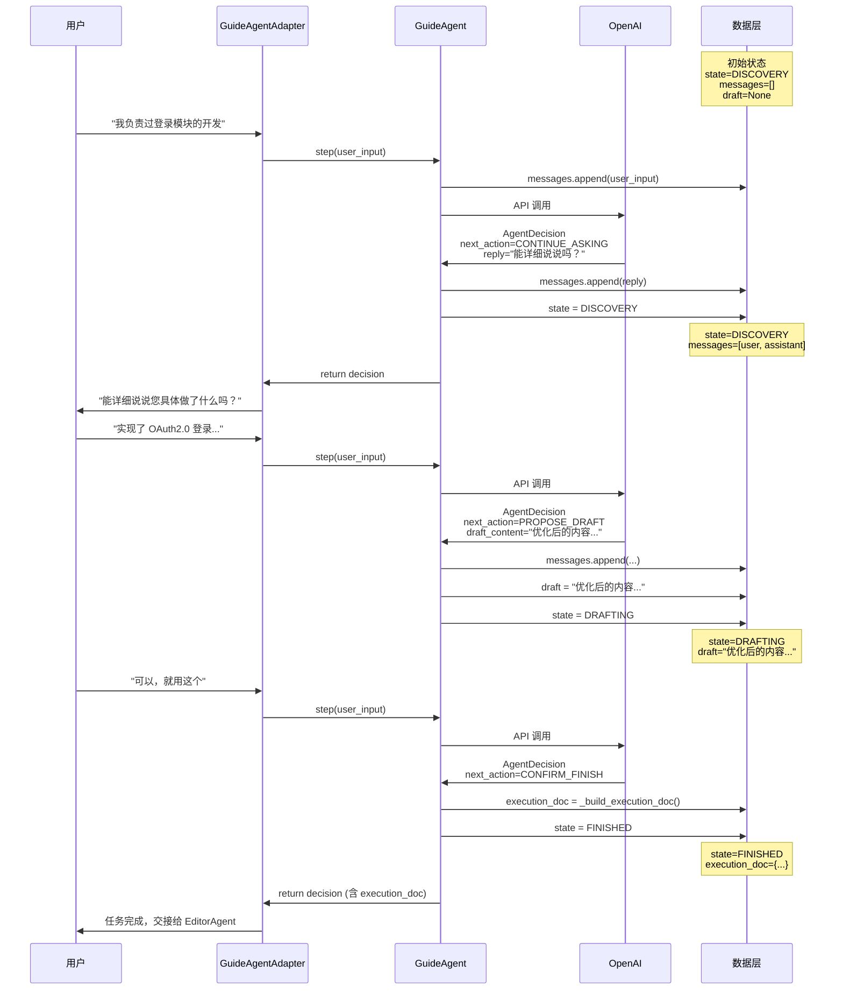

# AgentDecision 数据层操作详解

本文档详细讲解 `AgentDecision` 如何操作数据层，包括**控制状态（AgentState）**、**对话历史（messages）**、**草稿（draft）**以及**执行文档（ExecutionDoc）**的完整机制。

---

## 📊 整体架构概览



---

## 🧩 核心数据模型：AgentDecision

`AgentDecision` 是 LLM 返回的**结构化决策对象**，它决定了如何更新数据层的各个组件。

### 结构定义

```python
class AgentDecision(BaseModel):
    # 推理过程
    thought: str = Field(..., description="基于诊断和用户输入的推理过程")
    
    # 下一步动作（核心状态控制字段）
    next_action: Literal[
        "CONTINUE_ASKING",   # 继续提问
        "PROPOSE_DRAFT",     # 提出草稿
        "REQUEST_CONFIRM",   # 请求确认
        "CONFIRM_FINISH"     # 确认完成
    ]
    
    # 给用户的回复
    reply_to_user: str
    
    # 草稿内容（可选）
    draft_content: Optional[str] = None
    
    # 执行文档（可选）
    execution_doc: Optional[ExecutionDoc] = None
    
    # 智能回溯字段
    intent: Optional[Literal["CONTINUE", "BACKTRACK"]] = None
    target_section: Optional[str] = None
```

### 字段与数据层的映射关系

| AgentDecision 字段          | 控制的数据层组件 | 作用说明       |
| --------------------------- | ---------------- | -------------- |
| `next_action`               | `AgentState`     | 驱动状态机流转 |
| `reply_to_user`             | `messages`       | 追加到对话历史 |
| `draft_content`             | `draft`          | 更新当前草稿   |
| `execution_doc`             | `ExecutionDoc`   | 设置执行文档   |
| `intent` + `target_section` | `AgentState`     | 触发回溯逻辑   |

---

## 🔄 状态机流转机制

### AgentState 状态定义

```python
class AgentState(str, Enum):
    DISCOVERY = "DISCOVERY"     # 正在提问挖掘信息
    DRAFTING = "DRAFTING"       # 正在展示草稿等待确认
    CONFIRMING = "CONFIRMING"   # 等待用户确认执行
    FINISHED = "FINISHED"       # 任务已完成
```

### 状态流转图



---

## 💾 step() 方法：数据层操作的核心

`GuideAgent.step()` 是 AgentDecision 操作数据层的**核心入口**，它实现了**原子化状态更新**。

### 执行流程图



### 关键代码解析

```python
def step(self, user_input: str) -> AgentDecision:
    """
    执行一步对话交互：
    1. 接收用户输入
    2. 调用 LLM
    3. 原子化更新内部状态 (Messages, Draft, State)
    4. 返回决策对象供展示
    """
    # ======== 1. 更新对话历史 ========
    self.messages.append({"role": "user", "content": user_input})

    # ======== 2. 调用 LLM 获取决策 ========
    api_messages = [
        {"role": "system", "content": self._get_system_prompt()}
    ] + self.messages
    
    response = self.client.chat.completions.create(...)
    decision = AgentDecision.model_validate(json.loads(response))
    
    # ======== 3. 原子化更新数据层 ========
    
    # A. 处理回溯意图
    if decision.intent == "BACKTRACK":
        if self.current_state == AgentState.FINISHED:
            self.execution_doc = None           # 清除执行文档
            self.current_state = AgentState.DRAFTING  # 回退状态
    
    # B. 更新对话历史
    self.messages.append({"role": "assistant", "content": decision.reply_to_user})
    
    # C. 更新草稿
    if decision.draft_content:
        self.draft = decision.draft_content
    
    # D. 根据 next_action 更新状态
    if decision.next_action == "CONTINUE_ASKING":
        self.current_state = AgentState.DISCOVERY
        
    elif decision.next_action == "PROPOSE_DRAFT":
        self.current_state = AgentState.DRAFTING
        
    elif decision.next_action == "REQUEST_CONFIRM":
        self.execution_doc = self._build_execution_doc()  # 构建执行文档
        self.current_state = AgentState.CONFIRMING
        
    elif decision.next_action == "CONFIRM_FINISH":
        self.current_state = AgentState.FINISHED
    
    return decision
```

---

## 📝 对话历史（messages）管理

### 消息存储结构

```python
messages: List[dict] = [
    {"role": "user", "content": "用户的输入..."},
    {"role": "assistant", "content": "Agent的回复..."},
    {"role": "user", "content": "用户的下一轮输入..."},
    ...
]
```

### 消息流转时序图



---

## 📄 草稿（draft）管理

### 草稿生命周期



### 草稿更新逻辑

```python
# step() 方法中的草稿更新逻辑
if decision.draft_content:
    self.draft = decision.draft_content  # 覆盖式更新
```

> [!IMPORTANT]
> **草稿采用覆盖式更新**：每次 LLM 返回新的 `draft_content` 时，会直接替换旧草稿，而不是追加。

---

## 📋 执行文档（ExecutionDoc）管理

### ExecutionDoc 结构

```python
class ExecutionDoc(BaseModel):
    task_id: int              # 关联的任务 ID
    section_title: str        # 目标 section 标题
    item_id: Optional[str]    # 目标 item ID
    operation: Literal[       # 操作类型
        "update_basics",
        "update_experience",
        "update_generic",
        "add_item"
    ]
    changes: Dict[str, Any]   # 具体变更内容
    new_content_preview: str  # 预览文案
    reason: str               # 修改原因
```

### ExecutionDoc 生成流程



### 关键代码

```python
elif decision.next_action == "REQUEST_CONFIRM":
    if self.draft:
        # 构建执行文档
        self.execution_doc = self._build_execution_doc()
        self.current_state = AgentState.CONFIRMING
        
        # 附加到决策（供 Adapter 读取）
        decision.execution_doc = self.execution_doc
```

---

## 🔗 与 WorkflowState 的集成

`GuideAgentAdapter` 负责将 `GuideAgent` 的内部状态与 `WorkflowState` 同步。

### 集成架构图



### 状态快照（AgentSnapshot）

```python
class AgentSnapshot(BaseModel):
    """Agent 运行时快照，用于中断恢复"""
    current_state: AgentState   # 当前所处的流程状态
    messages: List[dict]        # 完整的对话历史上下文
    draft: Optional[str]        # 当前持有的最新草稿
    execution_doc: Optional[ExecutionDoc]  # 当前待确认的执行文档
```

### 导出与恢复代码

```python
# 导出状态
def export_state(self) -> AgentSnapshot:
    return AgentSnapshot(
        current_state=self.current_state,
        messages=self.messages,
        draft=self.draft,
        execution_doc=self.execution_doc
    )

# 恢复状态
def load_state(self, snapshot: AgentSnapshot):
    self.current_state = snapshot.current_state
    self.messages = snapshot.messages
    self.draft = snapshot.draft
    self.execution_doc = snapshot.execution_doc
```

---

## 🎯 完整数据流示例

以下是一个完整的用户交互场景，展示 AgentDecision 如何操作数据层：

### 场景：用户优化工作经历



---

## 📚 总结

| 数据层组件     | 更新时机             | 更新来源                   | 持久化方式    |
| -------------- | -------------------- | -------------------------- | ------------- |
| `AgentState`   | 每次 step()          | `next_action` + `intent`   | AgentSnapshot |
| `messages`     | 每次 step()          | user_input + reply_to_user | AgentSnapshot |
| `draft`        | `PROPOSE_DRAFT` 时   | `draft_content`            | AgentSnapshot |
| `ExecutionDoc` | `REQUEST_CONFIRM` 时 | `_build_execution_doc()`   | AgentSnapshot |

> [!TIP]
> **设计亮点**：AgentDecision 采用**声明式**设计——LLM 只需声明"下一步做什么"（next_action），具体的状态更新逻辑由 `step()` 方法统一处理，实现了 **LLM 决策** 与 **状态管理** 的解耦。

---

## 🔗 相关文档

- [guide_agent_state_machine.md](file:///c:/Users/admin/Desktop/ResumeAssistant/learning/guide_agent_state_machine.md) - GuideAgent 状态机详解
- [guide_state_persistence.md](file:///c:/Users/admin/Desktop/ResumeAssistant/learning/guide_state_persistence.md) - 状态持久化机制
- [guide_agent_adapter.md](file:///c:/Users/admin/Desktop/ResumeAssistant/learning/guide_agent_adapter.md) - Agent 适配器设计
- [workflow_state.md](file:///c:/Users/admin/Desktop/ResumeAssistant/learning/workflow_state.md) - 工作流状态管理
