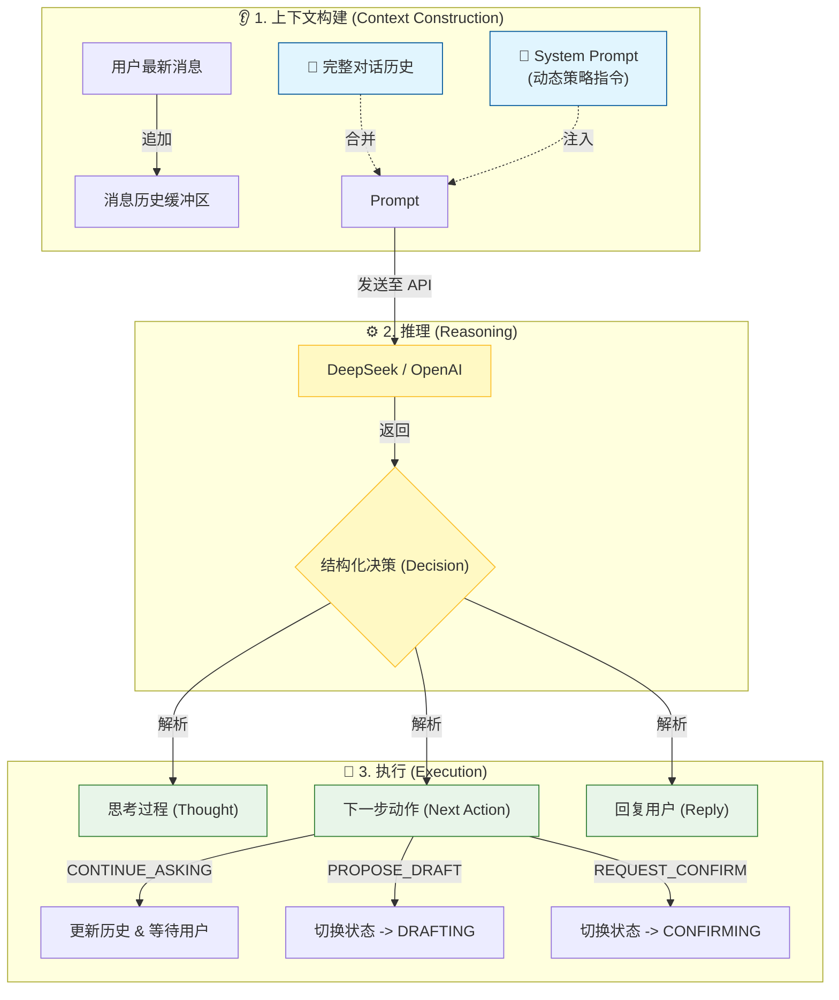
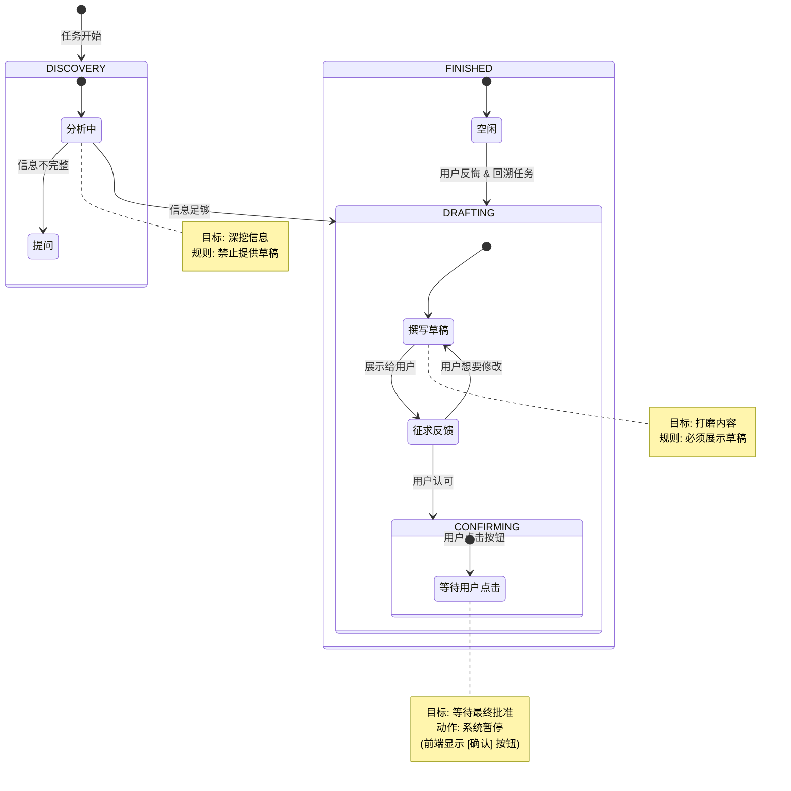

# GuideAgent：逻辑与原理图解

本文档通过图表展示 [GuideAgent](file:///c:/Users/admin/Desktop/ResumeAssistant/backend/guide_agent.py#10-1532) 的内部逻辑，解释它是如何处理信息并管理对话状态的。

---

## 1. 大脑：数据流管道 (The Brain)

每当你发送一条消息，GuideAgent 都会通过这个管道进行处理：



### 关键元素

| 元素              | 说明                                                                                 |
| ----------------- | ------------------------------------------------------------------------------------ |
| **System Prompt** | 告诉演员如何表演的"剧本"（例如："先别写草稿，先问问题"）。它会根据当前状态动态变化。 |
| **结构化 JSON**   | Agent 不仅仅是说话，它会输出一个包含*思考*、*决策*和*回复*的 JSON 对象。             |

---

## 2. 心脏：状态机 (The Heart)

Agent 的行为完全由它的 `current_state`（当前状态）决定。



### 状态说明

| 状态           | 目标         | 规则                       |
| -------------- | ------------ | -------------------------- |
| **DISCOVERY**  | 深挖信息     | 禁止提供草稿，专注于提问   |
| **DRAFTING**   | 打磨内容     | 必须展示草稿，征求反馈     |
| **CONFIRMING** | 等待最终批准 | 系统暂停，前端显示确认按钮 |
| **FINISHED**   | 任务完成     | 支持回溯到 DRAFTING        |

---

## 3. 代码映射表

| 概念              | 代码位置                                                                    | 说明                                                                                   |
| :---------------- | :-------------------------------------------------------------------------- | :------------------------------------------------------------------------------------- |
| **状态定义**      | [model.py](file:///c:/Users/admin/Desktop/ResumeAssistant/backend/model.py) | 枚举 `AgentState` (DISCOVERY, DRAFTING 等)                                             |
| **System Prompt** | `GuideAgent._get_system_prompt()`                                           | 根据 `self.current_state` 动态返回 Prompt                                              |
| **执行循环**      | `GuideAgent.step()`                                                         | 1. 追加用户消息<br/>2. 调用 LLM<br/>3. 根据 `next_action` 更新状态<br/>4. 返回决策对象 |

---

## 4. 核心代码片段

### 状态枚举定义

```python
class AgentState(str, Enum):
    DISCOVERY = "DISCOVERY"     # 正在提问挖掘信息
    DRAFTING = "DRAFTING"       # 正在展示草稿等待确认
    CONFIRMING = "CONFIRMING"   # 等待用户确认执行
    FINISHED = "FINISHED"       # 任务已完成
```

### 决策对象结构

```python
class AgentDecision(BaseModel):
    thought: str                # 推理过程
    next_action: Literal[       # 下一步动作
        "CONTINUE_ASKING",      # 继续提问
        "PROPOSE_DRAFT",        # 提出草稿
        "REQUEST_CONFIRM",      # 请求确认
        "CONFIRM_FINISH"        # 确认完成
    ]
    reply_to_user: str          # 回复用户的内容
    draft_content: Optional[str] # 草稿内容
    intent: Optional[Literal["CONTINUE", "BACKTRACK"]]  # 用户意图
```

### 状态转换逻辑

```python
# 在 step() 方法中
if decision.next_action == "CONTINUE_ASKING":
    self.current_state = AgentState.DISCOVERY
    
elif decision.next_action == "PROPOSE_DRAFT":
    self.current_state = AgentState.DRAFTING
    
elif decision.next_action == "REQUEST_CONFIRM":
    self.current_state = AgentState.CONFIRMING
    
elif decision.next_action == "CONFIRM_FINISH":
    self.current_state = AgentState.FINISHED
```

---

## 5. 延伸阅读

- [GuideAgent 上下文管理机制](file:///c:/Users/admin/Desktop/ResumeAssistant/learning/guide_agent_context_management.md) - 详细分析动态 Prompt 生成机制
- [源码：guide_agent.py](file:///c:/Users/admin/Desktop/ResumeAssistant/backend/guide_agent.py) - 完整实现代码
