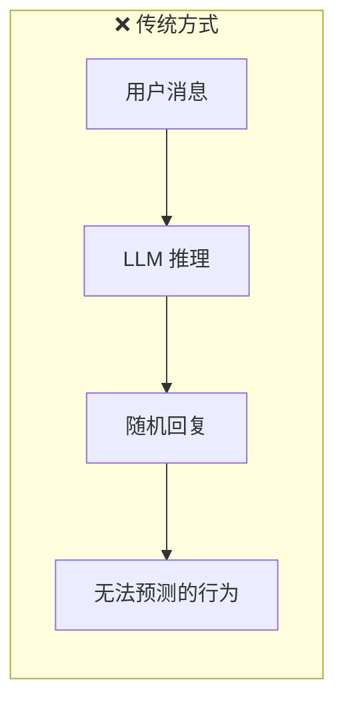
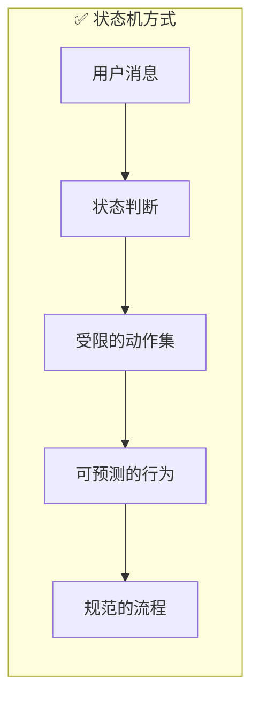
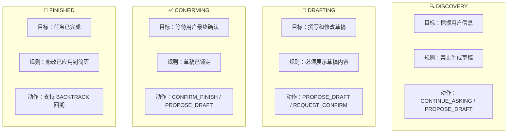
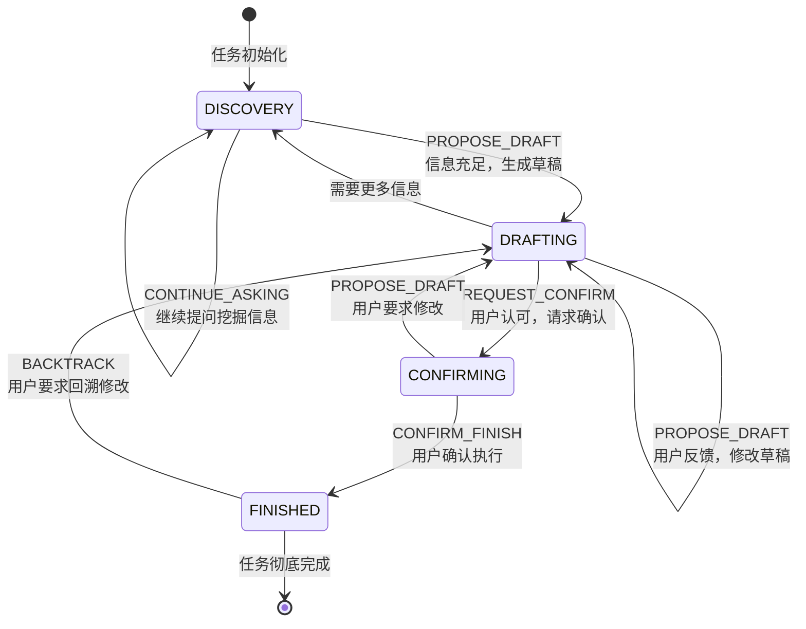
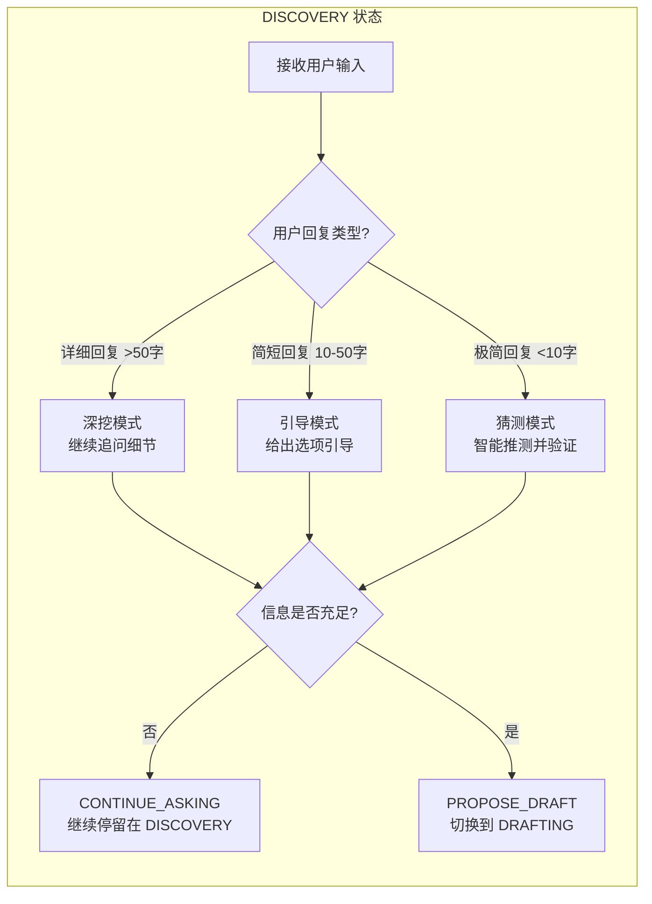
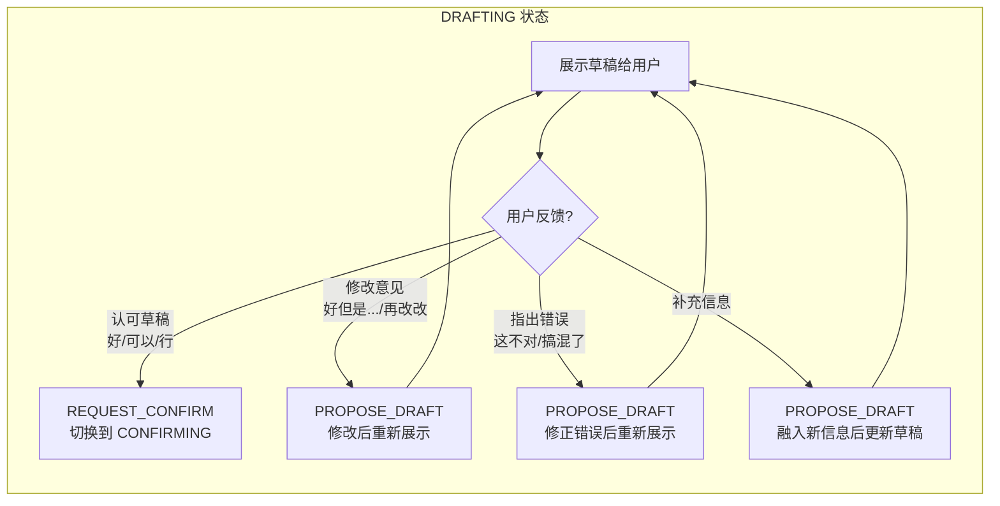
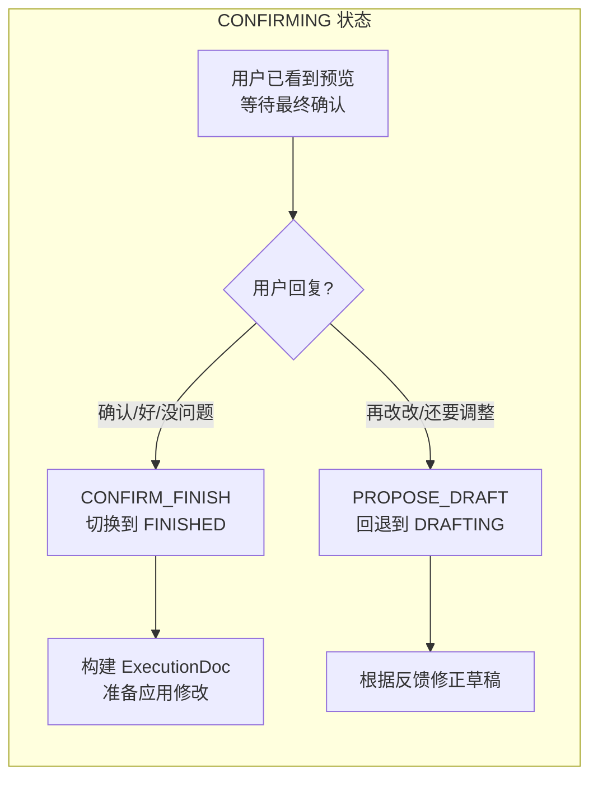
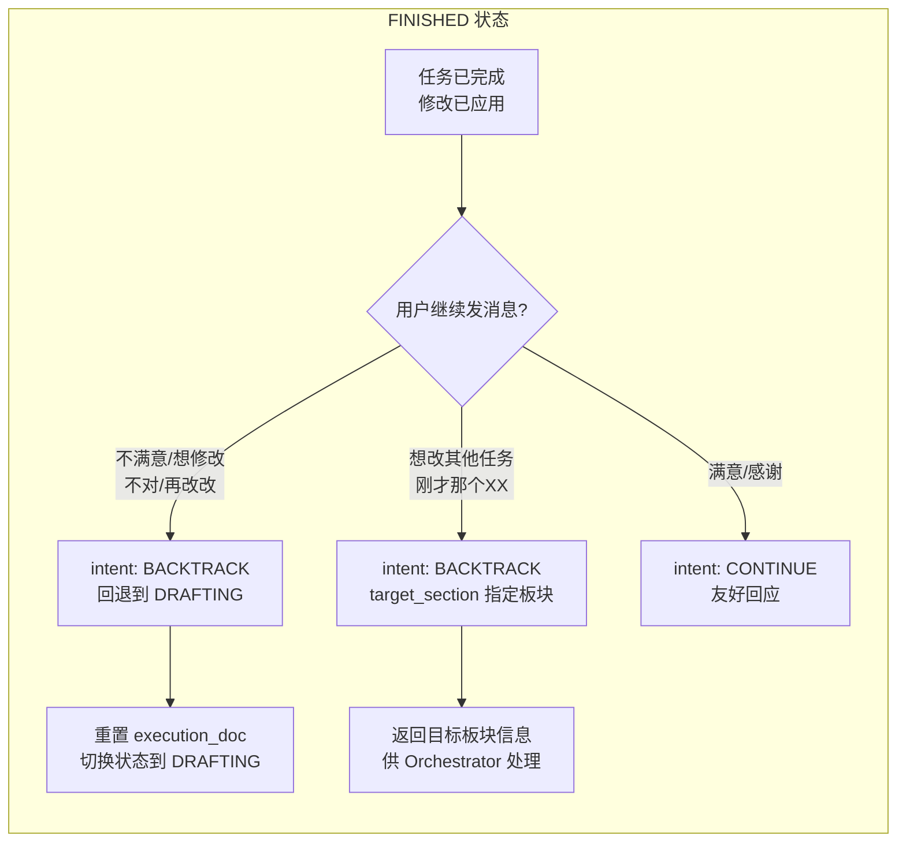
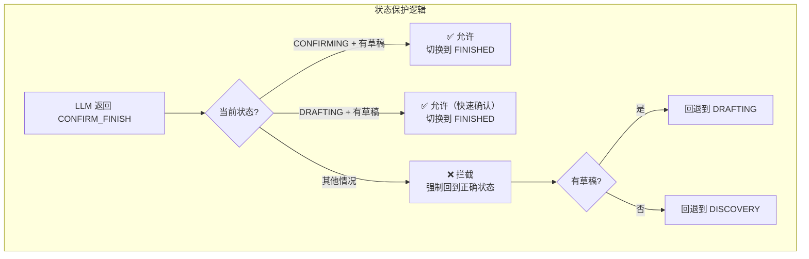
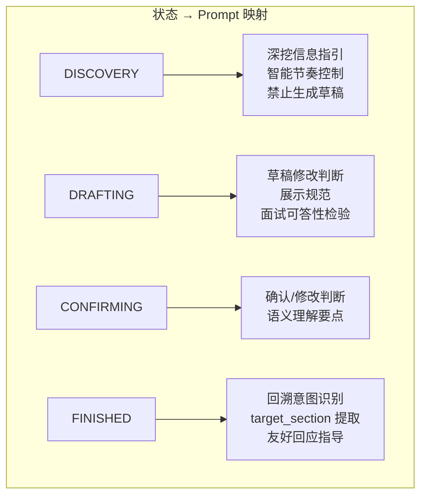

# GuideAgent 状态机设计与流转详解

本文档深入讲解 GuideAgent 的状态机设计哲学、状态流转机制、以及各状态下的行为规范。

---

## 📌 为什么使用状态机？

### 传统对话 AI 的问题



**问题**：
- LLM 可能在任何时候跳过步骤
- 对话流程不可控
- 用户体验不一致

### 状态机驱动的优势



**优势**：
- 每个状态只允许特定的动作
- 流程可控、可追踪
- 用户体验一致

---

## 🔄 状态定义

GuideAgent 使用 4 个核心状态来管理对话流程：

```python
class AgentState(str, Enum):
    DISCOVERY = "DISCOVERY"     # 信息挖掘阶段
    DRAFTING = "DRAFTING"       # 草稿撰写阶段
    CONFIRMING = "CONFIRMING"   # 等待确认阶段
    FINISHED = "FINISHED"       # 任务完成阶段
```

### 状态卡片



---

## 🎯 完整状态流转图



---

## 📊 状态详解

### 1️⃣ DISCOVERY（信息挖掘）



**System Prompt 注入的规则**：

```
当前状态: DISCOVERY (信息挖掘)
目标: 基于诊断结果，向用户提问以获取必要的信息。
约束: 暂时**不要**提供草稿。专注于理解用户的经历和细节。
可选动作: CONTINUE_ASKING, PROPOSE_DRAFT

📊 智能节奏控制（每次回复前必做判断）：
1️⃣ 用户回复质量评估：详细型/简短型/极简型
2️⃣ 下一步策略选择：深挖/引导/猜测
3️⃣ 话题切换信号：连续简短回复、用户明确结束
4️⃣ 禁止行为：不要一次问多个问题
```

---

### 2️⃣ DRAFTING（草稿撰写）



**关键判断逻辑**：

| 用户回复           | 判断结果     | 动作            |
| ------------------ | ------------ | --------------- |
| "好"、"可以"、"行" | 认可草稿     | REQUEST_CONFIRM |
| "好，但是..."      | 有修改意见   | PROPOSE_DRAFT   |
| "这不对"、"搞错了" | 指出错误     | PROPOSE_DRAFT   |
| 补充新的信息       | 需要更新草稿 | PROPOSE_DRAFT   |

**草稿展示规范**（首次展示）：
```
我帮你优化了【板块 - 具体条目】的XXX内容，草稿如下：

📝 草稿：
- ...

⚠️ 面试官可能会问：
1. "..."
   → 回答思路：...

这些问题你能hold住吗？
```

**草稿修改说明**（修改后重新展示）：
```
抱歉！我重新整理了一下：
- ❌ 之前错误：将本科课程混入了硕士背景
- ✅ 现在修正：只保留硕士阶段的核心课程

新草稿如下：
...
```

---

### 3️⃣ CONFIRMING（等待确认）



**语义理解要点**：

| 用户回复                   | 意图     | 动作           |
| -------------------------- | -------- | -------------- |
| "确认"、"没问题"、"就这样" | 同意执行 | CONFIRM_FINISH |
| "再改改"、"还要调整"       | 要求修改 | PROPOSE_DRAFT  |
| 提供具体修改建议           | 要求修改 | PROPOSE_DRAFT  |

---

### 4️⃣ FINISHED（任务完成）



**回溯信号词识别**：

| 信号词类型    | 示例                     | 处理方式                   |
| ------------- | ------------------------ | -------------------------- |
| 时间词        | "刚才"、"之前"、"上面"   | BACKTRACK                  |
| 否定词 + 板块 | "那个xx不对"、"xx还要改" | BACKTRACK + target_section |
| 直接指明板块  | "硕士课程"、"技能部分"   | BACKTRACK + target_section |
| 满意/感谢     | "谢谢"、"好的"、"完成了" | CONTINUE                   |

---

## ⚡ 状态转换代码实现

### step() 方法核心逻辑

```python
def step(self, user_input: str) -> AgentDecision:
    # 1. 追加用户消息
    self.messages.append({"role": "user", "content": user_input})

    # 2. 调用 LLM 获取决策
    decision = self._call_llm()
    
    # 3. 处理回溯意图
    if decision.intent == "BACKTRACK":
        if self.current_state == AgentState.FINISHED:
            self.execution_doc = None
            self.current_state = AgentState.DRAFTING
    
    # 4. 根据 next_action 更新状态
    elif decision.next_action == "CONTINUE_ASKING":
        self.current_state = AgentState.DISCOVERY
        
    elif decision.next_action == "PROPOSE_DRAFT":
        self.current_state = AgentState.DRAFTING
        
    elif decision.next_action == "REQUEST_CONFIRM":
        if self.draft:
            self.execution_doc = self._build_execution_doc()
            self.current_state = AgentState.CONFIRMING
            
    elif decision.next_action == "CONFIRM_FINISH":
        if self.current_state == AgentState.CONFIRMING and self.draft:
            self.current_state = AgentState.FINISHED
    
    # 5. 更新对话历史和草稿
    self.messages.append({"role": "assistant", "content": decision.reply_to_user})
    if decision.draft_content:
        self.draft = decision.draft_content
    
    return decision
```

---

## 🛡️ 状态机保护机制

### 非法状态转换拦截



**代码实现**：

```python
elif decision.next_action == "CONFIRM_FINISH":
    # 严格的状态流转检查
    if self.current_state == AgentState.CONFIRMING and self.draft:
        self.current_state = AgentState.FINISHED
        decision.execution_doc = self.execution_doc
    elif self.current_state == AgentState.DRAFTING and self.draft:
        # 允许从 DRAFTING 直接结束（用户快速确认）
        self.execution_doc = self._build_execution_doc()
        self.current_state = AgentState.FINISHED
        decision.execution_doc = self.execution_doc
    else:
        # 如果 LLM 试图跳过流程，强制拉回正确状态
        if self.draft:
            self.current_state = AgentState.DRAFTING
        else:
            self.current_state = AgentState.DISCOVERY
```

---

## 🔗 状态与 Prompt 的动态绑定

每个状态注入不同的 System Prompt 规则：



**这种设计的好处**：

1. **精确控制**：LLM 每次只看到当前状态允许的动作
2. **减少幻觉**：不会在 DISCOVERY 阶段误生成草稿
3. **节省 Token**：不加载无关规则

---

## 📐 设计总结

### 状态机设计原则

| 原则            | 实现                     | 效果               |
| --------------- | ------------------------ | ------------------ |
| **单一职责**    | 每个状态只负责一件事     | 逻辑清晰，易于维护 |
| **显式转换**    | next_action 明确指定目标 | 状态转换可追踪     |
| **防御性编程**  | 非法转换被拦截           | 流程不会失控       |
| **可回溯**      | FINISHED 支持 BACKTRACK  | 用户体验友好       |
| **动态 Prompt** | 每个状态注入专属规则     | LLM 行为受控       |

### 状态机 vs 无状态的对比

| 维度           | 无状态   | 状态机驱动 |
| -------------- | -------- | ---------- |
| 行为可预测性   | ❌ 低     | ✅ 高       |
| 流程可控性     | ❌ 差     | ✅ 强       |
| 调试难度       | ❌ 高     | ✅ 低       |
| 用户体验一致性 | ❌ 不稳定 | ✅ 一致     |
| 实现复杂度     | ✅ 低     | ⚠️ 中等     |

---

## 📚 相关文档

- [GuideAgent 上下文管理机制](file:///c:/Users/admin/Desktop/ResumeAssistant/learning/guide_agent_context_management.md)
- [GuideAgent 逻辑与原理图解](file:///c:/Users/admin/Desktop/ResumeAssistant/learning/guide_agent_logic.md)
- [源码：guide_agent.py](file:///c:/Users/admin/Desktop/ResumeAssistant/backend/guide_agent.py)
