# EditorAgent 执行机制详解

本文档详细讲解 `EditorAgent` 的执行流程，包括**混合执行模式**、**工具框架**、**与 Orchestrator 的交互**等核心机制。

---

## 📊 整体架构概览

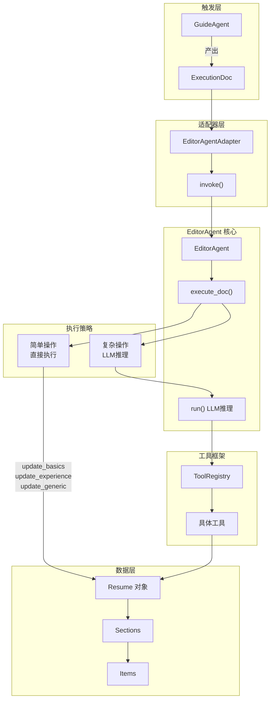

---

## 🎯 触发机制：从 GuideAgent 到 EditorAgent

### 触发条件

EditorAgent 的执行由 `ExecutionDoc` 触发。当 GuideAgent 进入 `FINISHED` 状态并产出 `ExecutionDoc` 后，Orchestrator 会自动触发 EditorAgent。

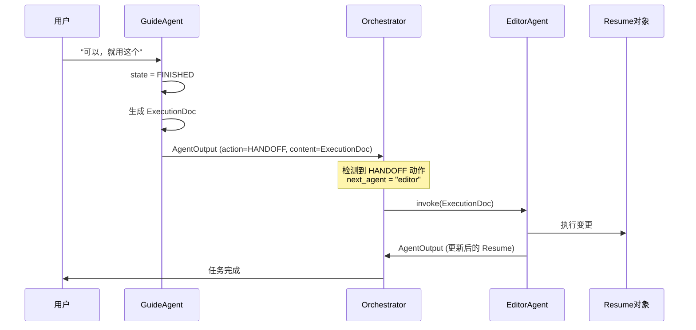

---

## 🔧 核心方法：execute_doc()

`execute_doc()` 是 EditorAgent 的核心执行方法，采用**混合模式**设计：

### 混合执行策略

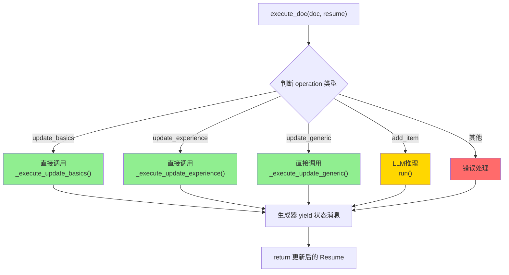

### 代码解析

```python
def execute_doc(self, doc: ExecutionDoc, resume: Resume) -> Generator[Dict, None, Resume]:
    """
    混合模式执行：根据ExecutionDoc执行简历变更。
    
    - 简单操作（update_basics, update_experience, update_generic）：直接调用工具，不需要LLM
    - 复杂操作（add_item等）：走LLM推理
    """
    self.resume = resume
    
    yield {"role": "assistant", "type": "info", "content": f"开始执行: {doc.operation}"}
    
    # 🟢 简单操作：直接执行
    if doc.operation == "update_basics":
        result = self._execute_update_basics(doc)
        yield {"role": "assistant", "type": "tool", "content": result}
        
    elif doc.operation == "update_experience":
        result = self._execute_update_experience(doc)
        yield {"role": "assistant", "type": "tool", "content": result}
        
    elif doc.operation == "update_generic":
        result = self._execute_update_generic(doc)
        yield {"role": "assistant", "type": "tool", "content": result}
        
    # 🟡 复杂操作：LLM推理
    elif doc.operation == "add_item":
        yield {"role": "assistant", "type": "info", "content": "复杂操作，启动LLM推理..."}
        prompt = self._build_llm_prompt_from_doc(doc)
        for msg in self.run(prompt, resume):
            yield msg
    
    return self.resume  # 返回更新后的简历
```

---

## 📝 四种操作类型详解

### 操作类型对照表

| 操作类型            | 执行方式 | 使用场景               | 执行方法                       |
| ------------------- | -------- | ---------------------- | ------------------------------ |
| `update_basics`     | 直接执行 | 更新姓名、邮箱、电话等 | `_execute_update_basics()`     |
| `update_experience` | 直接执行 | 更新工作/项目经历      | `_execute_update_experience()` |
| `update_generic`    | 直接执行 | 更新技能/证书等通用项  | `_execute_update_generic()`    |
| `add_item`          | LLM推理  | 新增条目等复杂操作     | `run()`                        |

### update_experience 执行流程

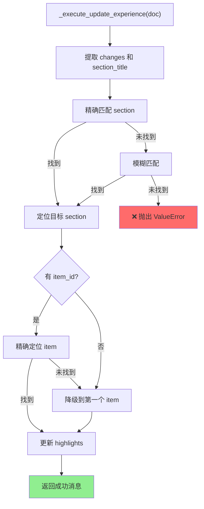

---

## 🤖 LLM推理模式：run() 方法

复杂操作（如 `add_item`）需要 LLM 推理来决定如何执行。

### ReAct 推理循环

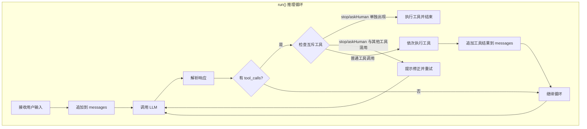

### 工具调用时序图

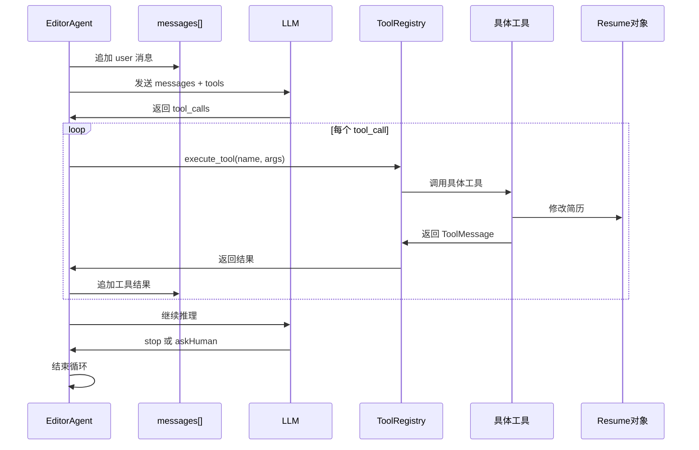

---

## 🛠️ 工具框架（Tool Framework）

EditorAgent 使用工具框架来执行具体的简历修改操作。

### 工具框架架构

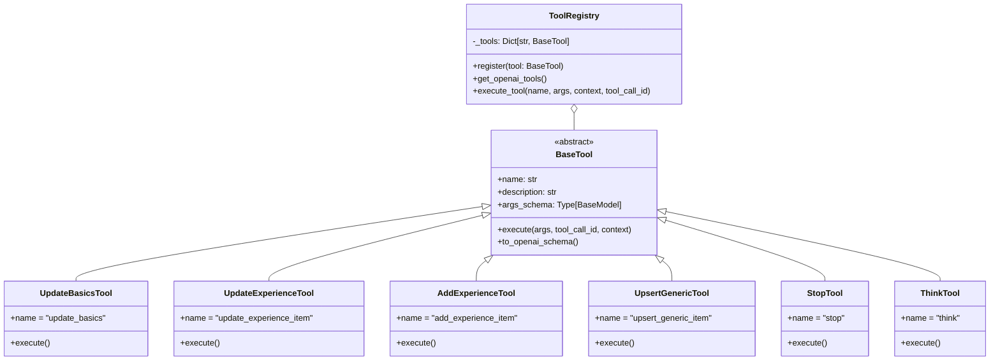

### 可用工具列表

| 工具名称                 | 描述              | 参数                                           |
| ------------------------ | ----------------- | ---------------------------------------------- |
| `update_basics`          | 更新基本信息      | name, email, phone, label, links               |
| `add_experience_item`    | 新增工作/项目经历 | section_title, title, organization, highlights |
| `update_experience_item` | 更新经历条目      | section_title, item_id, highlights             |
| `delete_experience_item` | 删除经历条目      | section_title, item_id                         |
| `upsert_generic_item`    | 新增/更新通用项   | section_title, title, subtitle, description    |
| `think`                  | 记录思考过程      | thought                                        |
| `askHuman`               | 向用户提问        | question                                       |
| `stop`                   | 标记任务结束      | reason                                         |

---

## 🔄 与 Adapter 层的集成

`EditorAgentAdapter` 负责将 `EditorAgent` 适配到统一的 `BaseAgent` 接口。

### Adapter 执行流程

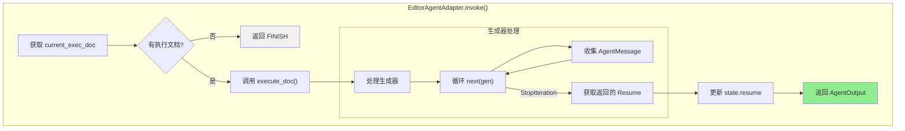

### 关键代码

```python
def invoke(self, input: AgentInput, state: WorkflowState) -> AgentOutput:
    exec_doc = state.current_exec_doc
    if not exec_doc:
        return AgentOutput(thought="没有待执行的文档", action=AgentAction.FINISH)
    
    # 处理生成器模式
    messages = []
    updated_resume = None
    
    gen = self._agent.execute_doc(exec_doc, state.resume)
    try:
        while True:
            msg = next(gen)
            messages.append(AgentMessage(
                role=msg.get("role", "assistant"),
                type=msg.get("type", "info"),
                content=msg.get("content"),
                agent_name=self.name
            ))
    except StopIteration as e:
        updated_resume = e.value  # 获取返回的 Resume
    
    # 更新状态
    if updated_resume:
        state.resume = updated_resume
    
    return AgentOutput(
        thought="执行完成",
        action=AgentAction.FINISH,
        content=state.resume,
        messages=messages
    )
```

---

## 🎬 完整执行场景

### 场景：更新工作经历的 highlights

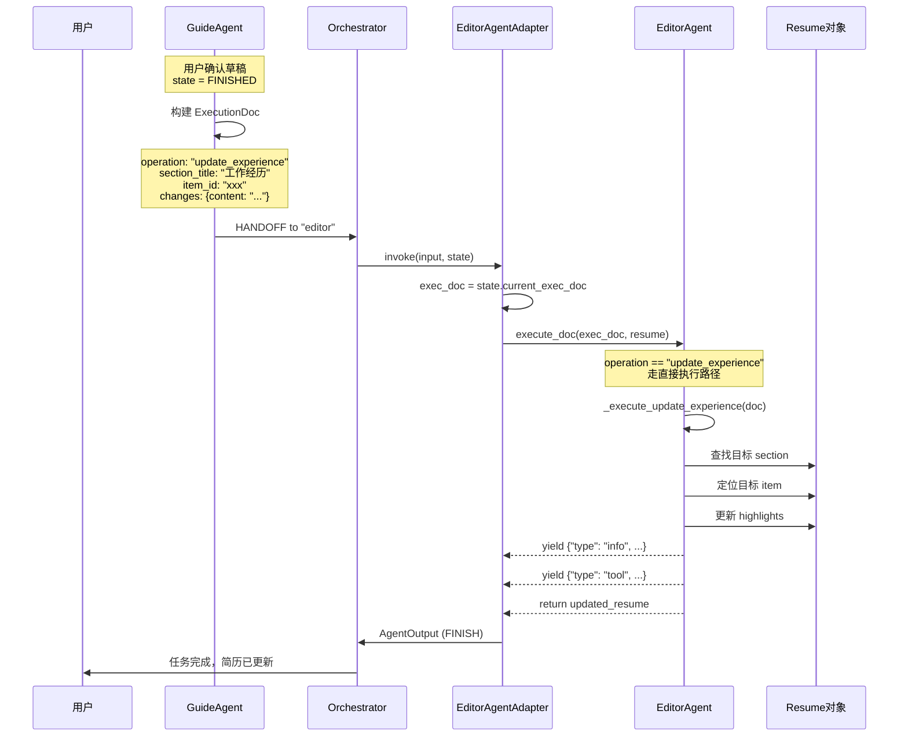

---

## 📊 执行模式对比

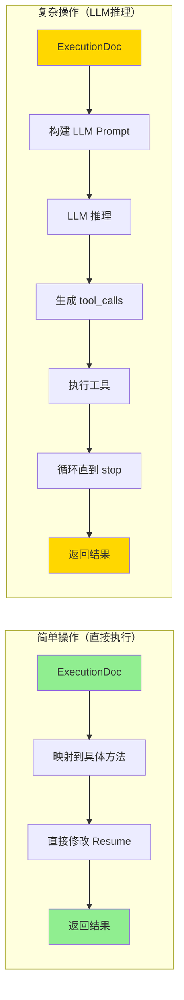

| 特性         | 简单操作     | 复杂操作           |
| ------------ | ------------ | ------------------ |
| **执行方式** | 直接调用方法 | LLM推理 + 工具调用 |
| **延迟**     | 低（~10ms）  | 高（~1-3s）        |
| **成本**     | 无 LLM 调用  | 需要 LLM API       |
| **灵活性**   | 固定逻辑     | 可处理边缘情况     |
| **适用场景** | 结构化更新   | 新增/复杂变更      |

---

## 📚 总结

> [!TIP]
> **设计亮点**：EditorAgent 采用**混合执行模式**——简单操作直接执行，复杂操作走 LLM 推理。这种设计在保证灵活性的同时，大幅降低了延迟和成本。

### 核心组件关系

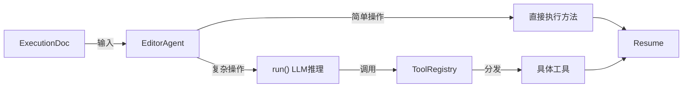

---

## 🔗 相关文档

- [guide_agent_decision_data_layer.md](file:///c:/Users/admin/Desktop/ResumeAssistant/learning/guide_agent_decision_data_layer.md) - AgentDecision 数据层操作
- [guide_agent_adapter.md](file:///c:/Users/admin/Desktop/ResumeAssistant/learning/guide_agent_adapter.md) - Agent 适配器设计
- [workflow_state.md](file:///c:/Users/admin/Desktop/ResumeAssistant/learning/workflow_state.md) - 工作流状态管理
