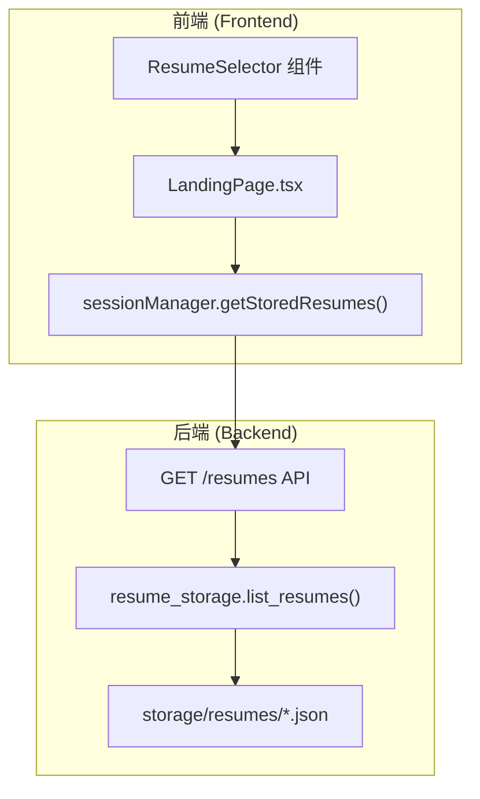
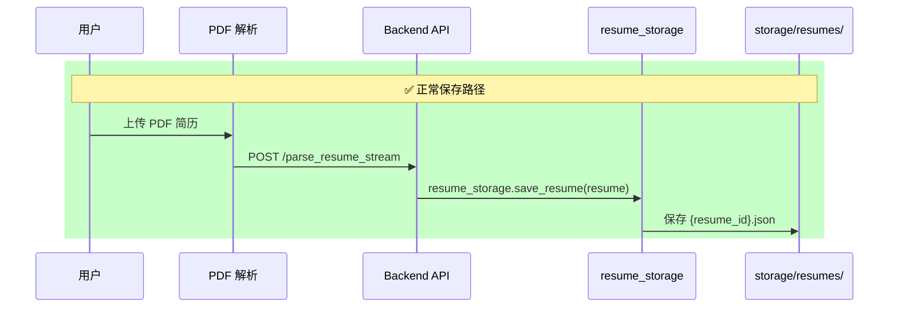
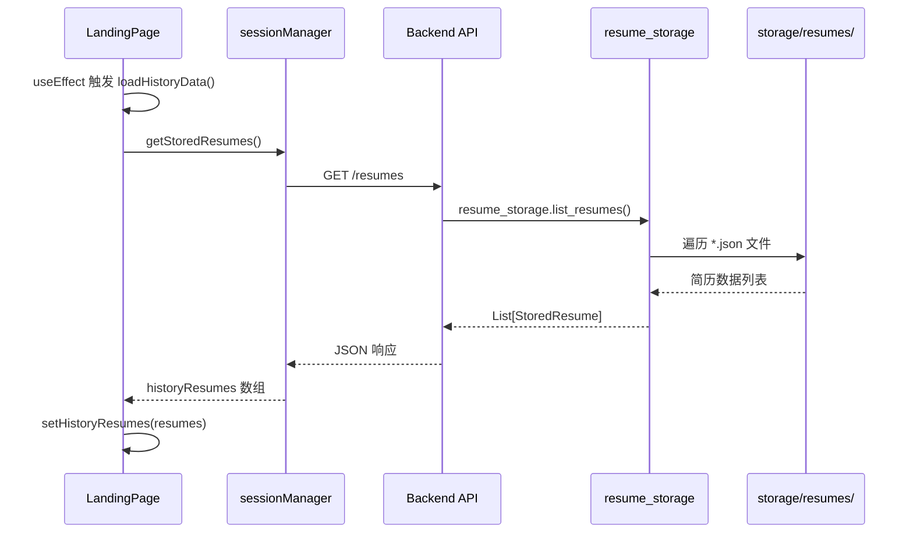
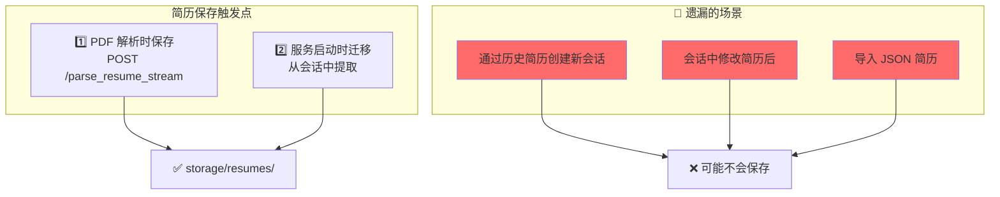
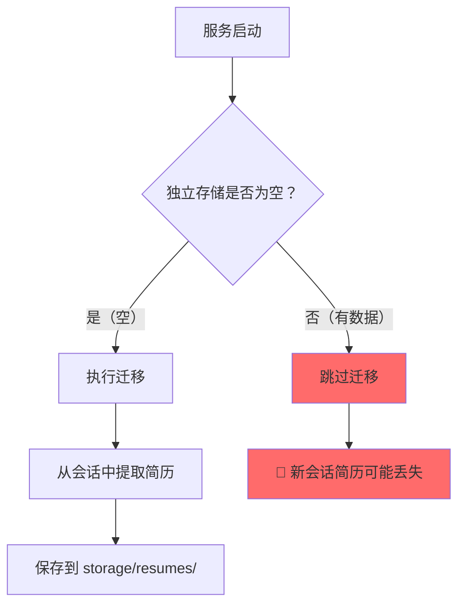
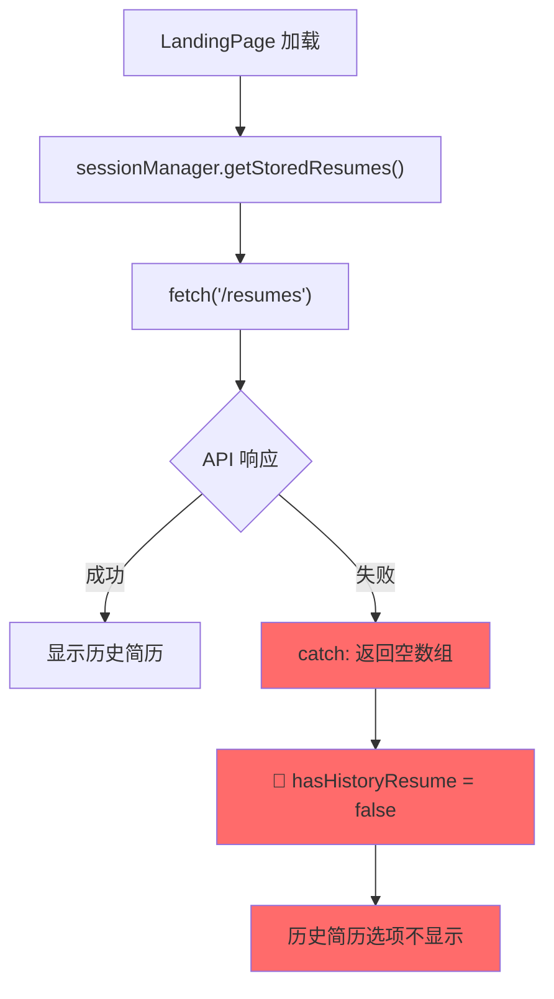
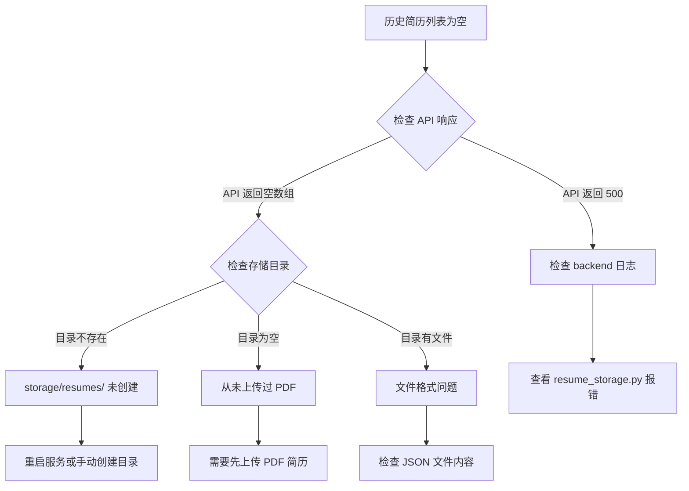
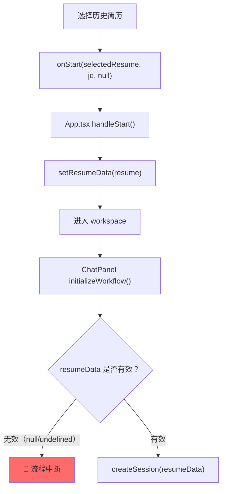
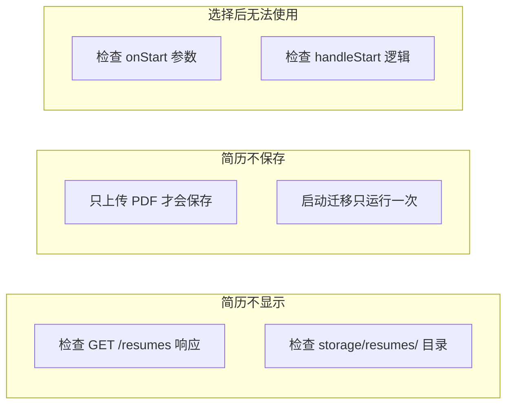

# 历史简历功能问题分析

本文档详细分析**历史简历功能**的实现流程，并指出可能导致"无法正常使用历史简历"的问题点。

---

## 📊 历史简历功能架构



---

## 🔍 完整数据流

### 1. 简历存储流程（写入）



### 2. 简历读取流程（读取）



---

## 🔴 潜在问题点分析

### 问题 1：简历保存时机问题



**代码位置**：`backend/api.py` 第 1264-1269 行

```python
# 只有 PDF 解析时才会自动保存
@app.post("/parse_resume_stream")
async def parse_resume_stream_endpoint(file: UploadFile = File(...)):
    # ...
    if progress_event.get("stage") == "complete":
        resume_id = resume_storage.save_resume(resume)  # ✅ 保存
```

### 问题 2：启动迁移只运行一次



**代码位置**：`backend/api.py` 第 76-90 行

```python
@app.on_event("startup")
async def startup_event():
    existing_resumes = resume_storage.list_resumes()
    
    if len(existing_resumes) == 0:  # 🔴 只有空的时候才迁移
        _do_startup_migration()
    else:
        logger.info(f"独立简历存储已有 {len(existing_resumes)} 个简历，跳过迁移")
```

### 问题 3：前端加载依赖 API 可用性



**代码位置**：`web/src/utils/sessionManager.ts` 第 330-350 行

```typescript
async getStoredResumes(): Promise<Array<{...}>> {
  try {
    const response = await fetch(`${API_BASE}/resumes`);
    if (!response.ok) {
      throw new Error(`获取简历列表失败: ${response.status}`);
    }
    return await response.json();
  } catch (error) {
    console.error('获取简历列表失败:', error);
    return [];  // 🔴 失败时静默返回空数组
  }
}
```

---

## 📍 关键代码位置索引

### 前端

| 组件         | 文件                | 行号    | 描述                   |
| ------------ | ------------------- | ------- | ---------------------- |
| 加载历史数据 | `LandingPage.tsx`   | 71-110  | `loadHistoryData()`    |
| 历史简历状态 | `LandingPage.tsx`   | 45-55   | `historyResumes` state |
| 简历选择器   | `LandingPage.tsx`   | 443-467 | `ResumeSelector` 组件  |
| API 调用     | `sessionManager.ts` | 330-350 | `getStoredResumes()`   |

### 后端

| 组件         | 文件                | 行号      | 描述               |
| ------------ | ------------------- | --------- | ------------------ |
| 简历列表 API | `api.py`            | 1070-1095 | `GET /resumes`     |
| 启动迁移     | `api.py`            | 76-121    | `startup_event()`  |
| PDF 保存     | `api.py`            | 1264-1269 | 解析时自动保存     |
| 存储管理器   | `resume_storage.py` | 76-255    | `ResumeStorage` 类 |

### 存储

```
backend/storage/resumes/
├── 34d3b909b53dd709.json   (753 bytes)
├── 8eaca822253b50fd.json   (8,699 bytes)
├── ac9c916e51f984b8.json   (6,639 bytes)
├── b2792c47614af8ce.json   (9,564 bytes)
├── be092a414817ff76.json   (905 bytes)
├── cb20e0532c945273.json   (7,750 bytes)
└── db06c78d1e24cf70.json   (506 bytes)
```

---

## 🐛 常见问题排查

### 问题：历史简历列表为空



### 问题：选择历史简历后无法使用



---

## 🔧 问题根因总结

### 问题 1：简历不保存到独立存储

**根因**：只有 PDF 解析时才自动保存，以下场景不会保存：
- 使用历史简历创建新会话
- 在会话中编辑简历
- 导入 JSON 简历

**影响代码**：`api.py` 第 1264-1269 行

### 问题 2：迁移逻辑只运行一次

**根因**：启动时只在存储目录为空时才迁移，之后新创建的会话简历不会被迁移。

**影响代码**：`api.py` 第 84-89 行

### 问题 3：前端静默失败

**根因**：`getStoredResumes()` 失败时返回空数组，不报错，用户无感知。

**影响代码**：`sessionManager.ts` 第 346-349 行

---

## 💡 建议修复方案

### 方案 1：在创建会话时保存简历

```python
# api.py - create_session 端点
@app.post("/session/create")
async def create_session(req: CreateSessionRequest):
    # ... 现有逻辑 ...
    
    # 🔧 新增：保存简历到独立存储
    try:
        resume_storage.save_resume(req.resume)
    except Exception as e:
        logger.warning(f"保存简历失败: {e}")
```

### 方案 2：会话编辑后同步保存

```python
# api.py - confirm_and_execute 端点结束时
# 🔧 新增：执行完成后同步更新独立存储
resume_storage.save_resume(state.resume)
```

### 方案 3：前端显示加载错误

```typescript
// sessionManager.ts
async getStoredResumes() {
  try {
    const response = await fetch(`${API_BASE}/resumes`);
    if (!response.ok) {
      // 🔧 改进：抛出错误让调用方处理
      throw new Error(`获取简历列表失败: ${response.status}`);
    }
    return await response.json();
  } catch (error) {
    console.error('获取简历列表失败:', error);
    // 🔧 可选：返回错误状态而非空数组
    throw error;
  }
}
```

---

## 📚 相关文档

- [guide_optimization_start_flow.md](file:///c:/Users/admin/Desktop/ResumeAssistant/learning/guide_optimization_start_flow.md) - 开始优化流程
- [guide_state_persistence.md](file:///c:/Users/admin/Desktop/ResumeAssistant/learning/guide_state_persistence.md) - 状态持久化

---

## 🔗 快速定位


