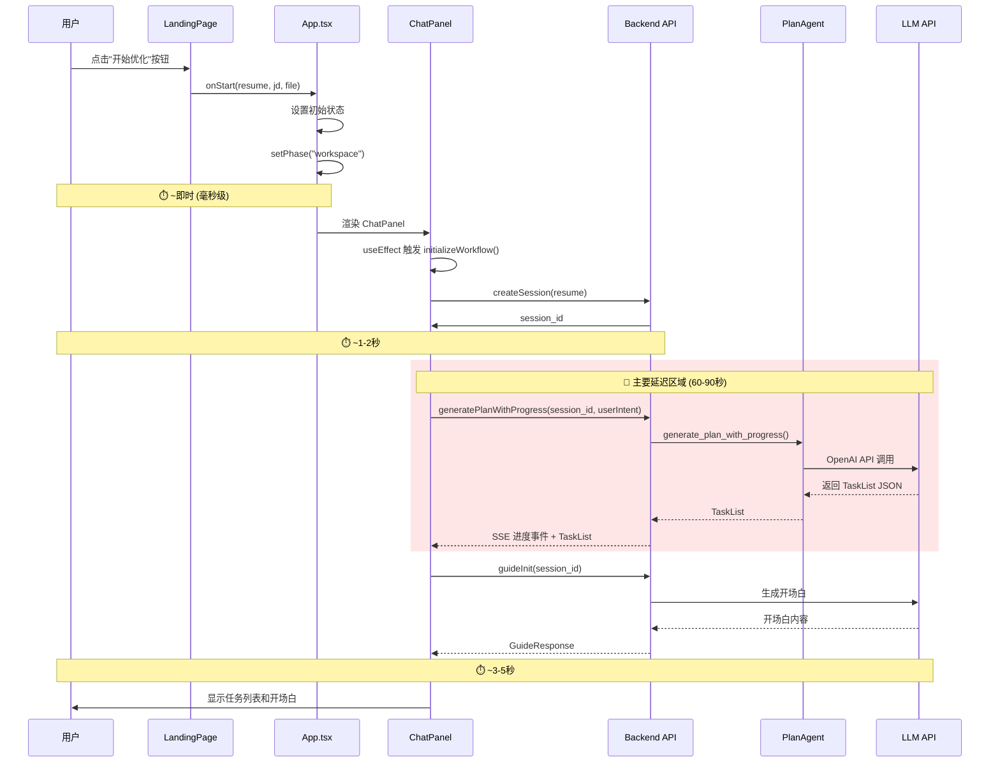
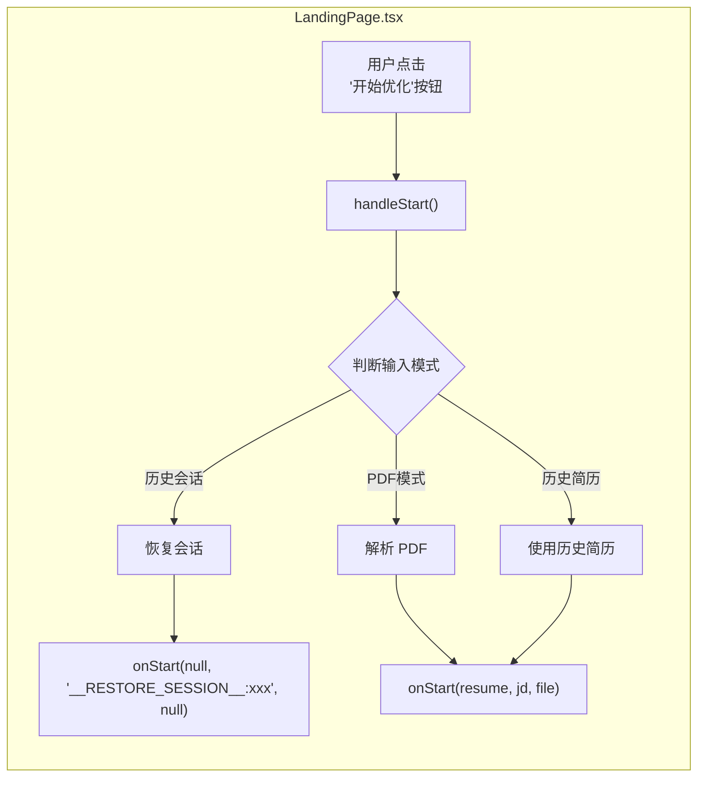
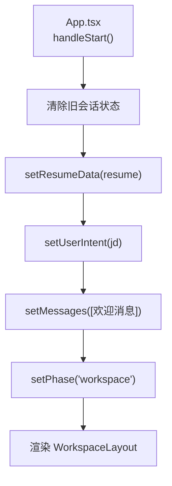
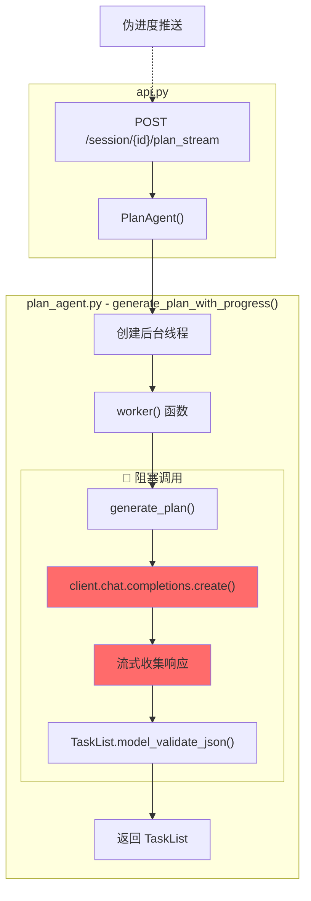
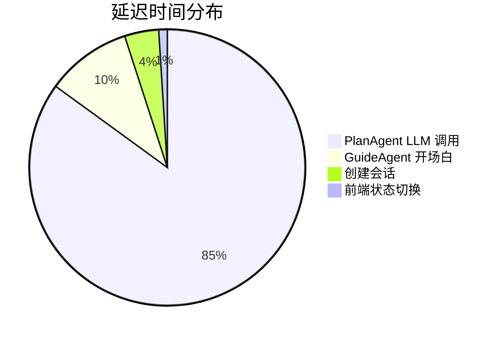
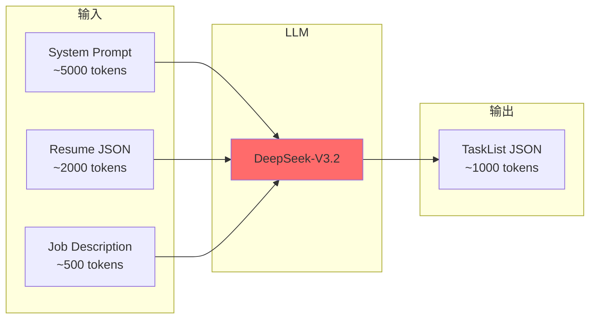
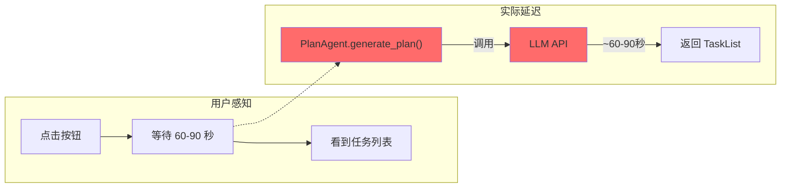

# 用户点击"开始优化"后的执行流程与延迟分析

本文档详细讲解用户点击"开始优化"按钮后的完整执行流程，并分析导致长时间等待的延迟瓶颈。

---

## 📊 整体执行流程概览



---

## 🔍 各阶段详细分析

### 阶段 1：前端触发（毫秒级）



**代码位置**: `web/src/components/LandingPage.tsx` 第 161-219 行

```typescript
const handleStart = async () => {
  // 历史会话模式 - 直接恢复会话
  if (inputMode === 'history' && selectedSession) {
    onStart(null, '__RESTORE_SESSION__:' + selectedSession.id, null);
    return;
  }
  
  // 历史简历模式
  if (inputMode === 'history' && selectedResume) {
    onStart(selectedResume, jd, null);
    return;
  }
  
  // PDF模式
  if (inputMode === 'pdf' && file) {
    const resume = await parseResumeWithProgress(file, handleProgressEvent);
    onStart(resume, jd, file);
  }
};
```

---

### 阶段 2：App.tsx 状态设置（毫秒级）



**代码位置**: `web/src/App.tsx` 第 59-124 行

```typescript
const handleStart = async (resume, jd, file) => {
  // 清除旧会话状态，确保创建新会话
  setSessionId(null);
  setTaskList([]);
  setCurrentTaskIdx(0);

  // 设置新会话的初始状态
  setResumeData(resume);
  setUserIntent(jd);
  
  // 添加欢迎消息
  setMessages([{
    role: "assistant",
    content: "你好！我是你的简历助手。正在为你生成优化计划..."
  }]);

  // 进入工作区
  setPhase("workspace");
};
```

---

### 阶段 3：ChatPanel 初始化工作流（60-90秒 🔴）

这是**主要延迟来源**！

```mermaid
flowchart TD
    subgraph "ChatPanel.tsx - initializeWorkflow()"
        A["useEffect 触发"] --> B["createSession()"]
        B -->|"~1-2秒"| C["获取 session_id"]
        
        C --> D["generatePlanWithProgress()"]
        
        subgraph "🔴 主要延迟 (60-90秒)"
            D --> E["发起 SSE 连接"]
            E --> F["PlanAgent.generate_plan_with_progress()"]
            F --> G["后台线程调用 generate_plan()"]
            G --> H["OpenAI API 调用"]
            H --> I["等待 LLM 返回"]
            I --> J["解析 TaskList"]
        end
        
        J --> K["guideInit()"]
        K -->|"~3-5秒"| L["显示开场白"]
    end
    
    style D fill:#ff6b6b
    style E fill:#ff6b6b
    style F fill:#ff6b6b
    style G fill:#ff6b6b
    style H fill:#ff6b6b
    style I fill:#ff6b6b
    style J fill:#ff6b6b
```



**代码位置**: `web/src/components/ChatPanel.tsx` 第 123-208 行

```typescript
const initializeWorkflow = async () => {
  setIsLoading(true);
  try {
    // 1. 创建会话 (~1-2秒)
    const sid = await createSession(resumeData);
    setSessionId(sid);

    // 2. 🔴 生成计划 (60-90秒！)
    const planResponse = await generatePlanWithProgress(
      sid, 
      userIntent,
      (event: PlanProgressEvent) => {
        // 进度回调：更新进度条
        if (event.stage === "analyzing") {
          // 更新进度消息...
        }
      }
    );
    
    setTaskList(planResponse.tasks);

    // 3. 调用开场白 (~3-5秒)
    const openingResponse = await guideInit(sid);
    setMessages(prev => [...prev, {
      role: "assistant",
      content: openingResponse.reply
    }]);
  } finally {
    setIsLoading(false);
  }
};
```

---

## 🔴 延迟瓶颈：PlanAgent.generate_plan()

### 瓶颈位置



**代码位置**: `backend/plan_agent.py` 第 216-287 行

```python
def generate_plan_with_progress(self, user_intent: str, resume: Resume):
    """带进度反馈的计划生成（伪进度）"""
    result = {"plan": None, "error": None}
    
    # 🔴 后台线程调用真实的 LLM
    def worker():
        try:
            result["plan"] = self.generate_plan(user_intent, resume)  # 阻塞！
        except Exception as e:
            result["error"] = str(e)
    
    thread = threading.Thread(target=worker)
    thread.start()
    
    # 伪进度阶段（等待 LLM 期间显示假进度）
    progress_steps = [
        (2, 5, "正在准备分析..."),
        (5, 15, "AI正在读取简历内容..."),
        (15, 35, "AI正在深度分析简历和职位匹配度..."),
        (30, 55, "AI正在识别优化机会..."),
        (50, 75, "正在生成优化方案..."),
        (70, 90, "正在验证和整理..."),
    ]
    
    # 等待线程完成（最多90秒）
    thread.join(timeout=90)
```

### generate_plan() 的真实延迟

```python
def generate_plan(self, user_intent: str, resume: Resume) -> TaskList:
    # 🔴 这里是真正的阻塞点！
    response = self.client.chat.completions.create(
        model=self.model,      # "Pro/deepseek-ai/DeepSeek-V3.2"
        messages=messages,
        response_format={"type": "json_object"},
        stream=True  # 虽然是流式，但要等所有 chunk 收完
    )
    
    # 收集所有 chunk
    content = ""
    for chunk in response:
        if chunk.choices and chunk.choices[0].delta.content:
            content += chunk.choices[0].delta.content
    
    return TaskList.model_validate_json(content)
```

---

## 📊 延迟时间分解

| 阶段               | 耗时       | 占比     | 位置                            |
| ------------------ | ---------- | -------- | ------------------------------- |
| 前端状态切换       | ~10ms      | <1%      | `LandingPage.tsx` → `App.tsx`   |
| 创建会话 API       | ~1-2s      | ~2%      | `POST /session/create`          |
| **生成计划 (LLM)** | **60-90s** | **~95%** | `PlanAgent.generate_plan()`     |
| 生成开场白 (LLM)   | ~3-5s      | ~3%      | `GuideAgent.generate_opening()` |

### 可视化



---

## 🔧 为什么 PlanAgent 这么慢？

### 原因分析

1. **复杂的 System Prompt**
   - `_get_system_prompt()` 生成的 prompt 非常长（~5000+ tokens）
   - 包含详细的学生项目策略、诊断策略、goal 模板等

2. **复杂的输入**
   - 完整的 Resume JSON 作为输入（可能 ~2000+ tokens）
   - 用户的 Job Description（可能 ~500+ tokens）

3. **复杂的输出**
   - 需要生成结构化的 TaskList JSON
   - 每个 Task 包含 section、diagnosis、goal、strategy 等字段

4. **模型选择**
   - 使用 `Pro/deepseek-ai/DeepSeek-V3.2`（高质量但较慢）



---

## 📍 代码位置索引

| 组件                        | 文件              | 行号        | 描述                       |
| --------------------------- | ----------------- | ----------- | -------------------------- |
| 开始按钮                    | `LandingPage.tsx` | 614-627     | "开始优化"按钮             |
| handleStart                 | `LandingPage.tsx` | 161-219     | 处理开始事件               |
| App handleStart             | `App.tsx`         | 59-124      | 设置状态并进入工作区       |
| initializeWorkflow          | `ChatPanel.tsx`   | 123-208     | 初始化工作流               |
| createSession API           | `api.py`          | 266-292     | 创建会话端点               |
| plan_stream API             | `api.py`          | 356-431     | 生成计划端点（SSE）        |
| **generate_plan**           | **plan_agent.py** | **188-214** | **🔴 LLM 调用（延迟瓶颈）** |
| generate_plan_with_progress | plan_agent.py     | 216-287     | 伪进度包装                 |

---

## 💡 潜在优化方向

### 1. 缓存已分析的简历
如果同一份简历之前分析过，可以复用之前的 TaskList。

### 2. 简化 System Prompt
精简 `_get_system_prompt()` 中的指令，减少 token 数。

### 3. 分阶段生成
先快速生成粗略计划，再逐步细化。

### 4. 使用更快的模型
在计划生成阶段使用更快的模型（如 GPT-3.5 Turbo）。

### 5. 预热机制
在用户填写 JD 时就开始预加载模型。

---

## 📚 总结



> [!CAUTION]
> **核心瓶颈**：`PlanAgent.generate_plan()` 中的 LLM API 调用是导致用户长时间等待的主要原因。尽管使用了伪进度和流式 SSE，实际的 LLM 计算时间无法压缩。

---

## 🔗 相关文档

- [guide_strategy_switching.md](file:///c:/Users/admin/Desktop/ResumeAssistant/learning/guide_strategy_switching.md) - 策略切换机制
- [guide_agent_decision_data_layer.md](file:///c:/Users/admin/Desktop/ResumeAssistant/learning/guide_agent_decision_data_layer.md) - AgentDecision 数据层操作
- [guide_editor_agent_execution.md](file:///c:/Users/admin/Desktop/ResumeAssistant/learning/guide_editor_agent_execution.md) - EditorAgent 执行机制
