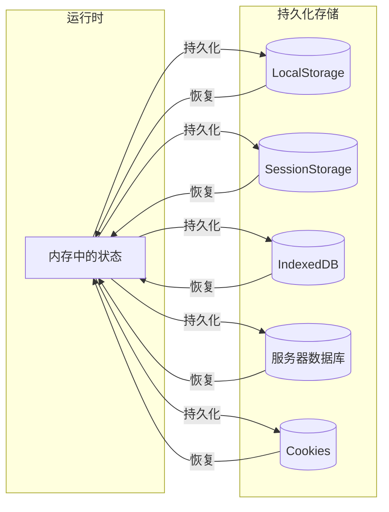
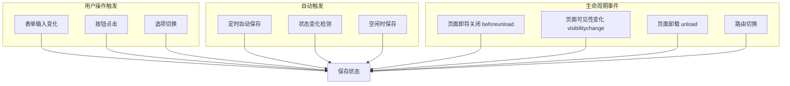
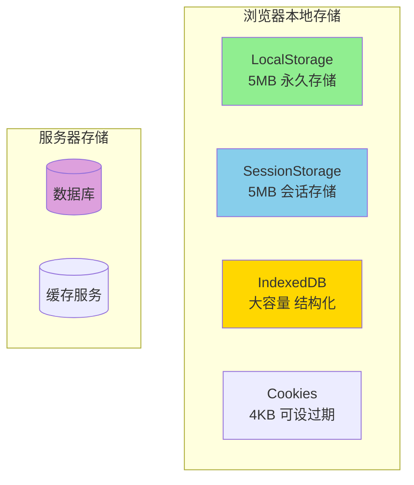
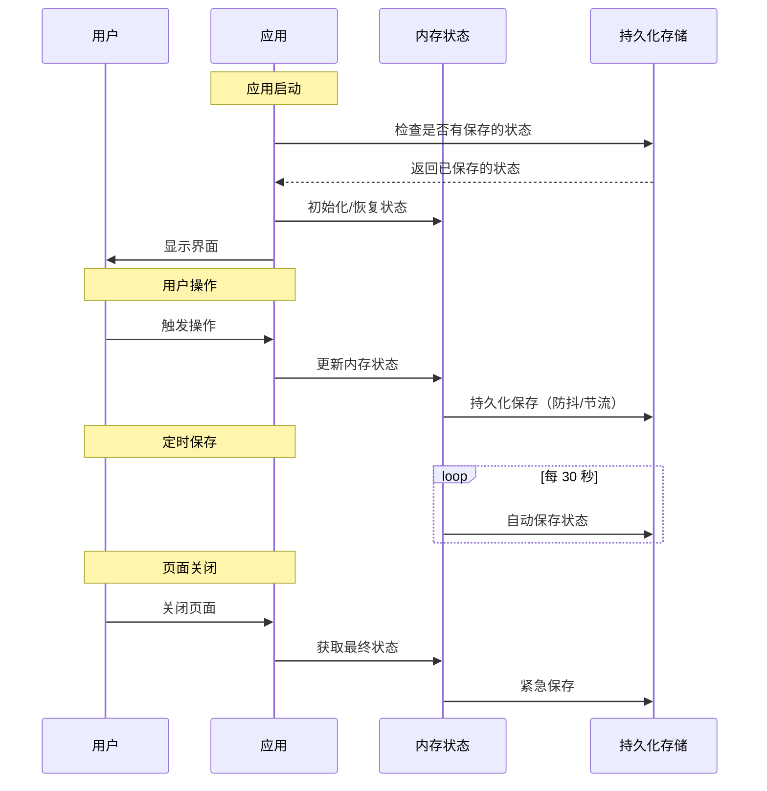
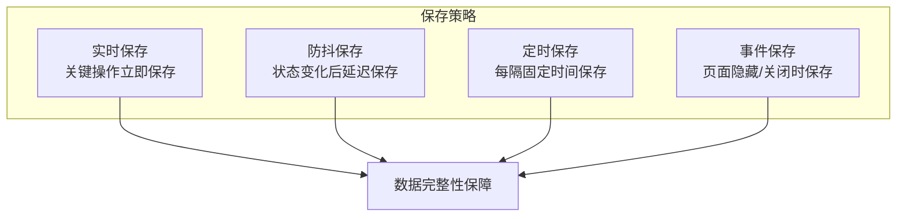
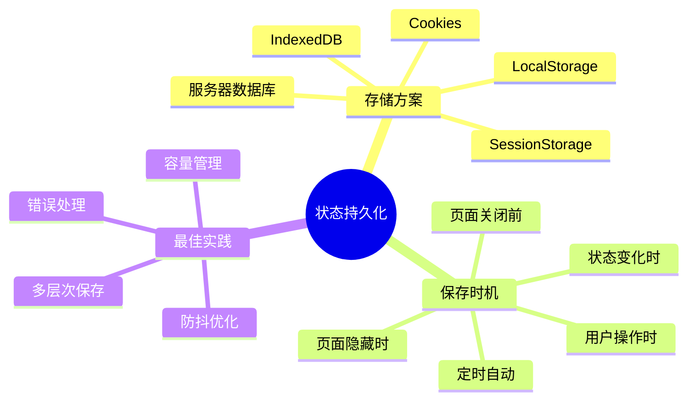

# 状态持久化详解

> 如何保证用户在关闭页面后能保存好状态？状态保存一般发生在什么时间段？

## 1. 什么是状态持久化？

**状态持久化**是指将应用程序的运行时状态（内存中的数据）保存到持久存储介质中，使得即使应用关闭或页面刷新后，状态仍然可以恢复。



---

## 2. 状态保存的时机

状态保存发生在多个关键时间点，下图展示了完整的时机分布：



### 2.1 各时机详解

| 保存时机         | 触发条件              | 可靠性 | 适用场景              |
| ---------------- | --------------------- | ------ | --------------------- |
| **用户操作时**   | 用户主动交互          | ⭐⭐⭐⭐⭐  | 表单数据、设置项      |
| **定时自动保存** | setInterval 定期触发  | ⭐⭐⭐⭐   | 文档编辑、草稿        |
| **状态变化时**   | 监听 state 变化       | ⭐⭐⭐⭐   | Redux/Vuex 等状态管理 |
| **页面隐藏时**   | visibilitychange 事件 | ⭐⭐⭐⭐   | 切换标签页、最小化    |
| **页面关闭前**   | beforeunload 事件     | ⭐⭐⭐    | 紧急保存              |
| **页面卸载时**   | unload 事件           | ⭐⭐     | 最后机会保存          |

---

## 3. 常用持久化存储方案对比



### 3.1 存储方案详细对比

| 存储方式           | 容量限制 | 生命周期       | 数据类型   | 同步/异步 | 跨设备 |
| ------------------ | -------- | -------------- | ---------- | --------- | ------ |
| **LocalStorage**   | ~5MB     | 永久           | 字符串     | 同步      | ❌      |
| **SessionStorage** | ~5MB     | 标签页关闭失效 | 字符串     | 同步      | ❌      |
| **IndexedDB**      | 几百MB+  | 永久           | 结构化数据 | 异步      | ❌      |
| **Cookies**        | ~4KB     | 可设置过期     | 字符串     | 同步      | ❌      |
| **服务器数据库**   | 无限制   | 永久           | 任意       | 异步      | ✅      |

---

## 4. 实现方案详解

### 4.1 使用 LocalStorage 保存状态

```javascript
// 保存状态
function saveState(key, state) {
    try {
        const serializedState = JSON.stringify(state);
        localStorage.setItem(key, serializedState);
    } catch (err) {
        console.error('保存状态失败:', err);
    }
}

// 恢复状态
function loadState(key) {
    try {
        const serializedState = localStorage.getItem(key);
        if (serializedState === null) {
            return undefined;
        }
        return JSON.parse(serializedState);
    } catch (err) {
        console.error('恢复状态失败:', err);
        return undefined;
    }
}
```

### 4.2 监听页面关闭事件

```javascript
// 页面即将关闭时保存
window.addEventListener('beforeunload', (event) => {
    saveState('appState', currentState);
    // 如需提示用户，可以设置 returnValue
    // event.returnValue = '确定要离开吗？';
});

// 页面可见性变化时保存（更可靠）
document.addEventListener('visibilitychange', () => {
    if (document.visibilityState === 'hidden') {
        saveState('appState', currentState);
    }
});
```

### 4.3 定时自动保存

```javascript
// 每 30 秒自动保存一次
const AUTO_SAVE_INTERVAL = 30000;

setInterval(() => {
    saveState('appState', currentState);
    console.log('状态已自动保存');
}, AUTO_SAVE_INTERVAL);
```

### 4.4 状态变化时保存（防抖优化）

```javascript
// 使用防抖避免频繁保存
function debounce(func, wait) {
    let timeout;
    return function executedFunction(...args) {
        const later = () => {
            clearTimeout(timeout);
            func(...args);
        };
        clearTimeout(timeout);
        timeout = setTimeout(later, wait);
    };
}

// 状态变化后延迟 1 秒保存
const debouncedSave = debounce((state) => {
    saveState('appState', state);
}, 1000);

// 监听状态变化
function onStateChange(newState) {
    currentState = newState;
    debouncedSave(newState);
}
```

---

## 5. 完整的状态持久化流程



---

## 6. 最佳实践建议

### 6.1 多层次保存策略



### 6.2 推荐的保存时机组合

> [!TIP]
> **最佳实践：组合使用多种保存时机**

1. **关键操作立即保存** - 如用户点击"保存"按钮
2. **状态变化防抖保存** - 1-2秒的防抖延迟
3. **定时自动保存** - 30秒到1分钟间隔
4. **页面隐藏时保存** - visibilitychange 事件
5. **页面关闭前保存** - beforeunload 事件（作为最后保障）

### 6.3 注意事项

> [!WARNING]
> **避免常见陷阱**

- **不要只依赖 `beforeunload`** - 在移动端和某些浏览器中不可靠
- **优先使用 `visibilitychange`** - 比 `beforeunload` 更可靠
- **注意存储容量限制** - LocalStorage 只有约 5MB
- **大数据考虑 IndexedDB** - 支持更大容量和结构化存储
- **敏感数据考虑加密** - localStorage 数据可被用户直接查看

---

## 7. 示例：完整的状态持久化实现

```javascript
class StatePersistence {
    constructor(storageKey, options = {}) {
        this.storageKey = storageKey;
        this.state = null;
        this.autoSaveInterval = options.autoSaveInterval || 30000;
        this.debounceDelay = options.debounceDelay || 1000;
        
        this.init();
    }
    
    init() {
        // 1. 恢复状态
        this.state = this.load() || {};
        
        // 2. 设置定时保存
        setInterval(() => this.save(), this.autoSaveInterval);
        
        // 3. 监听页面可见性变化
        document.addEventListener('visibilitychange', () => {
            if (document.visibilityState === 'hidden') {
                this.save();
            }
        });
        
        // 4. 监听页面关闭
        window.addEventListener('beforeunload', () => {
            this.save();
        });
    }
    
    // 保存状态
    save() {
        try {
            localStorage.setItem(
                this.storageKey, 
                JSON.stringify(this.state)
            );
            console.log('状态已保存:', new Date().toLocaleTimeString());
        } catch (err) {
            console.error('保存失败:', err);
        }
    }
    
    // 加载状态
    load() {
        try {
            const data = localStorage.getItem(this.storageKey);
            return data ? JSON.parse(data) : null;
        } catch (err) {
            console.error('加载失败:', err);
            return null;
        }
    }
    
    // 更新状态（带防抖）
    update(newState) {
        this.state = { ...this.state, ...newState };
        this.debouncedSave();
    }
    
    // 防抖保存
    debouncedSave = this.debounce(() => {
        this.save();
    }, this.debounceDelay);
    
    // 防抖工具函数
    debounce(func, wait) {
        let timeout;
        return (...args) => {
            clearTimeout(timeout);
            timeout = setTimeout(() => func.apply(this, args), wait);
        };
    }
}

// 使用示例
const appState = new StatePersistence('myApp', {
    autoSaveInterval: 30000,  // 30秒自动保存
    debounceDelay: 1000       // 1秒防抖延迟
});

// 更新状态
appState.update({ userName: '张三', theme: 'dark' });
```

---

## 8. 总结



**核心要点：**

1. **不要依赖单一保存时机** - 组合使用多种策略
2. **visibilitychange 比 beforeunload 更可靠** - 优先使用
3. **使用防抖优化频繁保存** - 避免性能问题
4. **选择合适的存储方案** - 根据数据大小和需求选择
5. **做好错误处理** - 存储可能失败，需要容错机制
