# 策略模式详解：GuideAgent 的双策略引导机制

本文档深入讲解 ResumeAssistant 项目中 **策略模式（Strategy Pattern）** 的应用，包括设计思想、两种策略的差异，以及动态切换机制。

---

## 📌 什么是策略模式？

**策略模式（Strategy Pattern）** 是一种行为设计模式，它允许在运行时选择算法或行为。在 GuideAgent 中，策略模式被用于实现 **不同类型简历板块的差异化处理**。

> **核心思想**：将"如何引导用户"的逻辑封装成不同的策略，根据任务类型动态选择。

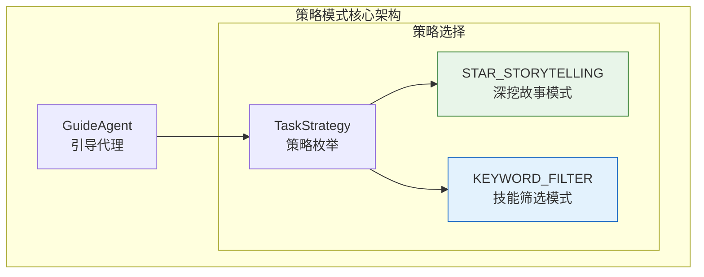

---

## 🎯 为什么需要策略模式？

### 问题场景

简历中不同板块需要**完全不同的处理方式**：

| 板块类型 | 处理需求           | 用户交互方式         |
| -------- | ------------------ | -------------------- |
| 项目经历 | 深挖细节、量化数据 | 多轮对话、STAR 法则  |
| 工作经历 | 深挖成就、业务影响 | 多轮对话、引导式提问 |
| 技能特长 | 快速筛选、匹配岗位 | 1-2轮确认即可        |
| 自我评价 | 文字优化           | 简单修改             |

### 不使用策略模式的问题

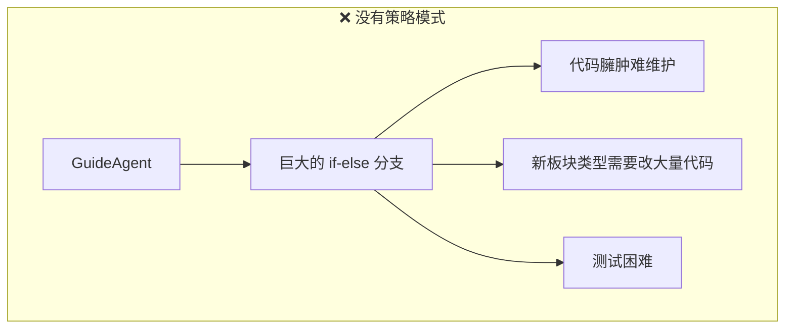

### 使用策略模式的优势

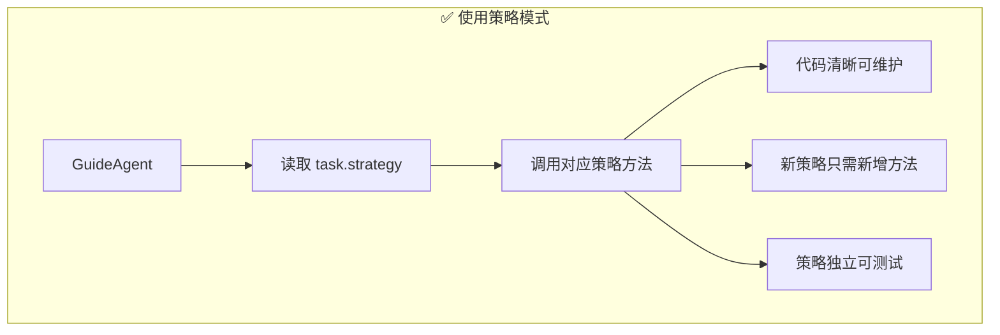

---

## 📊 两种核心策略

项目定义了两种策略，通过枚举类型 `TaskStrategy` 表示：

```python
class TaskStrategy(str, Enum):
    """任务处理策略枚举"""
    STAR_STORYTELLING = "STAR_STORYTELLING"  # 深挖故事模式（工作/项目经历）
    KEYWORD_FILTER = "KEYWORD_FILTER"        # 技能筛选模式（技能特长/工具）
```

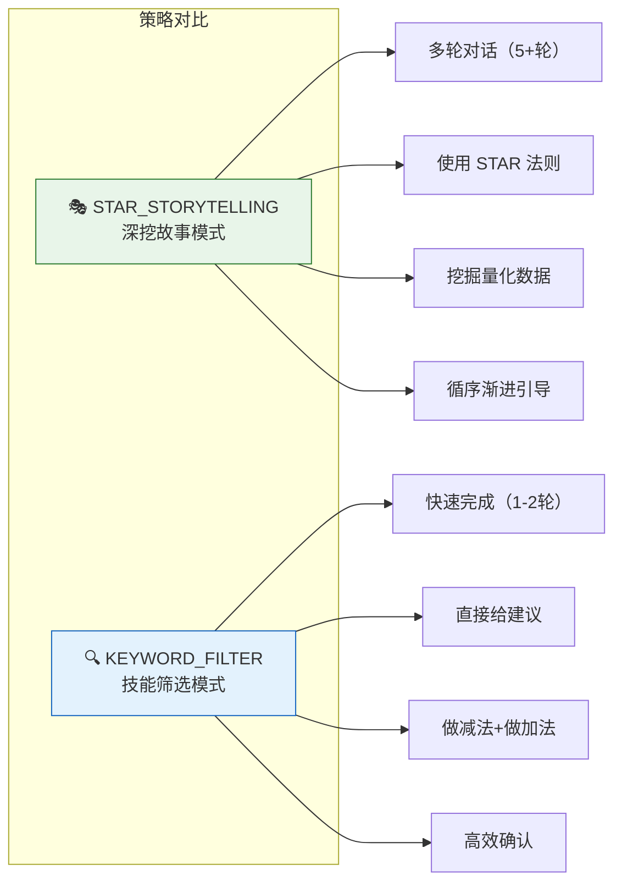

---

## 🌟 策略一：STAR_STORYTELLING（深挖故事模式）

### 适用场景

- 项目经历
- 工作经历
- 实习经历
- 教育背景（课程、成就描述）

### 核心理念

使用 **STAR 法则**（Situation-Task-Action-Result）通过多轮对话挖掘用户经历中的亮点。

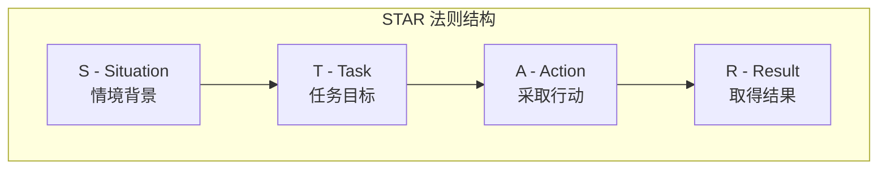

### 对话流程

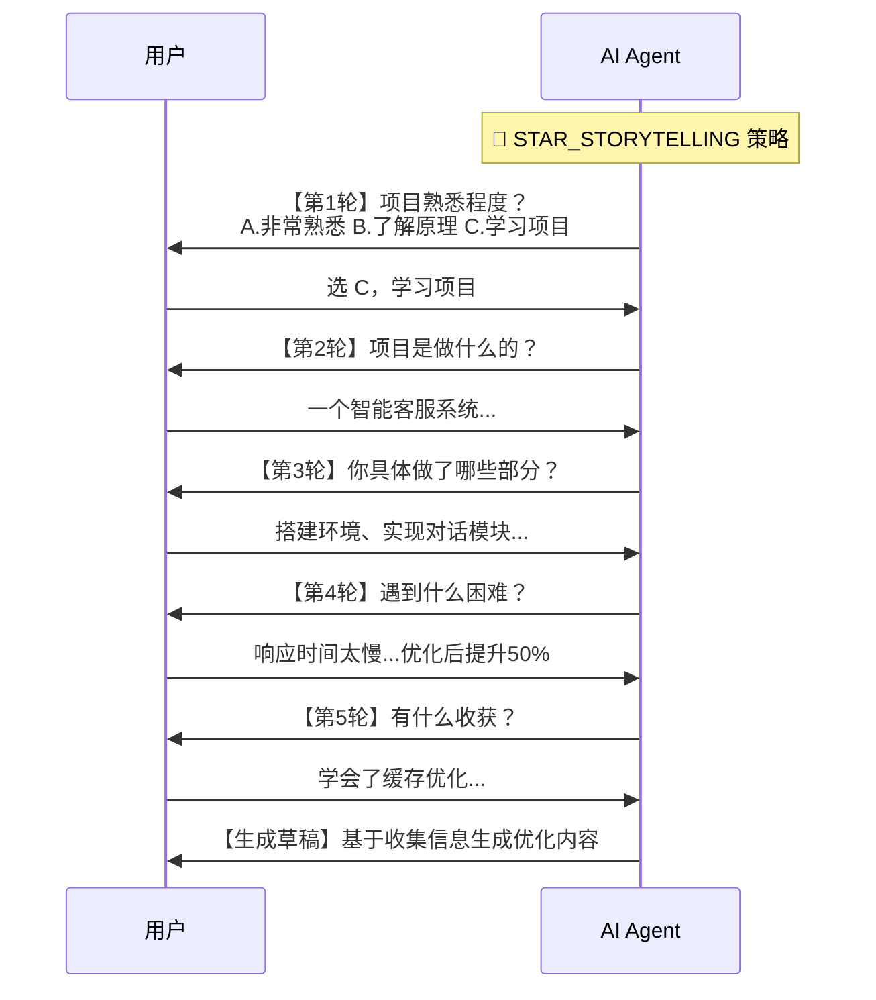

### 三种子模式

根据用户对项目的熟悉程度，STAR_STORYTELLING 内部还会动态切换子策略：

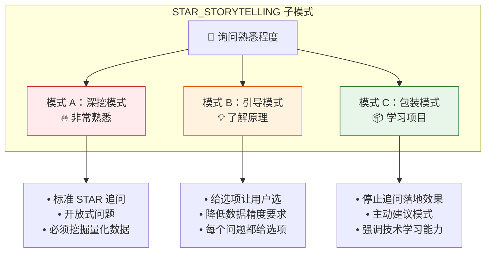

### 代码结构

```python
def _get_star_storytelling_strategy(self) -> str:
    """STAR_STORYTELLING 策略的详细指导"""
    return """
    # Strategy: STAR_STORYTELLING（深挖故事模式）
    
    ## 💬 对话式过渡话术（让对话更自然）
    - 话题深入：当用户提供有价值信息，继续深挖
    - 话题切换：当前话题聊透了，自然过渡
    - 给出选项：用户回答简短时，提供具体选项
    - 鼓励表达：降低用户压力
    
    ## 🎯 掌握程度探测
    - A. 非常熟悉 → 深挖模式
    - B. 了解原理 → 引导模式
    - C. 学习项目 → 包装模式
    
    ## 📊 量化数据要求（灵活处理）
    - 真实项目：必须包含 2+ 项量化数据
    - 学习项目：可用技术复杂度替代
    ...
    """
```

---

## 🔍 策略二：KEYWORD_FILTER（技能筛选模式）

### 适用场景

- 技能特长
- 工具/软件列表
- 语言能力
- 证书资质

### 核心理念

**快速高效**，直接给出分析结果，做减法（删除无关技能）+ 做加法（补充关键技能）。

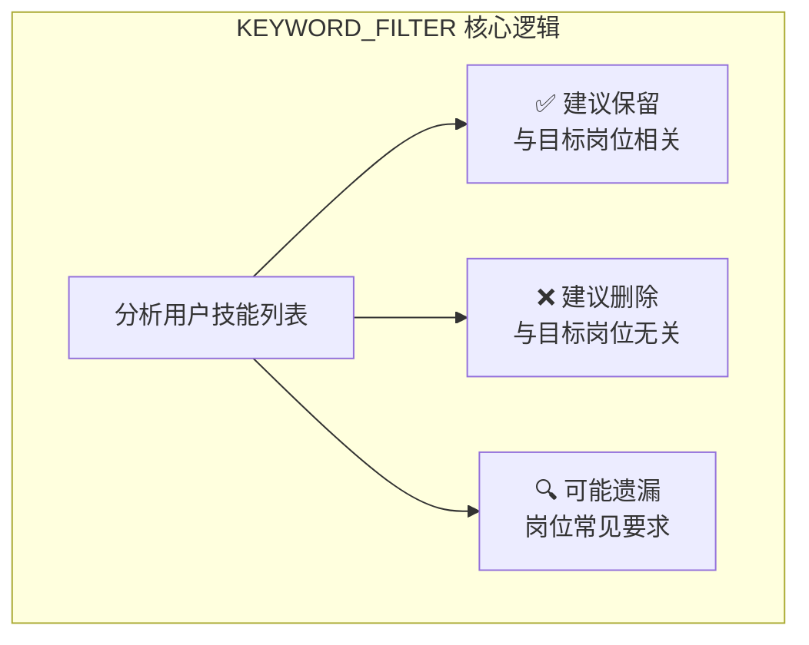

### 对话流程

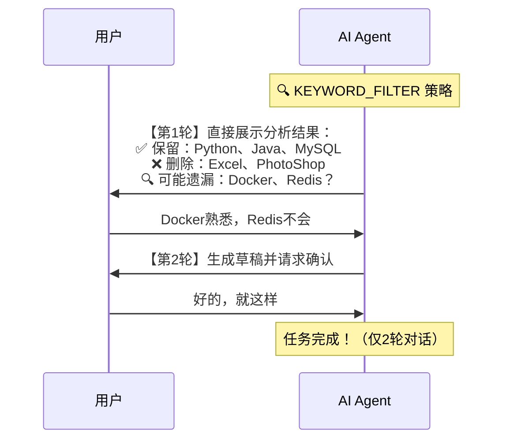

### 禁止行为

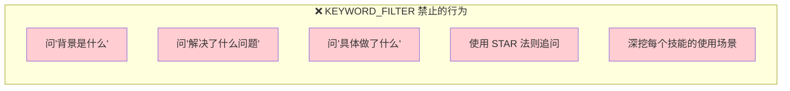

### 代码结构

```python
def _get_keyword_filter_strategy(self) -> str:
    """KEYWORD_FILTER 策略的详细指导"""
    return """
    # Strategy: KEYWORD_FILTER（技能筛选模式）
    
    ## 核心原则
    - 做减法：直接建议删除无关技能
    - 做加法：询问是否具备关键技能
    - 快速高效：最多 2 轮对话完成
    
    ## 禁止行为
    - ❌ 禁止问"背景是什么"
    - ❌ 禁止使用 STAR 法则追问
    
    ## 允许行为
    - ✅ 直接给出技能筛选建议
    - ✅ 询问是否具备某技能（是/否即可）
    ...
    """
```

---

## ⚙️ 策略模式的实现方式

### 1. 策略定义（枚举）

```python
# backend/model.py
class TaskStrategy(str, Enum):
    """任务处理策略枚举"""
    STAR_STORYTELLING = "STAR_STORYTELLING"
    KEYWORD_FILTER = "KEYWORD_FILTER"
```

### 2. 任务携带策略

```python
# backend/model.py
class Task(BaseModel):
    id: int
    section: str
    strategy: TaskStrategy = Field(
        default=TaskStrategy.STAR_STORYTELLING,
        description="Processing strategy for this task"
    )
    original_text: str
    diagnosis: str
    goal: str
```

### 3. 策略路由（核心！）

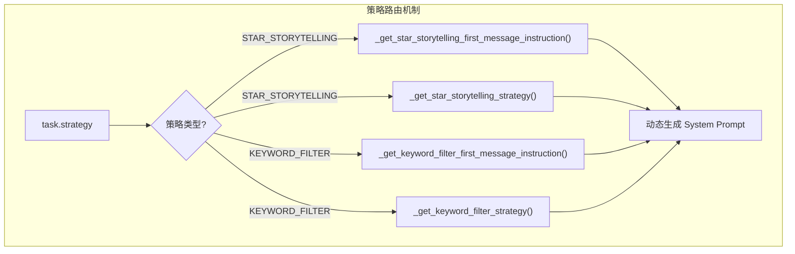

```python
# backend/guide_agent.py - _get_system_prompt() 方法
def _get_system_prompt(self) -> str:
    strategy = self.task.strategy
    
    # 根据策略生成首次对话指引
    if len(self.messages) == 0:
        if strategy == TaskStrategy.KEYWORD_FILTER:
            first_message_instruction = self._get_keyword_filter_first_message_instruction()
        else:
            first_message_instruction = self._get_star_storytelling_first_message_instruction()
    
    # 根据策略生成策略指导
    if strategy == TaskStrategy.KEYWORD_FILTER:
        strategy_instruction = self._get_keyword_filter_strategy()
    else:
        strategy_instruction = self._get_star_storytelling_strategy()
    
    return f"""
    # Context
    任务策略: {strategy.value}
    ...
    {first_message_instruction}
    {strategy_instruction}
    """
```

---

## 🔄 策略分配机制

策略由 **Plan Agent** 在生成任务计划时自动分配：

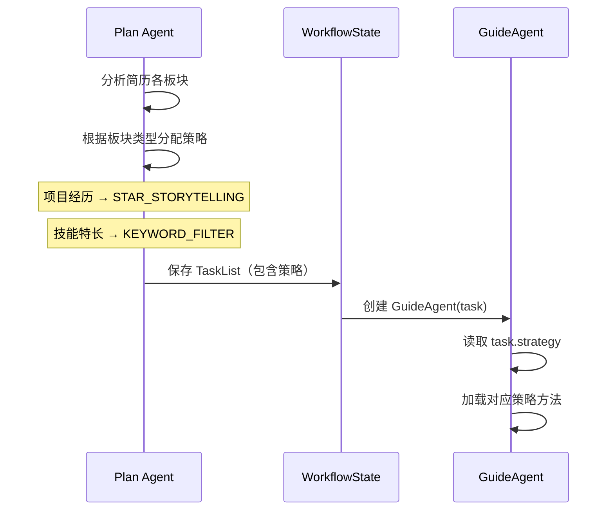

### Plan Agent 的策略分配逻辑

```python
# Plan Agent Prompt 中的策略选择指导
"""
## 策略选择指南

1. **STAR_STORYTELLING**（深挖故事模式）：
   - 适用于：工作经历、项目经历、实习经历
   - 特点：多轮对话、STAR法则、挖掘量化数据

2. **KEYWORD_FILTER**（技能筛选模式）：
   - 适用于：技能特长、工具/框架列表
   - 特点：1-2轮对话、直接给建议、快速高效
"""
```

---

## 📊 两种策略的完整对比

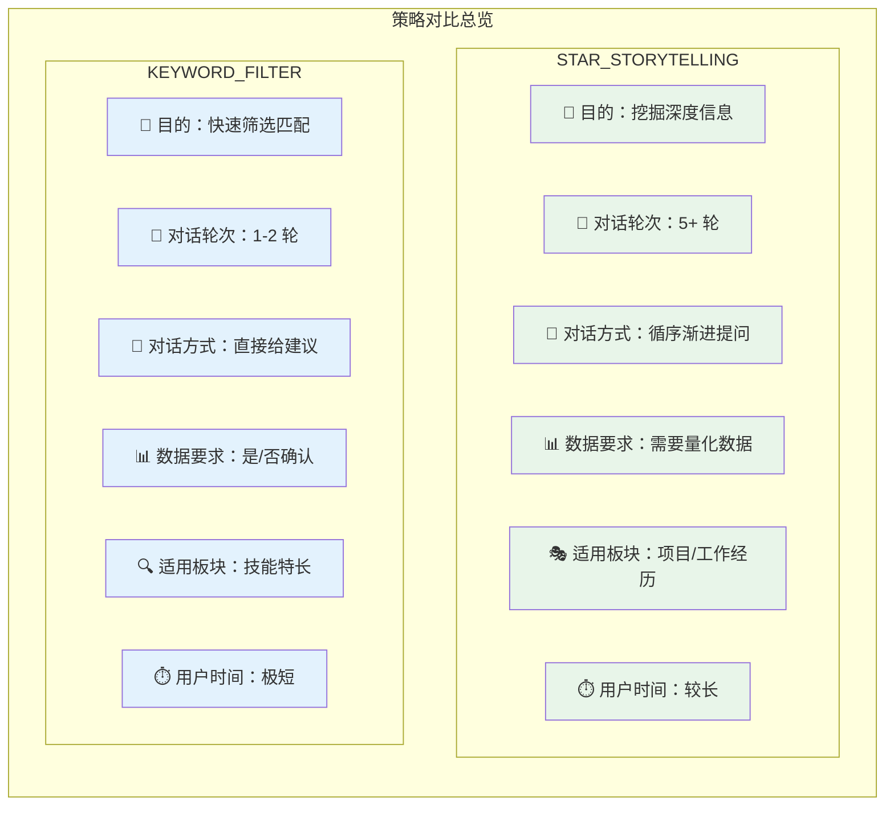

| 维度         | STAR_STORYTELLING        | KEYWORD_FILTER      |
| ------------ | ------------------------ | ------------------- |
| **目的**     | 挖掘用户经历的深度信息   | 快速筛选和匹配技能  |
| **对话轮次** | 5+ 轮                    | 1-2 轮              |
| **开场方式** | 1句观察 + 1个问题        | 直接展示分析结果    |
| **提问风格** | 开放式 → 逐步深入        | 确认性问题（是/否） |
| **数据要求** | 量化数据（数字、百分比） | 技能具备与否        |
| **适用板块** | 项目经历、工作经历       | 技能特长、工具列表  |
| **代码行数** | ~400 行指导              | ~50 行指导          |

---

## 🧩 与传统策略模式的对比

### 传统 OOP 策略模式

```python
# 传统方式：使用接口和类
class Strategy(ABC):
    @abstractmethod
    def execute(self): pass

class StarStorytelling(Strategy):
    def execute(self): ...

class KeywordFilter(Strategy):
    def execute(self): ...

class GuideAgent:
    def __init__(self, strategy: Strategy):
        self.strategy = strategy
    
    def run(self):
        self.strategy.execute()
```

### 本项目的实现方式

```python
# 本项目方式：基于枚举 + 方法映射
class TaskStrategy(str, Enum):
    STAR_STORYTELLING = "STAR_STORYTELLING"
    KEYWORD_FILTER = "KEYWORD_FILTER"

class GuideAgent:
    def _get_system_prompt(self):
        if self.task.strategy == TaskStrategy.KEYWORD_FILTER:
            return self._get_keyword_filter_strategy()
        else:
            return self._get_star_storytelling_strategy()
```

### 为什么选择这种方式？

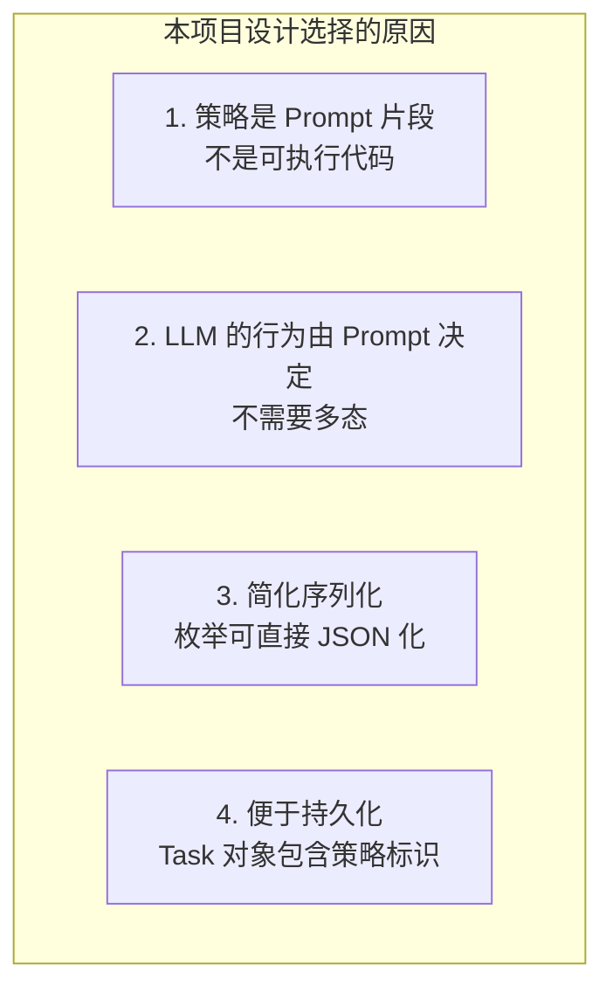

---

## ✨ 设计亮点

### 1. 策略与状态机的结合

策略模式与状态机协同工作：

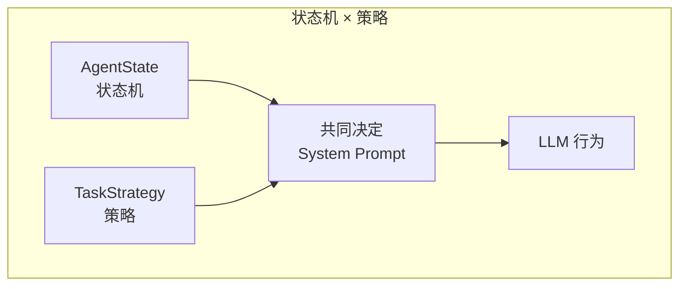

- **状态机**决定"当前处于哪个阶段"
- **策略**决定"这个阶段怎么做"

### 2. 可扩展性

添加新策略只需：
1. 在 `TaskStrategy` 枚举中添加新值
2. 添加对应的 `_get_xxx_strategy()` 方法
3. 添加对应的 `_get_xxx_first_message_instruction()` 方法

### 3. 策略内的动态适应

STAR_STORYTELLING 策略内部还有**子策略切换**（模式 A/B/C），实现了更细粒度的适应性。

---

## 📐 总结

| 维度         | 说明                                      |
| ------------ | ----------------------------------------- |
| **模式**     | 策略模式（Strategy Pattern）              |
| **实现方式** | 枚举 + 方法映射（非传统 OOP 接口）        |
| **策略数量** | 2 种（STAR_STORYTELLING、KEYWORD_FILTER） |
| **分配时机** | Plan Agent 生成任务计划时                 |
| **使用时机** | GuideAgent 生成 System Prompt 时          |
| **核心价值** | 同一个 Agent 类处理不同类型任务           |

---

## 📚 相关文档

- [GuideAgent 状态机设计](file:///c:/Users/admin/Desktop/ResumeAssistant/learning/guide_agent_state_machine.md)
- [GuideAgent 上下文管理](file:///c:/Users/admin/Desktop/ResumeAssistant/learning/guide_agent_context_management.md)
- [工作流上下文详解](file:///c:/Users/admin/Desktop/ResumeAssistant/learning/guide_workflow_context.md)
- [源码：model.py](file:///c:/Users/admin/Desktop/ResumeAssistant/backend/model.py) - TaskStrategy 定义
- [源码：guide_agent.py](file:///c:/Users/admin/Desktop/ResumeAssistant/backend/guide_agent.py) - 策略实现
