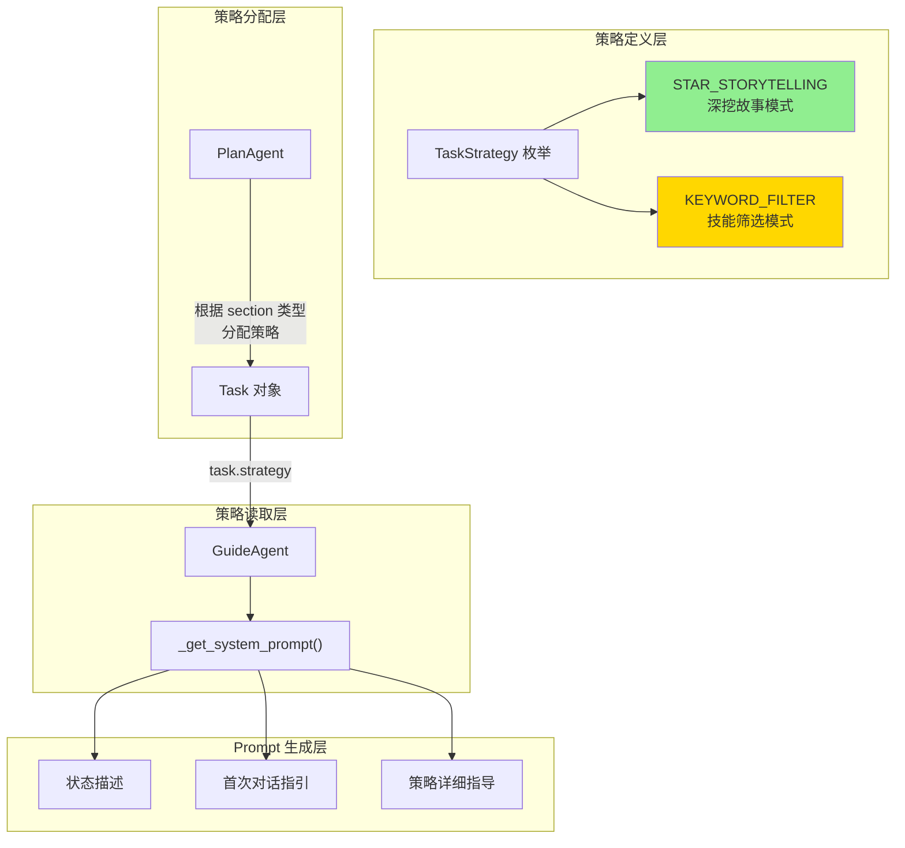
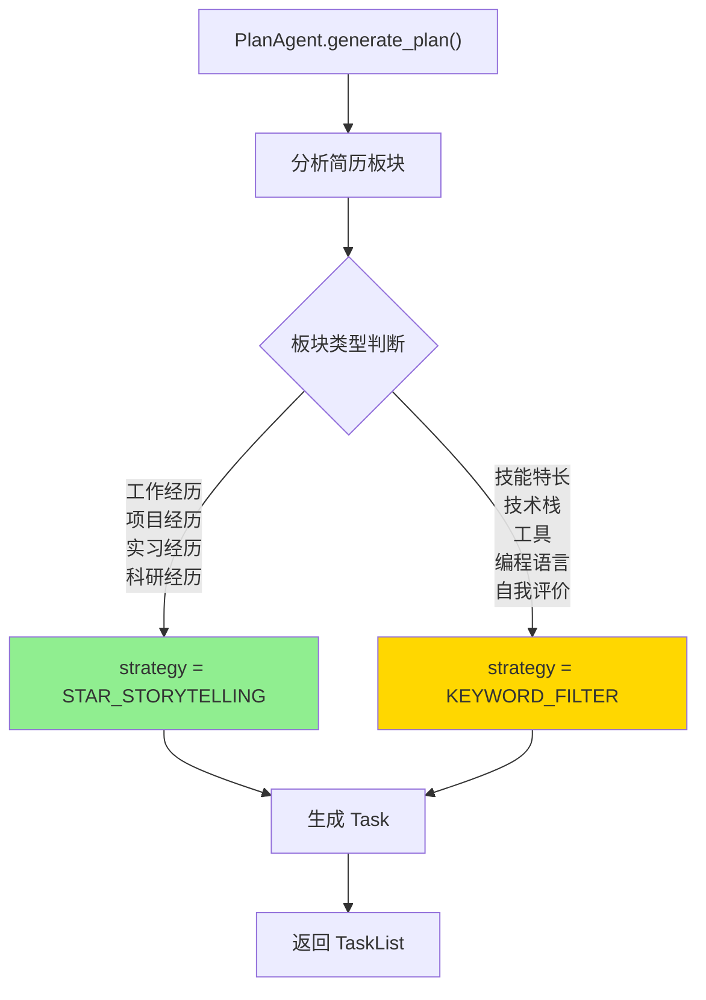
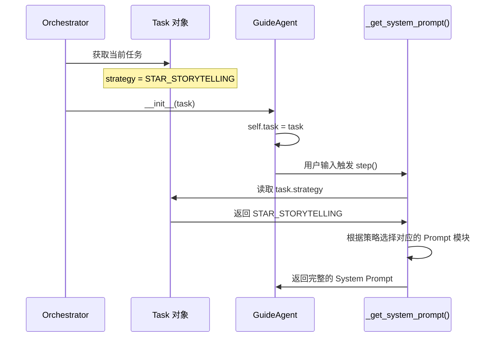
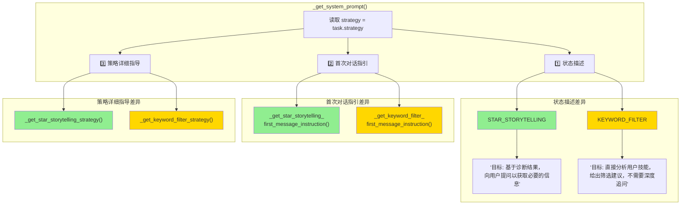
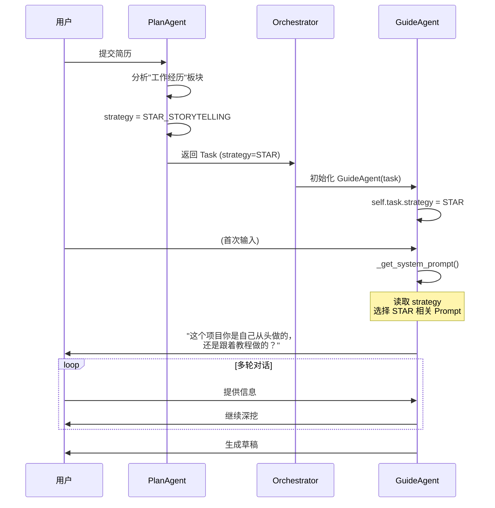
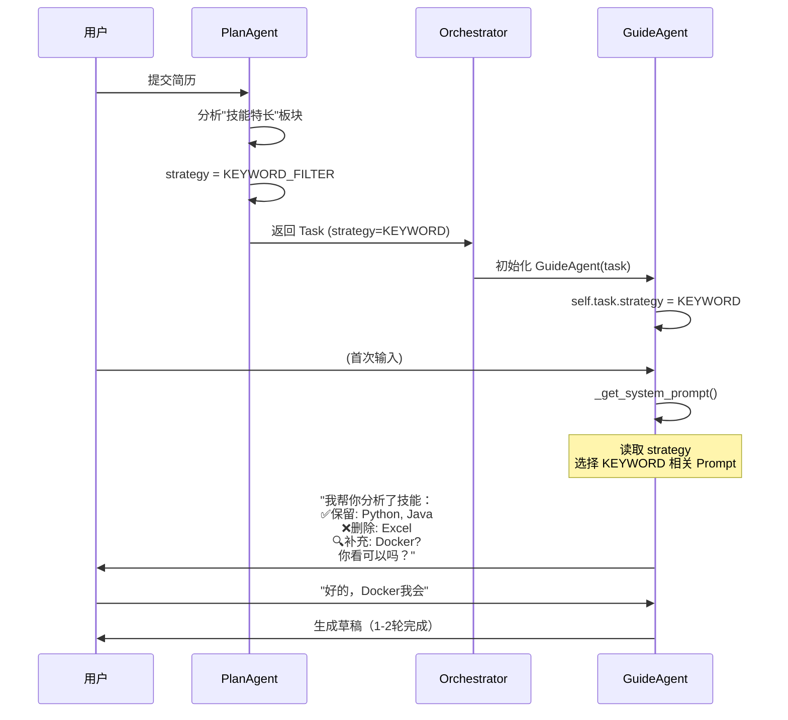
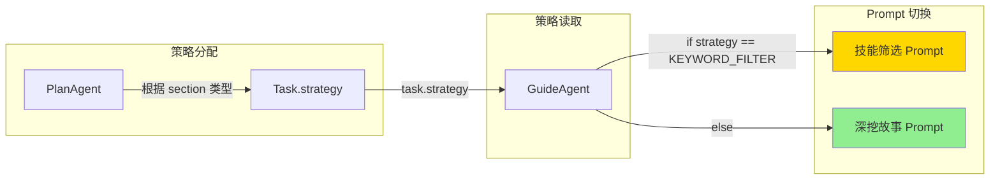

# 策略切换机制详解

本文档详细讲解**策略切换（Strategy Switching）**机制，包括策略的定义、分配、读取和在 Prompt 中的应用。

---

## 📊 整体架构概览



---

## 🎯 两种策略定义

### TaskStrategy 枚举

```python
# 位置: backend/model.py

class TaskStrategy(str, Enum):
    """任务处理策略枚举"""
    STAR_STORYTELLING = "STAR_STORYTELLING"  # 深挖故事模式（工作/项目经历）
    KEYWORD_FILTER = "KEYWORD_FILTER"        # 技能筛选模式（技能特长/工具）
```

### 策略对比表

| 特性           | STAR_STORYTELLING            | KEYWORD_FILTER         |
| -------------- | ---------------------------- | ---------------------- |
| **适用板块**   | 工作经历、项目经历、实习经历 | 技能特长、技术栈、工具 |
| **核心方法**   | STAR 法则深挖故事            | 做减法 + 做加法        |
| **对话轮数**   | 多轮（5轮左右）              | 1-2轮                  |
| **用户参与度** | 高（需要详细回答）           | 低（确认即可）         |
| **挖掘内容**   | 背景、行动、成果、量化数据   | 保留/删除/补充技能     |

---

## 📍 策略分配：发生在 PlanAgent

PlanAgent 在生成修改计划时，根据**简历板块类型**为每个 Task 分配合适的策略。

### 分配规则



### PlanAgent 中的策略规则

```python
# 位置: backend/plan_agent.py (System Prompt 中)

# Strategy Selection Rules（策略选择规则）
# 每个 Task 必须指定 `strategy` 字段，根据 section 类型选择合适的策略：

# 1. STAR_STORYTELLING（深挖故事模式）：
#    - 适用于：工作经历、项目经历、实习经历、科研经历
#    - 特点：需要 STAR 法则深挖背景、行动、结果
#    - 需要多轮对话挖掘量化数据和技术细节

# 2. KEYWORD_FILTER（技能筛选模式）：
#    - 适用于：技能特长、技术栈、工具、编程语言、自我评价
#    - 特点：做减法（删除无关技能）+ 做加法（补充关键技能）
#    - 不需要讲故事，只需快速筛选和确认
```

### 生成的 Task 示例

```json
{
  "tasks": [
    {
      "id": 1,
      "section": "工作经历 - 后台管理系统",
      "strategy": "STAR_STORYTELLING",  // ✅ 工作经历用深挖模式
      "original_text": "负责公司后台管理系统的开发...",
      "diagnosis": "描述过于简单...",
      "goal": "补充量化数据和技术难点..."
    },
    {
      "id": 2,
      "section": "技能特长",
      "strategy": "KEYWORD_FILTER",  // ✅ 技能板块用筛选模式
      "original_text": "Java, Python, Excel, PhotoShop...",
      "diagnosis": "包含与目标岗位无关的技能...",
      "goal": "精简无关项，补充关键技能..."
    }
  ]
}
```

---

## 📖 策略读取：发生在 GuideAgent

GuideAgent 在初始化时接收 Task 对象，通过 `task.strategy` 读取策略，然后在 `_get_system_prompt()` 中动态生成对应的 Prompt。

### 策略读取流程



### 关键代码位置

```python
# 位置: backend/guide_agent.py

class GuideAgent:
    def __init__(self, task: Task, context: Optional[Dict] = None):
        self.task = task  # Task 对象包含 strategy 字段
        # ...

    def _get_system_prompt(self) -> str:
        # 🎯 读取策略
        strategy = self.task.strategy
        
        # 根据策略生成不同的 Prompt 组件...
```

---

## 🔀 Prompt 差异化生成

`_get_system_prompt()` 方法会根据策略在三个维度生成不同的内容：



---

## 📝 维度一：状态描述差异

在 DISCOVERY 状态下，两种策略的描述完全不同：

### STAR_STORYTELLING 模式

```python
if self.current_state == AgentState.DISCOVERY:
    if strategy == TaskStrategy.KEYWORD_FILTER:
        # KEYWORD_FILTER 的描述...
    else:
        # STAR_STORYTELLING 的描述
        state_description = (
            "当前状态: DISCOVERY (信息挖掘)\n"
            "目标: 基于诊断结果，向用户提问以获取必要的信息。\n"
            "约束: 暂时**不要**提供草稿。专注于理解用户的经历和细节。\n"
            "可选动作: CONTINUE_ASKING, PROPOSE_DRAFT\n"
            "\n"
            "📊 智能节奏控制（每次回复前必做判断）：\n"
            # ... 详细的深挖指引
        )
```

### KEYWORD_FILTER 模式

```python
if strategy == TaskStrategy.KEYWORD_FILTER:
    state_description = (
        "当前状态: DISCOVERY (技能筛选分析)\n"
        "目标: 直接分析用户技能，给出筛选建议，不需要深度追问。\n"
        "约束: 第一轮就直接给出分析结果（做减法+做加法），询问用户确认。\n"
        "可选动作: CONTINUE_ASKING (用户需要补充信息), PROPOSE_DRAFT (给出草稿)"
    )
```

---

## 💬 维度二：首次对话指引差异

### STAR_STORYTELLING 首次对话

```python
def _get_star_storytelling_first_message_instruction(self) -> str:
    return """
# 🚨 首次对话指引 (STAR_STORYTELLING 模式)

**🔑 核心原则：循序渐进引导，不要一次性抛出所有信息！**

## 开场白规则（必须遵守）：

1. **禁止一次性抛出多个问题**
   ❌ 不要列问题清单（1. 2. 3. ...）
   ✅ 只问1个最核心的探索性问题

2. **开场问题优先级**（学生项目）：
   第一优先：项目熟悉程度（自己做 vs 跟着做）

## 示例：
\"我看了你的**项目经历**，挺有意思的！不过我注意到技术细节这块可以再丰富一些。

先问个基础问题：这个项目你是自己从头做的，还是跟着教程/参考别人的？\"
"""
```

### KEYWORD_FILTER 首次对话

```python
def _get_keyword_filter_first_message_instruction(self) -> str:
    return """
# 🚨 首次对话指引 (KEYWORD_FILTER 模式)

**🔑 核心原则：循序渐进但保持高效**

## 开场白规则：

1. **简短寒暄 + 快速分析**
   ✅ 用自然友好的语气开场
   ✅ 直接展示分析结果（这是技能筛选任务的特点）

2. **分析结果分类**（保持高效特性）：
   - ✅ 建议保留（核心技能）
   - ❌ 建议删除（无关技能）
   - 🔍 可能遗漏（关键技能）

## 示例：
\"我看了你的**技能特长**，帮你快速分析了一下：

✅ **建议保留：** Python、FastAPI、MySQL（这些都是核心技能）
❌ **建议删除：** Excel、PhotoShop（和AI工程师岗位关系不大）
🔍 **你可能有但没写：** LangChain、Docker、Redis？

你看这样调整可以吗？还有什么技能想补充的？\"
"""
```

---

## 📚 维度三：策略详细指导差异

### STAR_STORYTELLING 策略指导（部分）

```python
def _get_star_storytelling_strategy(self) -> str:
    return """
# Strategy: STAR_STORYTELLING（深挖故事模式）

## 🎯 掌握程度探测
"在深入之前，我想先了解一下你对这个项目的熟悉程度：
A. 🔥 非常熟悉 - 这是我主导的
B. 💡 了解原理 - 大概知道怎么回事
C. 📦 学习项目 - 主要是跟着教程/参考做的"

## 🔄 策略切换机制

### 模式 A：深挖模式
- 使用标准 STAR 法则追问细节
- 必须挖掘出至少 2 项量化数据

### 模式 B：引导模式
- 给 2-3 个选项让用户选
- 降低对精确数据的要求

### 模式 C：包装模式
- 立即停止追问落地效果
- 先问"这个项目你实际动手做了哪些部分？"
- 强调技术实现能力

## 📊 量化数据要求
1. 真实项目/实习项目：必须包含至少 2 项量化数据
2. 课程项目/毕业设计：可以用估算值
3. 学习项目/demo：可以用技术复杂度、代码规模等替代
"""
```

### KEYWORD_FILTER 策略指导

```python
def _get_keyword_filter_strategy(self) -> str:
    return """
# Strategy: KEYWORD_FILTER（技能筛选模式）

## 核心流程（1-2轮对话完成）

第一轮：
1. 分析现有技能列表
2. 分类展示（保留/删除/补充）
3. 询问用户确认

第二轮（如需要）：
1. 根据用户反馈调整
2. 生成最终草稿

## 筛选规则
- 保留：与目标岗位强相关的核心技能
- 删除：与岗位无关的技能（如：办公软件、设计软件）
- 补充：岗位要求但用户可能遗漏的技能

## 注意事项
- 不需要 STAR 法则
- 不需要深挖故事
- 快速高效是关键
"""
```

---

## 🔄 完整流程示例

### 场景：处理工作经历（STAR_STORYTELLING）



### 场景：处理技能特长（KEYWORD_FILTER）



---

## 📍 代码位置索引

| 功能              | 文件                     | 位置            |
| ----------------- | ------------------------ | --------------- |
| TaskStrategy 定义 | `backend/model.py`       | 第 79-82 行     |
| 策略分配规则      | `backend/plan_agent.py`  | 第 112-123 行   |
| 策略读取          | `backend/guide_agent.py` | 第 40 行        |
| 状态描述差异      | `backend/guide_agent.py` | 第 44-206 行    |
| STAR 首次对话     | `backend/guide_agent.py` | 第 387-492 行   |
| KEYWORD 首次对话  | `backend/guide_agent.py` | 第 494-588 行   |
| STAR 策略指导     | `backend/guide_agent.py` | 第 590-1165 行  |
| KEYWORD 策略指导  | `backend/guide_agent.py` | 第 1167-1222 行 |

---

## 📚 总结



> [!TIP]
> **设计亮点**：策略切换采用**配置驱动**设计——PlanAgent 在规划阶段就确定策略，GuideAgent 在执行阶段只需读取策略并选择对应的 Prompt 模块。这种设计实现了**规划与执行的解耦**，使得添加新策略变得简单。

---

## 🔗 相关文档

- [guide_agent_decision_data_layer.md](file:///c:/Users/admin/Desktop/ResumeAssistant/learning/guide_agent_decision_data_layer.md) - AgentDecision 数据层操作
- [guide_agent_state_machine.md](file:///c:/Users/admin/Desktop/ResumeAssistant/learning/guide_agent_state_machine.md) - GuideAgent 状态机详解
- [guide_editor_agent_execution.md](file:///c:/Users/admin/Desktop/ResumeAssistant/learning/guide_editor_agent_execution.md) - EditorAgent 执行机制
