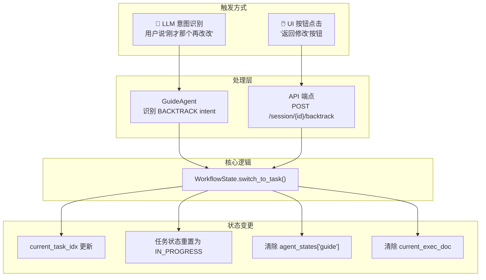
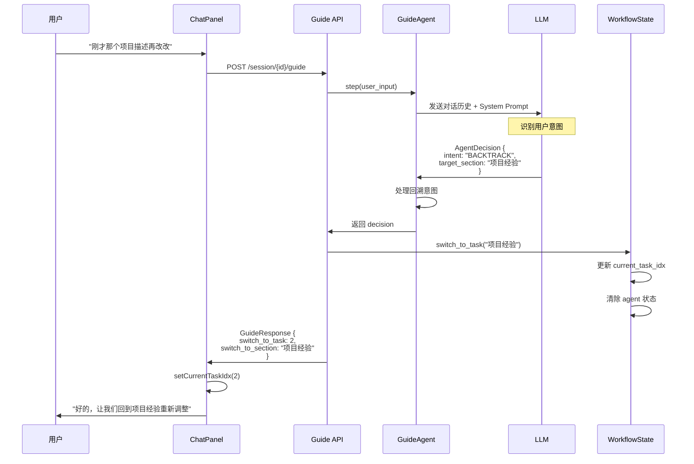
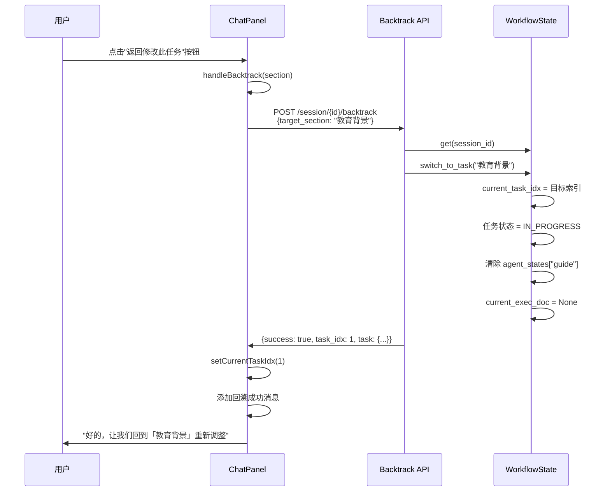
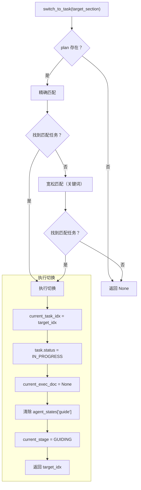
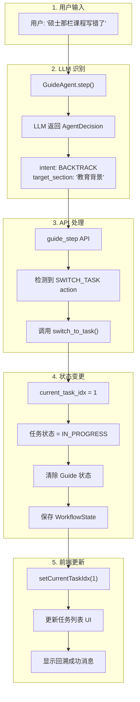
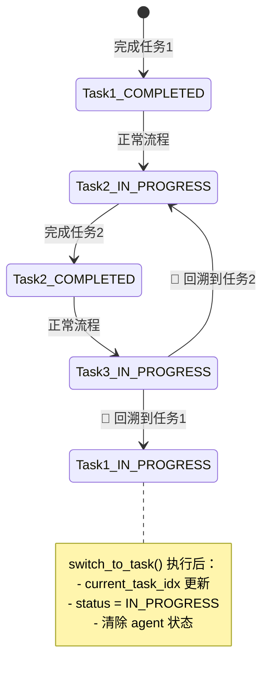

# 任务回溯机制设计详解

本文档详细讲解**任务回溯（Task Backtracking）**机制的设计，包括触发方式、数据流、状态变更和代码位置。

---

## 📊 整体架构概览



---

## 🔀 两种触发方式

### 方式 1：LLM 意图识别（智能回溯）

用户在对话中表达想要修改之前内容时，LLM 自动识别 `BACKTRACK` 意图。



### 方式 2：UI 按钮点击（手动回溯）

用户点击任务完成消息下方的"返回修改"按钮。



---

## 🎯 LLM 意图识别机制

### AgentDecision 中的回溯字段

```python
# model.py
class AgentDecision(BaseModel):
    thought: str
    next_action: Literal["CONTINUE_ASKING", "PROPOSE_DRAFT", "REQUEST_CONFIRM", "CONFIRM_FINISH"]
    reply_to_user: str
    
    # 🔑 回溯相关字段
    intent: Optional[Literal["CONTINUE", "BACKTRACK"]] = "CONTINUE"
    target_section: Optional[str] = None  # 回溯目标板块名称
```

### System Prompt 中的回溯指令

```python
# guide_agent.py - _get_system_prompt()

# 🔄 智能任务回溯（Intent Recognition）

## 意图判断规则

1. **CONTINUE（继续当前任务）**：默认意图
   - 回答你的问题
   - 提供信息
   - 对草稿给出反馈

2. **BACKTRACK（回溯修改）**：用户想修改之前已完成的任务
   
   **回溯信号词**：
   - 时间词："刚才"、"之前"、"上面"、"前面"
   - 否定词 + 板块："那个xx不对"、"xx那里错了"
   - 直接指明板块："硕士课程"、"技能特长"
   
   **示例**：
   - "你在硕士那栏里标着本科课程，这不对啊" → BACKTRACK，target_section="教育背景"
   - "刚才那个项目描述再改改" → BACKTRACK，target_section="项目经验"
   - "技能那块还要调整" → BACKTRACK，target_section="技能特长"
```

---

## 🔧 核心处理逻辑

### WorkflowState.switch_to_task()

这是回溯的核心方法，负责执行任务切换：



### 代码实现

```python
# workflow_state.py

def switch_to_task(self, target_section: str) -> Optional[int]:
    """
    切换到指定任务（用于智能回溯修改）
    
    Args:
        target_section: 目标任务的板块名称（部分匹配即可）
        
    Returns:
        目标任务的索引，如果未找到返回 None
    """
    if not self.plan:
        return None
    
    # 查找匹配的任务（支持部分匹配）
    target_idx = None
    for idx, task in enumerate(self.plan.tasks):
        # 检查板块名称是否包含目标关键词
        if target_section in task.section or task.section in target_section:
            target_idx = idx
            break
    
    if target_idx is None:
        # 尝试更宽松的匹配（关键词匹配）
        target_lower = target_section.lower()
        for idx, task in enumerate(self.plan.tasks):
            section_lower = task.section.lower()
            if any(keyword in section_lower for keyword in target_lower.split()):
                target_idx = idx
                break
    
    if target_idx is not None:
        # 🔑 执行切换
        self.current_task_idx = target_idx
        self.plan.tasks[target_idx].status = TaskStatus.IN_PROGRESS
        self.current_exec_doc = None
        self.agent_states.pop("guide", None)  # 清除 Guide Agent 状态
        self.current_stage = WorkflowStage.GUIDING
        
        return target_idx
    
    return None
```

---

## 📱 前端处理

### handleBacktrack 函数

```typescript
// ChatPanel.tsx

const handleBacktrack = async (targetSection?: string) => {
  if (!sessionId || isLoading || isExecuting) return;

  setIsLoading(true);
  
  try {
    const result = await backtrackTask(sessionId, targetSection);
    
    if (result.success && result.task) {
      // 更新当前任务索引
      setCurrentTaskIdx(result.task_idx);
      
      // 更新任务状态
      setTaskList(prevTasks => 
        prevTasks.map((task, idx) => 
          idx === result.task_idx 
            ? { ...task, status: 'in_progress' }
            : task
        )
      );
      
      // 添加回溯成功消息
      setMessages(prev => [...prev, {
        role: "assistant",
        content: `好的，让我们回到「${result.task?.section}」重新调整。请告诉我你想怎么修改？`
      }]);
    }
  } catch (error) {
    // 错误处理...
  } finally {
    setIsLoading(false);
  }
};
```

### "返回修改"按钮

```tsx
// ChatPanel.tsx - 消息渲染部分

{/* 返回修改按钮 - 在任务完成消息后显示 */}
{m.showBacktrackButton && !isLoading && !isExecuting && (
  <div className="mt-3">
    <button
      onClick={() => handleBacktrack(m.completedTaskSection)}
      className="px-3 py-1.5 text-xs text-blue-600 hover:bg-blue-50 ..."
    >
      ↩ 返回修改此任务
    </button>
  </div>
)}
```

---

## 🔄 完整数据流

### 场景：用户通过对话触发回溯



---

## 📍 代码位置索引

### 后端

| 组件               | 文件                  | 行号        | 描述                             |
| ------------------ | --------------------- | ----------- | -------------------------------- |
| AgentDecision 模型 | `model.py`            | 133-134     | `intent`, `target_section` 字段  |
| 回溯 Prompt        | `guide_agent.py`      | 303-337     | System Prompt 中的回溯指令       |
| 意图处理           | `guide_agent.py`      | 1269-1277   | LLM 返回后的回溯处理             |
| API 端点           | `api.py`              | 776-821     | `POST /session/{id}/backtrack`   |
| 智能切换           | `api.py`              | 607-622     | guide_step 中的 SWITCH_TASK 处理 |
| **核心方法**       | **workflow_state.py** | **177-222** | **switch_to_task()**             |
| 获取最后完成任务   | `workflow_state.py`   | 144-160     | `get_last_completed_task()`      |

### 前端

| 组件              | 文件            | 行号    | 描述                     |
| ----------------- | --------------- | ------- | ------------------------ |
| handleBacktrack   | `ChatPanel.tsx` | 395-431 | 回溯处理函数             |
| 返回修改按钮      | `ChatPanel.tsx` | 526-538 | UI 按钮                  |
| 智能切换响应      | `ChatPanel.tsx` | 240-256 | 处理 switch_to_task 响应 |
| backtrackTask API | `workflow.ts`   | 469-489 | API 调用函数             |

---

## 🎨 状态变更可视化



---

## 💡 设计亮点

1. **双触发机制**：同时支持 LLM 智能识别和用户手动操作
2. **模糊匹配**：支持部分匹配和关键词匹配，容错性强
3. **状态重置**：回溯时清除 Guide Agent 状态，确保重新开始对话
4. **保留历史**：不删除之前的对话记录，保留上下文
5. **实时同步**：前后端状态保持一致

---

## 🔗 相关文档

- [guide_agent_decision_data_layer.md](file:///c:/Users/admin/Desktop/ResumeAssistant/learning/guide_agent_decision_data_layer.md) - AgentDecision 数据层
- [workflow_state.md](file:///c:/Users/admin/Desktop/ResumeAssistant/learning/workflow_state.md) - WorkflowState 详解
- [guide_agent_state_machine.md](file:///c:/Users/admin/Desktop/ResumeAssistant/learning/guide_agent_state_machine.md) - GuideAgent 状态机
