# 工作流上下文详解：让 AI 感知全局进度的关键机制

本文档深入讲解 **工作流上下文（Workflow Context）** 在 ResumeAssistant 项目中的作用、设计思想和实现细节。

---

## 📌 什么是工作流上下文？

**工作流上下文** 是一种在多任务工作流中，让 AI Agent 感知 **全局进度和历史** 的机制。它解决了一个核心问题：

> **当 AI 处理第 N 个任务时，如何让它知道前面发生了什么？**

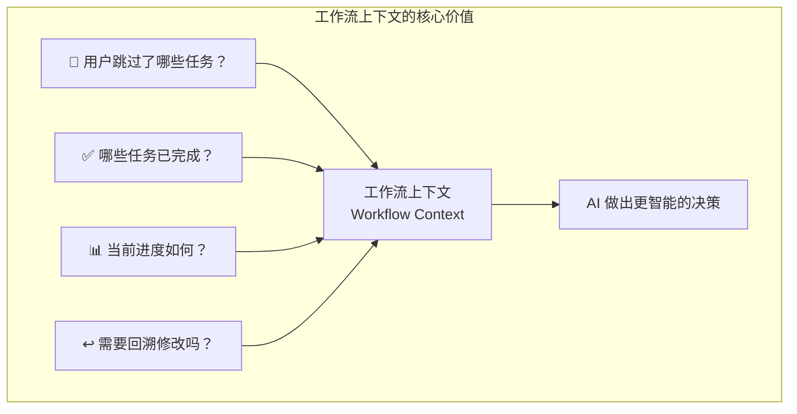

---

## 🎯 为什么需要工作流上下文？

### 没有工作流上下文的问题

想象一个场景：用户正在优化简历，他跳过了"技能特长"任务，现在轮到"项目经历"任务。

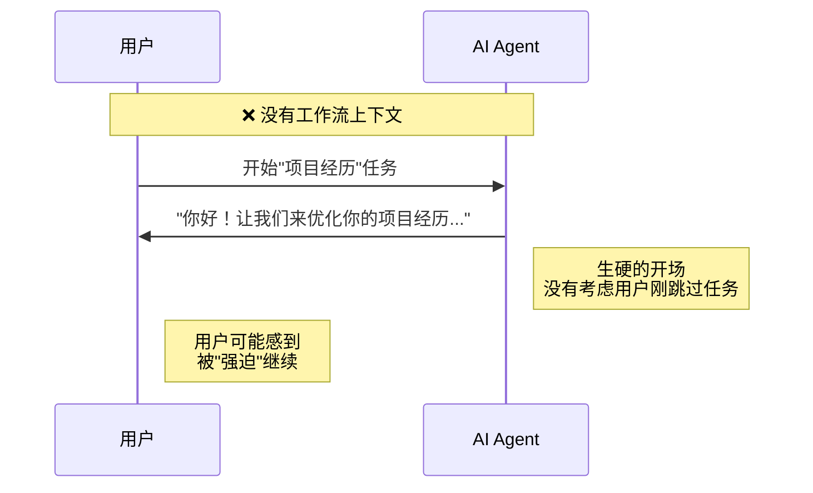

### 有工作流上下文的改善

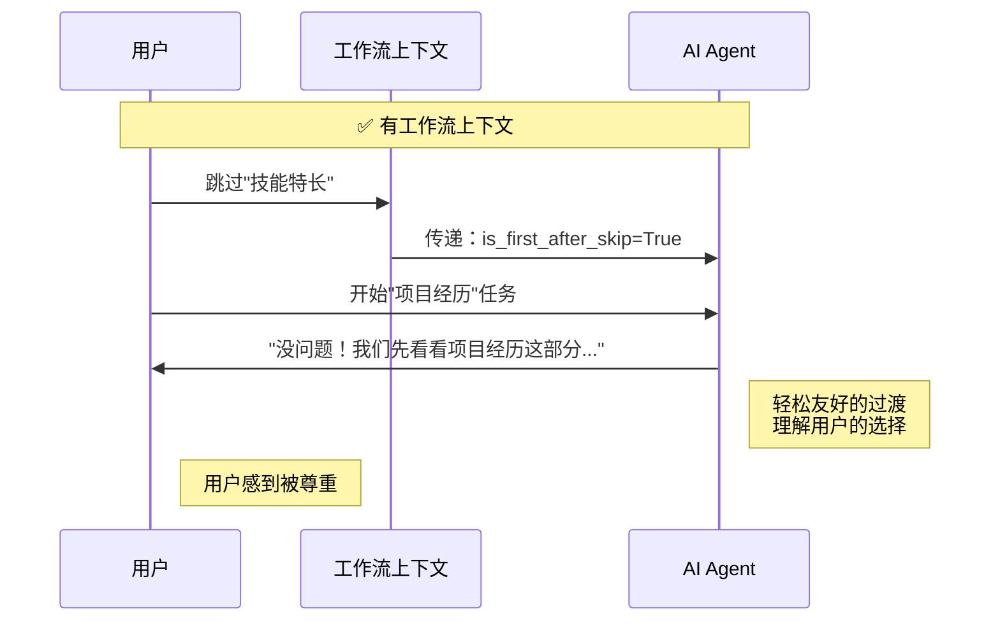

---

## 📊 工作流上下文的数据结构

工作流上下文通过 Python 字典传递，包含以下关键信息：

```python
context = {
    "skipped_tasks": ["技能特长", "自我评价"],    # 用户跳过的任务
    "completed_tasks": ["教育背景 - 硕士"],       # 已完成的任务
    "progress": {
        "total_tasks": 5,                         # 总任务数
        "completed_tasks": 2,                     # 已完成数
        "skipped_tasks": 1                        # 已跳过数
    },
    "is_first_after_skip": True                   # 是否刚跳过任务
}
```

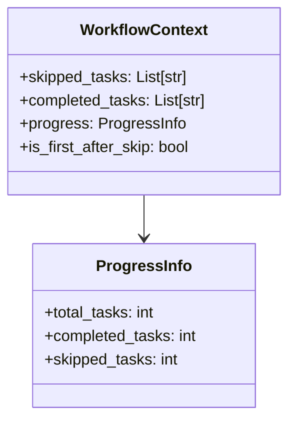

---

## 🔄 工作流上下文的生命周期

### 1. 创建与注入

工作流上下文在 `SessionManager` 中创建，并注入到 `GuideAgent`：

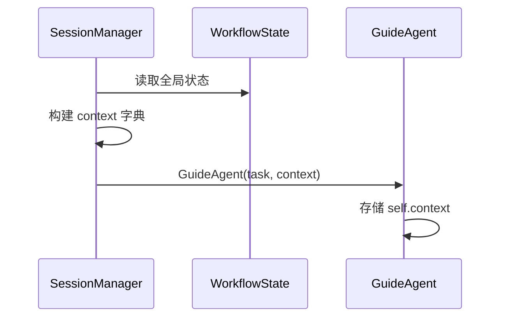

### 2. 使用时机

在每次调用 LLM 之前，`_build_workflow_context()` 方法将 context 转换为自然语言：

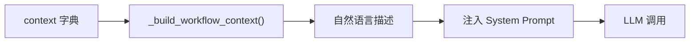

### 3. 生成的文本示例

```
# 任务流转上下文
当前进度：已完成 2/5，已跳过 1/5

**已完成的任务（可回溯修改）**：
- 教育背景 - 硕士

用户在本次会话中跳过了以下任务：技能特长, 自我评价

⚠️ 用户刚刚跳过了上一个任务。这可能意味着：
- 用户觉得那个内容暂时不重要
- 用户没有相关信息可以补充
- 用户希望快速推进流程

请用轻松友好的语气开始当前任务，不要让用户感到压力。
```

---

## 🏗️ 核心实现：`_build_workflow_context()` 方法

```python
def _build_workflow_context(self) -> str:
    """
    构建任务流转上下文信息，用于让 LLM 感知用户跳过了哪些任务。
    这样 LLM 可以生成更自然、更有同理心的过渡话术。
    同时包含已完成任务列表，用于支持智能任务回溯。
    """
    if not self.context:
        return ""
    
    skipped_tasks = self.context.get("skipped_tasks", [])
    completed_tasks = self.context.get("completed_tasks", [])
    progress = self.context.get("progress", {})
    is_first_after_skip = self.context.get("is_first_after_skip", False)
    
    context_lines = ["\n# 任务流转上下文"]
    
    # 添加进度信息
    if progress:
        total = progress.get("total_tasks", 0)
        completed = progress.get("completed_tasks", 0)
        skipped = progress.get("skipped_tasks", 0)
        context_lines.append(f"当前进度：已完成 {completed}/{total}，已跳过 {skipped}/{total}")
    
    # 添加已完成的任务信息（用于回溯识别）
    if completed_tasks:
        context_lines.append(f"\n**已完成的任务（可回溯修改）**：")
        for task_info in completed_tasks:
            context_lines.append(f"- {task_info}")
    
    # 添加跳过的任务信息
    if skipped_tasks:
        context_lines.append(f"\n用户在本次会话中跳过了以下任务：{', '.join(skipped_tasks)}")
    
    # 添加特殊提示
    if is_first_after_skip:
        context_lines.append("")
        context_lines.append("⚠️ 用户刚刚跳过了上一个任务。这可能意味着：")
        context_lines.append("- 用户觉得那个内容暂时不重要")
        context_lines.append("- 用户没有相关信息可以补充")
        context_lines.append("- 用户希望快速推进流程")
        context_lines.append("")
        context_lines.append("请用轻松友好的语气开始当前任务，不要让用户感到压力。")
    
    return "\n".join(context_lines) + "\n"
```

---

## 🧩 工作流上下文在系统中的位置

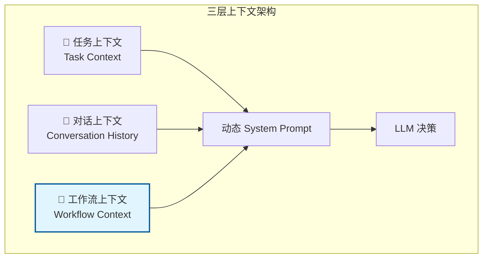

### 三种上下文的对比

| 上下文类型       | 来源          | 变化频率   | 作用                     |
| ---------------- | ------------- | ---------- | ------------------------ |
| **任务上下文**   | Task 对象     | 任务切换时 | 告诉 AI "当前要做什么"   |
| **对话上下文**   | messages 列表 | 每轮对话   | 告诉 AI "之前说了什么"   |
| **工作流上下文** | context 字典  | 任务切换时 | 告诉 AI "全局发生了什么" |

---

## 🎬 工作流上下文的实际效果

### 场景 1：跳过任务后的过渡

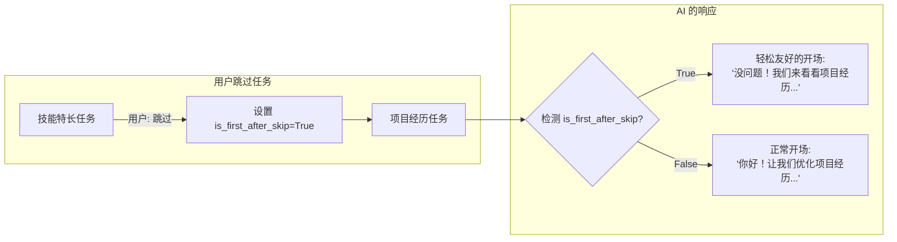

### 场景 2：支持任务回溯

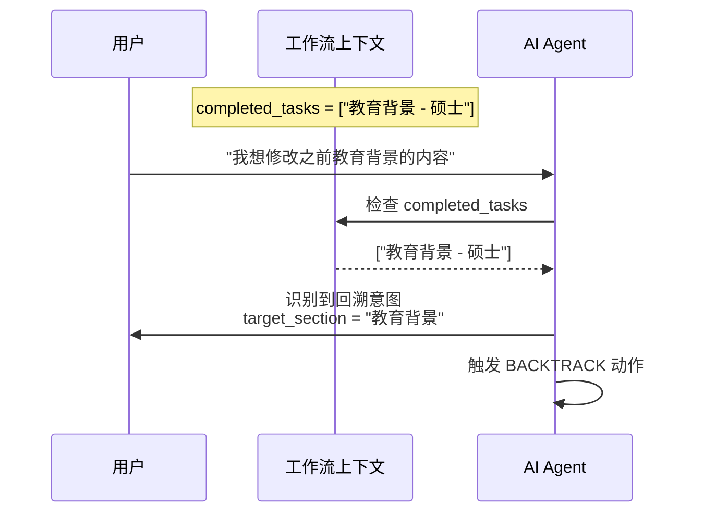

### 场景 3：进度感知

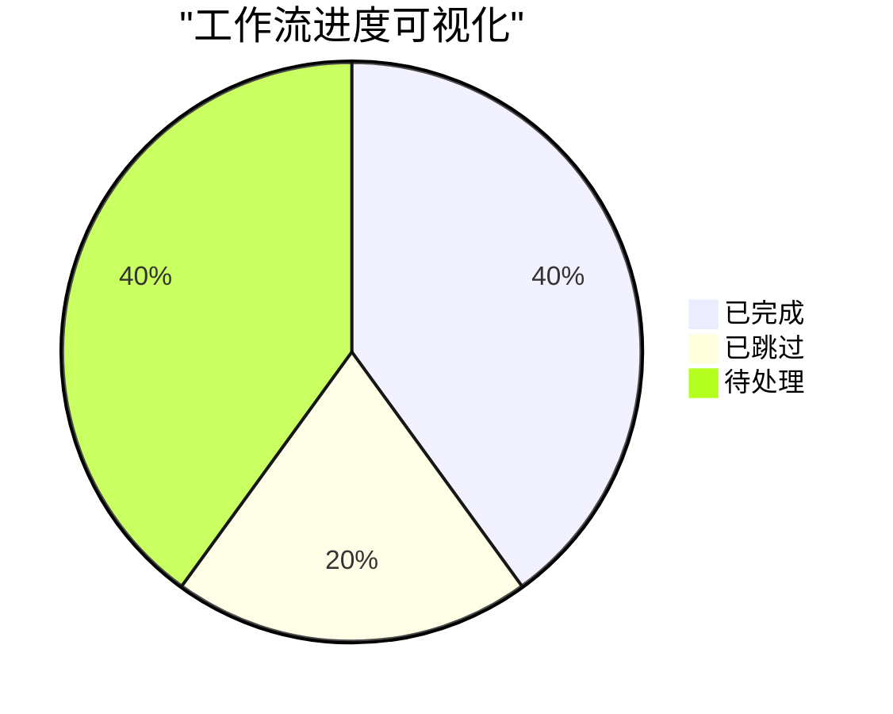

AI 可以根据进度信息调整对话策略：
- **进度较慢时**：给予鼓励，简化流程
- **即将完成时**：提醒用户检查，准备收尾

---

## 🔗 与其他组件的关系

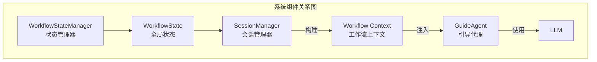

### 数据流向

1. **WorkflowState** 存储全局状态（跳过任务列表、已完成任务列表等）
2. **SessionManager** 读取状态，构建 context 字典
3. **GuideAgent** 接收 context，作为构造函数参数
4. **_build_workflow_context()** 将 context 转换为自然语言
5. **System Prompt** 包含工作流上下文
6. **LLM** 基于上下文做出更智能的决策

---

## ✨ 设计亮点

### 1. 解耦设计

工作流上下文通过**字典注入**，不依赖具体的状态管理实现：

```python
# GuideAgent 只关心 context 字典，不关心它从哪里来
agent = GuideAgent(task, context={
    "skipped_tasks": [...],
    "completed_tasks": [...],
    ...
})
```

### 2. 渐进式信息披露

只有在**需要时**才添加特定信息：

```python
# 只有跳过任务后，才会添加特殊提示
if is_first_after_skip:
    context_lines.append("⚠️ 用户刚刚跳过了上一个任务...")
```

### 3. 人性化表达

将**技术数据转换为自然语言**，让 LLM 能够理解并生成合适的回复：

```
技术数据: skipped_tasks = ["技能特长"]
↓ 转换
自然语言: "用户在本次会话中跳过了以下任务：技能特长"
```

### 4. 支持 LLM 推理

提供**可能的原因**，帮助 LLM 做出更好的判断：

```
⚠️ 用户刚刚跳过了上一个任务。这可能意味着：
- 用户觉得那个内容暂时不重要
- 用户没有相关信息可以补充
- 用户希望快速推进流程
```

---

## 📐 总结

| 维度         | 工作流上下文的作用               |
| ------------ | -------------------------------- |
| **信息传递** | 在多任务工作流中传递全局状态     |
| **用户体验** | 让 AI 回复更自然、更有同理心     |
| **回溯支持** | 告诉 AI 哪些任务可以回溯修改     |
| **进度感知** | 让 AI 了解当前处于流程的哪个阶段 |
| **解耦设计** | 通过字典注入，不依赖具体实现     |

---

## 📚 相关文档

- [WorkflowState 详解](file:///c:/Users/admin/Desktop/ResumeAssistant/learning/workflow_state.md) - 全局状态容器
- [GuideAgent 上下文管理](file:///c:/Users/admin/Desktop/ResumeAssistant/learning/guide_agent_context_management.md) - 完整上下文架构
- [源码：guide_agent.py](file:///c:/Users/admin/Desktop/ResumeAssistant/backend/guide_agent.py) - `_build_workflow_context()` 方法
