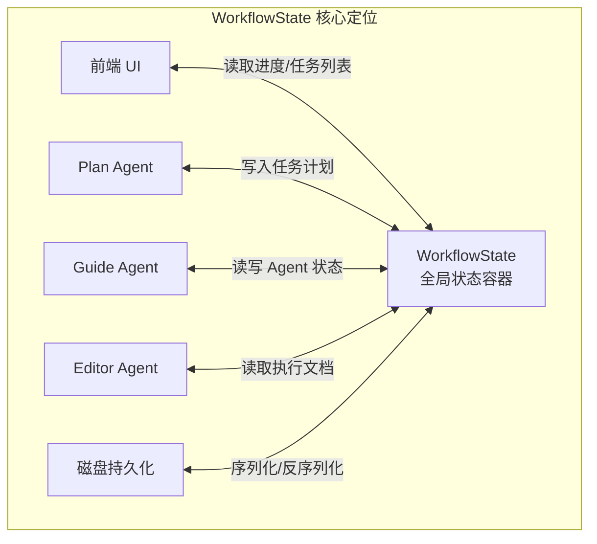
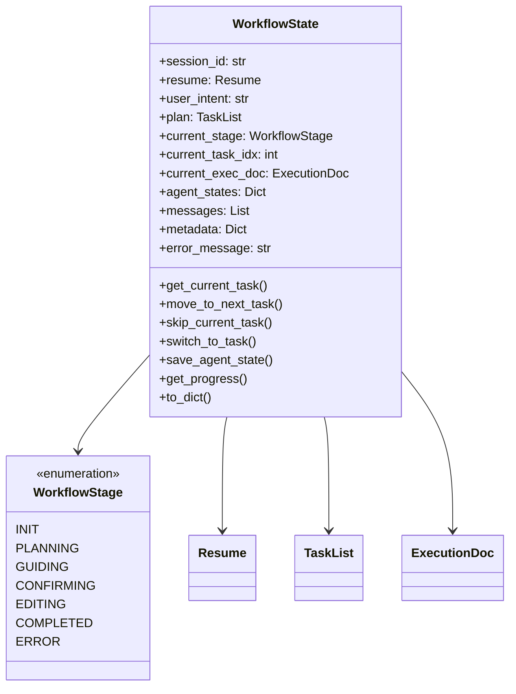
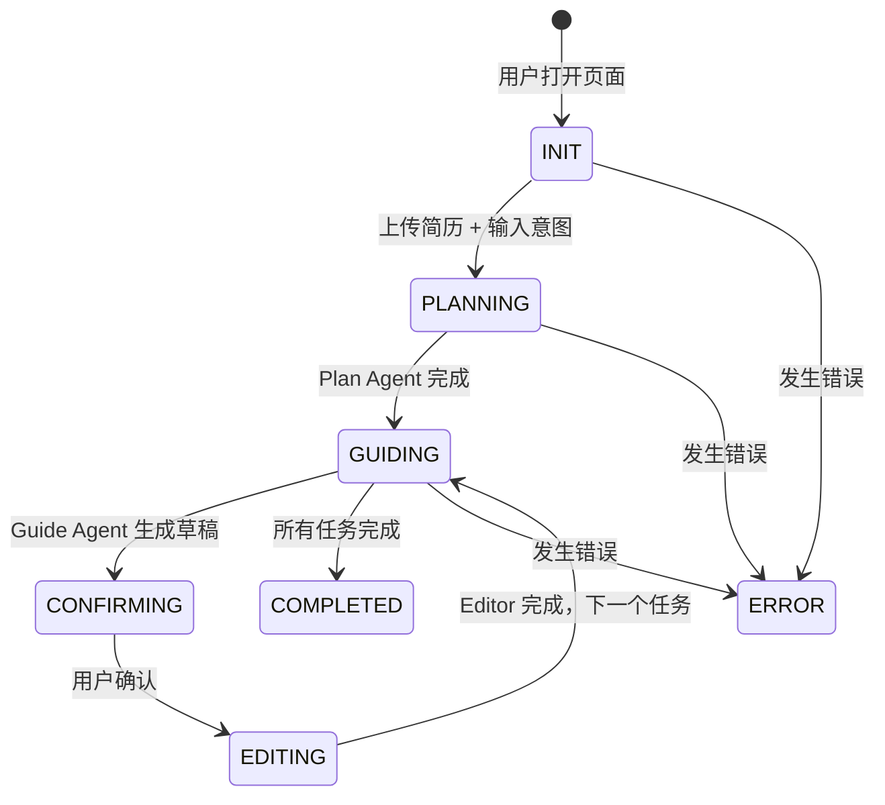
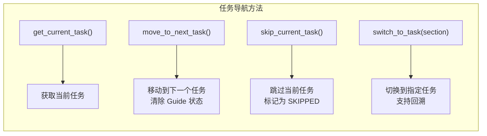
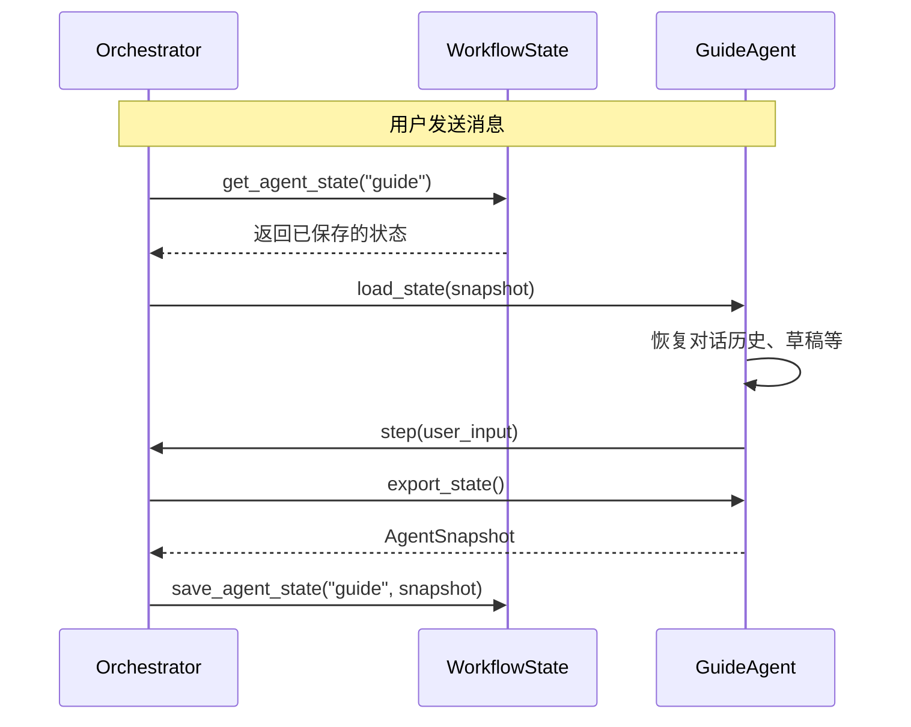
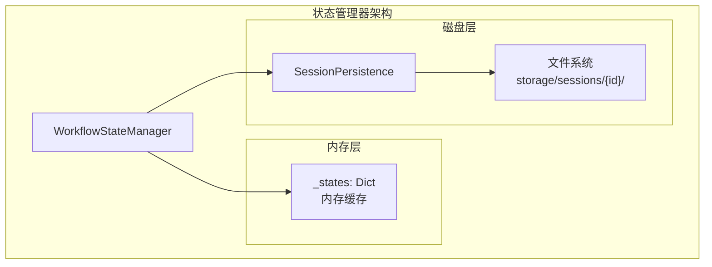
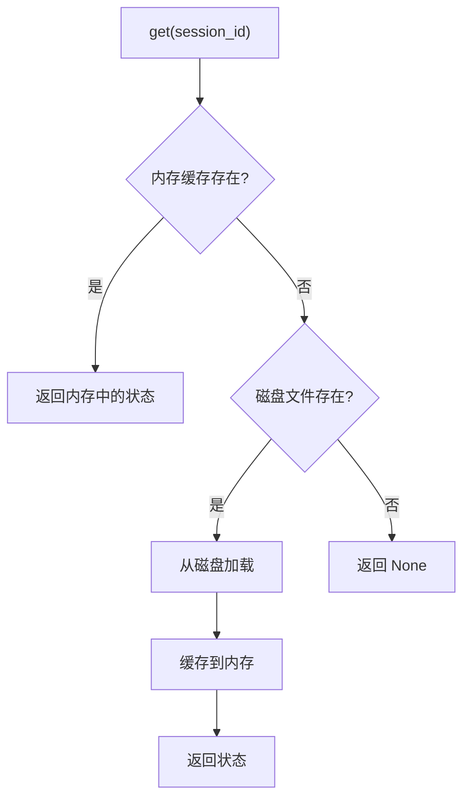
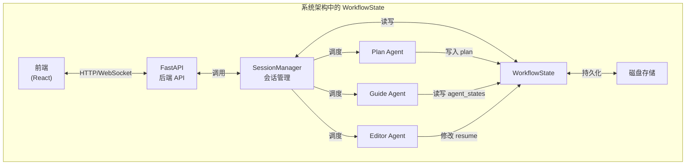
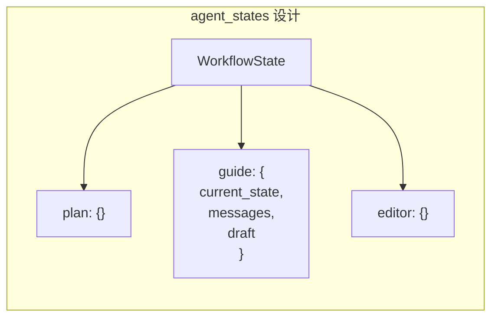

# WorkflowState 详解：简历优化工作流的状态管理中枢

本文档深入讲解 `WorkflowState` 在 ResumeAssistant 项目中的作用、设计思想和实现细节。

---

## 📌 什么是 WorkflowState？

**WorkflowState** 是整个简历优化工作流的**全局状态容器**，它是连接前端、后端、多个 Agent 的**唯一数据源**（Single Source of Truth）。



---

## 🏗️ 核心设计目标

| 目标               | 实现方式            | 效果                                 |
| ------------------ | ------------------- | ------------------------------------ |
| **解耦**           | 状态与 Agent 分离   | SessionManager 不依赖具体 Agent 类型 |
| **可序列化**       | Pydantic BaseModel  | 支持 JSON 持久化和恢复               |
| **LangGraph 兼容** | 模仿 TypedDict 设计 | 未来可无缝升级到 LangGraph           |
| **断点续传**       | 完整状态快照        | 用户关闭页面后可恢复                 |

---

## 📊 WorkflowState 数据结构



### 字段详解

#### 1️⃣ 会话标识
```python
session_id: str  # UUID，唯一标识一个用户会话
```

#### 2️⃣ 核心数据
```python
resume: Resume           # 当前简历对象（可被 Editor 修改）
user_intent: str         # 用户的求职意图（如"应聘 AI 工程师"）
plan: TaskList           # Plan Agent 生成的任务列表
```

#### 3️⃣ 流程控制
```python
current_stage: WorkflowStage  # 当前工作流阶段
current_task_idx: int         # 当前处理的任务索引
current_exec_doc: ExecutionDoc  # 待确认的执行文档
```

#### 4️⃣ Agent 状态
```python
agent_states: Dict[str, Dict[str, Any]]  
# 存储各 Agent 的内部状态快照
# 例如: {"guide": {"current_state": "DRAFTING", "messages": [...], "draft": "..."}}
```

#### 5️⃣ 消息历史与元数据
```python
messages: List[Dict]   # 工作流消息历史
metadata: Dict         # 扩展元数据
error_message: str     # 错误信息
```

---

## 🔄 工作流阶段 (WorkflowStage)



### 阶段说明

| 阶段         | 触发条件     | 活跃 Agent   | 用户交互           |
| ------------ | ------------ | ------------ | ------------------ |
| `INIT`       | 会话创建     | 无           | 上传简历、输入意图 |
| `PLANNING`   | 简历上传完成 | Plan Agent   | 等待               |
| `GUIDING`    | 计划生成完成 | Guide Agent  | 对话交互           |
| `CONFIRMING` | 草稿生成完成 | 无           | 确认/修改          |
| `EDITING`    | 用户确认     | Editor Agent | 等待               |
| `COMPLETED`  | 所有任务完成 | 无           | 查看/导出          |
| `ERROR`      | 发生异常     | 无           | 错误提示           |

---

## 🎯 核心功能方法

### 任务导航



#### 跳过任务
```python
def skip_current_task(self) -> Optional[Task]:
    """跳过当前任务"""
    current = self.get_current_task()
    if current:
        current.status = TaskStatus.SKIPPED
    return self.move_to_next_task()
```

#### 任务回溯（智能切换）
```python
def switch_to_task(self, target_section: str) -> Optional[int]:
    """
    切换到指定任务（用于智能回溯修改）
    
    1. 通过板块名称查找目标任务（支持部分匹配）
    2. 更新 current_task_idx
    3. 将目标任务状态改为 IN_PROGRESS
    4. 清除当前 Guide Agent 状态
    5. 切换工作流阶段到 GUIDING
    """
```

### Agent 状态管理



#### 保存 Agent 状态
```python
def save_agent_state(self, agent_name: str, state: Dict[str, Any]) -> None:
    """保存 Agent 状态快照"""
    self.agent_states[agent_name] = state
```

#### 获取 Agent 状态
```python
def get_agent_state(self, agent_name: str) -> Optional[Dict[str, Any]]:
    """获取 Agent 状态快照"""
    return self.agent_states.get(agent_name)
```

### 进度查询

```python
def get_progress(self) -> Dict[str, Any]:
    """获取进度信息"""
    return {
        "total_tasks": len(tasks),          # 总任务数
        "completed_tasks": completed,        # 已完成数
        "skipped_tasks": skipped,            # 已跳过数
        "current_task_idx": self.current_task_idx,
        "current_task": self.get_current_task(),
        "tasks_summary": [...]               # 任务状态列表
    }
```

---

## 💾 持久化机制

### WorkflowStateManager



### 读取优先级



### 持久化文件结构

```
backend/storage/sessions/
└── {session_id}/
    ├── workflow_state.json    # 完整状态快照
    └── metadata.json          # 会话元数据
```

#### workflow_state.json 示例

```json
{
  "session_id": "ee83e633-1f17-43cf-9c26-dcd4aabd101b",
  "resume": {
    "basics": {"name": "张三", "email": "..."},
    "sections": [...]
  },
  "user_intent": "应聘 AI 工程师",
  "plan": {
    "tasks": [
      {"id": 1, "status": "completed", "section": "教育背景"},
      {"id": 2, "status": "in_progress", "section": "项目经历"}
    ]
  },
  "current_stage": "guiding",
  "current_task_idx": 1,
  "agent_states": {
    "guide": {
      "current_state": "DRAFTING",
      "messages": [...],
      "draft": "..."
    }
  }
}
```

---

## 🔗 WorkflowState 与其他组件的关系



### 数据流向

| 操作     | 数据流                       | 修改的字段                          |
| -------- | ---------------------------- | ----------------------------------- |
| 上传简历 | 前端 → API → WorkflowState   | `resume`, `user_intent`             |
| 生成计划 | Plan Agent → WorkflowState   | `plan`, `current_stage`             |
| 对话交互 | Guide Agent ↔ WorkflowState  | `agent_states["guide"]`             |
| 确认草稿 | 用户 → WorkflowState         | `current_exec_doc`, `current_stage` |
| 执行修改 | Editor Agent → WorkflowState | `resume`                            |
| 任务完成 | Orchestrator → WorkflowState | `current_task_idx`, 任务 `status`   |

---

## 🎯 设计亮点

### 1. LangGraph 兼容设计

```python
# 当前 Pydantic 实现
class WorkflowState(BaseModel):
    resume: Resume
    plan: TaskList
    current_stage: WorkflowStage
    ...

# 未来 LangGraph 升级（无缝转换）
class GraphState(TypedDict):
    resume: Resume
    plan: TaskList
    current_stage: str
    ...
```

### 2. Agent 状态隔离



- 每个 Agent 的状态独立存储
- 切换任务时只需清除对应 Agent 的状态
- 不影响其他 Agent

### 3. 智能任务回溯

```python
def switch_to_task(self, target_section: str):
    # 支持部分匹配
    if target_section in task.section or task.section in target_section:
        ...
    
    # 支持关键词匹配
    if any(keyword in section_lower for keyword in target_lower.split()):
        ...
```

用户说"修改硕士那栏"，系统能自动匹配到"教育背景 - 硕士阶段"任务。

---

## 📐 总结

| 维度           | WorkflowState 的作用                  |
| -------------- | ------------------------------------- |
| **数据中心**   | 存储简历、计划、进度等所有核心数据    |
| **流程控制**   | 管理工作流阶段和任务索引              |
| **Agent 协调** | 存储各 Agent 的状态快照，支持断点续传 |
| **持久化**     | 支持 JSON 序列化，可保存到磁盘        |
| **可扩展性**   | 设计兼容 LangGraph，便于未来升级      |

---

## 📚 相关文档

- [GuideAgent 状态机设计](file:///c:/Users/admin/Desktop/ResumeAssistant/learning/guide_agent_state_machine.md)
- [GuideAgent 上下文管理](file:///c:/Users/admin/Desktop/ResumeAssistant/learning/guide_agent_context_management.md)
- [源码：workflow_state.py](file:///c:/Users/admin/Desktop/ResumeAssistant/backend/workflow_state.py)
