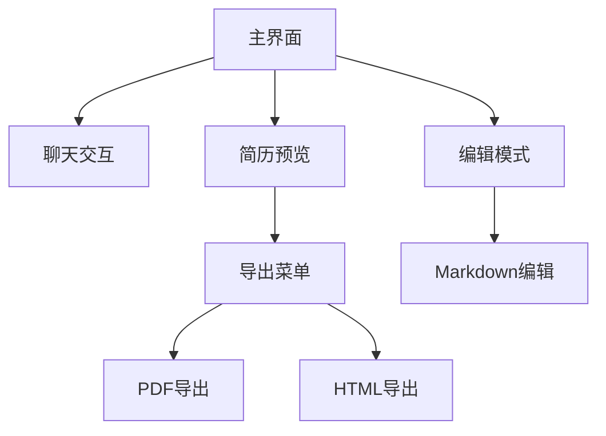

## 1. 产品概述
将ResumeAssistant前端界面从原生CSS升级到Radix UI组件库与Tailwind CSS框架，提升用户体验、可访问性和开发效率。保持现有功能不变，优化界面布局与交互设计。

目标：构建现代化、响应式、高可访问性的简历助手界面，提供更专业的视觉体验和更流畅的交互操作。

## 2. 核心功能

### 2.1 用户角色
| 角色 | 注册方式 | 核心权限 |
|------|----------|----------|
| 普通用户 | 无需注册，直接使用 | 使用简历助手对话功能，编辑和导出简历 |

### 2.2 功能模块
升级范围包含以下核心页面：
1. **主界面**：聊天对话区域、简历预览/编辑区域、分隔条调整功能
2. **导出功能**：PDF和HTML格式导出菜单

### 2.3 页面详情
| 页面名称 | 模块名称 | 功能描述 |
|----------|----------|----------|
| 主界面 | 聊天区域 | 显示用户与AI助手的对话历史，支持文本输入和发送功能。保持现有消息类型（用户消息、助手回答、思考过程） |
| 主界面 | 简历预览区域 | 实时显示简历渲染效果，支持iframe嵌入展示。保持现有简历模板和渲染逻辑 |
| 主界面 | 编辑模式切换 | 在预览和编辑模式间切换，编辑模式下显示Markdown编辑器 |
| 主界面 | 分隔条 | 可拖拽调整左右区域宽度，支持键盘操作（左右箭头键），提供视觉反馈 |
| 主界面 | 导出菜单 | 下拉菜单提供PDF和HTML导出选项，支持外部点击关闭 |
| 编辑模式 | Markdown编辑器 | 文本编辑区域，支持实时预览切换。保持现有工具栏功能 |

## 3. 核心流程

### 用户操作流程
1. **对话交互流程**：用户输入简历需求 → AI助手回复 → 生成简历数据 → 实时预览更新
2. **编辑流程**：切换到编辑模式 → 修改Markdown内容 → 实时预览效果 → 导出简历
3. **导出流程**：点击导出按钮 → 选择格式（PDF/HTML）→ 下载文件

### 页面导航流程

## 4. 用户界面设计

### 4.1 设计规范
- **色彩方案**：
  - 主色调：蓝色系（#0066cc 升级为更现代的蓝色）
  - 背景：白色和浅灰色层次
  - 文本：深灰色（#1f2937）提高可读性
  - 边框：柔和的灰色（#e5e7eb）

- **组件风格**：
  - 按钮：圆角设计，hover状态反馈
  - 输入框：清晰的边框和焦点状态
  - 卡片：轻微阴影和圆角
  - 间距：8px基线网格系统

- **字体系统**：
  - 主要：系统字体栈（-apple-system, BlinkMacSystemFont, 'Segoe UI', Roboto）
  - 代码：等宽字体（SFMono-Regular, Menlo, Monaco, Consolas）
  - 字号：14px基础，标题16-18px

### 4.2 页面设计详述
| 页面名称 | 模块名称 | UI元素 |
|----------|----------|--------|
| 主界面 | 整体布局 | 使用Tailwind Grid替代原生CSS Grid，响应式设计，移动端适配 |
| 主界面 | 聊天区域 | Radix ScrollArea组件实现消息列表滚动，优化性能 |
| 主界面 | 消息气泡 | Radix Card组件，区分用户和助手消息样式 |
| 主界面 | 输入区域 | Radix TextField组件，更清晰的焦点状态 |
| 主界面 | 发送按钮 | Radix Button组件，加载状态显示 |
| 主界面 | 简历预览 | Radix Card容器，iframe嵌入保持现有功能 |
| 主界面 | 模式切换 | Radix ToggleGroup替代原生radio，更好的交互体验 |
| 主界面 | 导出按钮 | Radix IconButton，悬停效果优化 |
| 主界面 | 导出菜单 | Radix DropdownMenu，键盘导航支持 |
| 主界面 | 分隔条 | Radix Separator增强版，拖拽手柄更明显 |
| 编辑模式 | 工具栏 | Radix Toolbar组件，图标按钮组 |
| 编辑模式 | 文本域 | Radix TextArea，自适应高度，更好的滚动体验 |

### 4.3 响应式设计
- **桌面优先**：默认针对桌面端优化，充分利用屏幕空间
- **移动端适配**：
  - 小于768px时切换为垂直布局
  - 聊天区域在上，简历预览在下
  - 隐藏拖拽分隔条，使用固定比例
- **触摸优化**：按钮和交互元素最小44px触摸目标

### 4.4 可访问性增强
- **键盘导航**：完整的Tab键导航顺序
- **屏幕阅读器**：所有交互元素都有适当的ARIA标签
- **颜色对比**：确保WCAG 2.1 AA级别的颜色对比度
- **焦点指示**：清晰的焦点状态指示器
- **语义化HTML**：使用正确的HTML语义元素