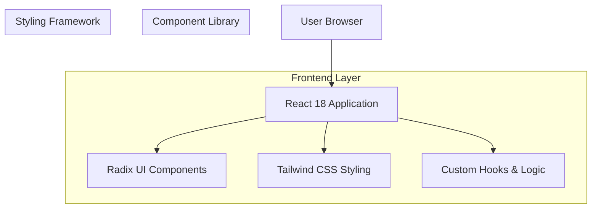

## 1. 架构设计



## 2. 技术栈说明

- **前端框架**: React@18 + TypeScript
- **UI组件库**: Radix UI Primitives
- **样式框架**: Tailwind CSS@3
- **构建工具**: Vite@5
- **初始化工具**: vite-init
- **后端**: 无变更，继续使用现有FastAPI后端
- **依赖管理**: npm

### 核心依赖包
```json
{
  "dependencies": {
    "@radix-ui/react-accordion": "^1.2.0",
    "@radix-ui/react-button": "^1.1.0",
    "@radix-ui/react-card": "^1.1.0",
    "@radix-ui/react-dialog": "^1.1.0",
    "@radix-ui/react-dropdown-menu": "^2.1.0",
    "@radix-ui/react-label": "^2.1.0",
    "@radix-ui/react-scroll-area": "^1.2.0",
    "@radix-ui/react-separator": "^1.1.0",
    "@radix-ui/react-text-field": "^1.1.0",
    "@radix-ui/react-toggle-group": "^1.1.0",
    "@radix-ui/react-toolbar": "^1.1.0",
    "@radix-ui/react-visually-hidden": "^1.1.0",
    "lucide-react": "^0.400.0"
  },
  "devDependencies": {
    "tailwindcss": "^3.4.0",
    "autoprefixer": "^10.4.0",
    "postcss": "^8.4.0",
    "@tailwindcss/forms": "^0.5.0",
    "@tailwindcss/typography": "^0.5.0"
  }
}
```

## 3. 路由定义

保持现有单页应用结构，无路由变更：

| 路由 | 用途 |
|------|------|
| / | 主应用界面，包含聊天和简历预览功能 |

## 4. 组件架构升级

### 4.1 组件映射关系

| 现有组件 | Radix UI替代方案 | Tailwind样式类 |
|----------|------------------|----------------|
| 原生div容器 | Radix Card | `bg-white rounded-lg shadow-sm border border-gray-200` |
| 原生input | Radix TextField | `w-full px-3 py-2 border border-gray-300 rounded-md focus:ring-2 focus:ring-blue-500` |
| 原生button | Radix Button | `px-4 py-2 bg-blue-600 text-white rounded-md hover:bg-blue-700` |
| 原生textarea | Radix TextArea | `w-full p-3 border border-gray-300 rounded-md resize-none` |
| radio按钮组 | Radix ToggleGroup | `inline-flex rounded-lg border border-gray-300` |
| 下拉菜单 | Radix DropdownMenu | `absolute right-0 mt-2 w-48 bg-white rounded-md shadow-lg` |
| 滚动容器 | Radix ScrollArea | `h-full w-full rounded-md border border-gray-200` |
| 分隔条 | Radix Separator | `bg-gray-200 data-[orientation=vertical]:w-px` |

### 4.2 样式系统设计

#### Tailwind配置扩展
```javascript
// tailwind.config.js
module.exports = {
  content: [
    "./index.html",
    "./src/**/*.{js,ts,jsx,tsx}",
  ],
  theme: {
    extend: {
      colors: {
        primary: {
          50: '#eff6ff',
          500: '#3b82f6',
          600: '#2563eb',
          700: '#1d4ed8',
        },
        gray: {
          50: '#f9fafb',
          100: '#f3f4f6',
          200: '#e5e7eb',
          300: '#d1d5db',
          400: '#9ca3af',
          500: '#6b7280',
          600: '#4b5563',
          700: '#374151',
          800: '#1f2937',
          900: '#111827',
        }
      },
      fontFamily: {
        sans: ['Inter', 'ui-sans-serif', 'system-ui'],
        mono: ['Fira Code', 'ui-monospace', 'SFMono-Regular'],
      },
      animation: {
        'fade-in': 'fadeIn 0.2s ease-in-out',
        'slide-down': 'slideDown 0.2s ease-out',
      }
    }
  },
  plugins: [
    require('@tailwindcss/forms'),
    require('@tailwindcss/typography'),
  ]
}
```

#### 基础样式类
```css
/* 全局基础样式 */
@tailwind base;
@tailwind components;
@tailwind utilities;

/* 自定义组件类 */
@layer components {
  .btn-primary {
    @apply px-4 py-2 bg-primary-600 text-white rounded-md 
           hover:bg-primary-700 focus:ring-2 focus:ring-primary-500 
           focus:ring-offset-2 transition-colors duration-200;
  }
  
  .btn-secondary {
    @apply px-4 py-2 bg-white text-gray-700 border border-gray-300 
           rounded-md hover:bg-gray-50 focus:ring-2 focus:ring-primary-500 
           focus:ring-offset-2 transition-colors duration-200;
  }
  
  .card {
    @apply bg-white rounded-lg shadow-sm border border-gray-200 
           overflow-hidden;
  }
  
  .input-field {
    @apply w-full px-3 py-2 border border-gray-300 rounded-md 
           focus:ring-2 focus:ring-primary-500 focus:border-primary-500 
           transition-colors duration-200;
  }
}

/* 可访问性增强 */
@layer utilities {
  .focus-visible {
    @apply focus:outline-none focus:ring-2 focus:ring-primary-500 
           focus:ring-offset-2;
  }
}
```

### 4.3 组件升级策略

#### 渐进式升级
1. **阶段1**: 替换基础组件（Button, Input, Card）
2. **阶段2**: 升级复杂组件（Dropdown, ToggleGroup, ScrollArea）
3. **阶段3**: 优化布局和响应式设计
4. **阶段4**: 增强可访问性和键盘导航

#### 兼容性保证
- 保持所有现有props接口不变
- 维持原有状态管理逻辑
- 保留现有事件处理函数
- 确保功能行为完全一致

## 5. 数据模型

无数据模型变更，继续使用现有简历数据结构：

```typescript
interface ResumeData {
  basics: {
    name?: string;
    email?: string;
    phone?: string;
    // ... 其他基础信息
  };
  sections: Array<{
    type: string;
    title: string;
    items: Array<Record<string, any>>;
  }>;
}

interface Message {
  role: "assistant" | "user";
  content: string;
}
```

## 6. 性能优化

### 6.1 样式优化
- 使用Tailwind的JIT编译器，只生成用到的样式
- 避免内联样式，统一使用className
- 利用CSS模块化减少样式冲突

### 6.2 组件优化
- Radix组件的懒加载和代码分割
- 使用React.memo优化重渲染
- 保持现有useEffect和useMemo优化

### 6.3 构建优化
- 配置Tree Shaking移除未使用代码
- 压缩和优化CSS文件
- 利用Vite的HMR提升开发体验

## 7. 开发计划

### 第一阶段（基础组件）
- 安装和配置Tailwind CSS
- 配置Radix UI依赖
- 升级Button和Input组件
- 替换基础容器样式

### 第二阶段（复杂组件）
- 升级DropdownMenu
- 替换ToggleGroup
- 实现ScrollArea
- 优化分隔条交互

### 第三阶段（布局优化）
- 实现响应式布局
- 优化移动端体验
- 调整间距和排版
- 完善暗色模式支持

### 第四阶段（可访问性）
- 增强键盘导航
- 完善ARIA标签
- 优化焦点管理
- 测试屏幕阅读器兼容性

## 8. 测试策略

### 功能测试
- 确保所有现有功能正常工作
- 验证拖拽分隔条功能
- 测试导出功能完整性
- 检查响应式布局

### 可访问性测试
- 键盘导航测试
- 屏幕阅读器兼容性
- 颜色对比度检查
- 焦点指示器验证

### 性能测试
- 加载时间对比
- 内存使用监控
- 重渲染性能分析
- 移动端性能评估